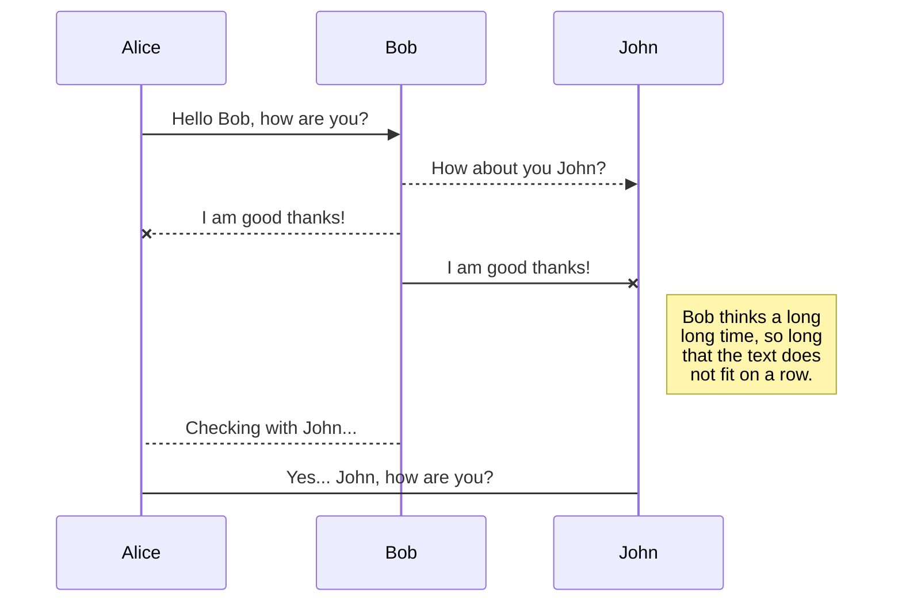
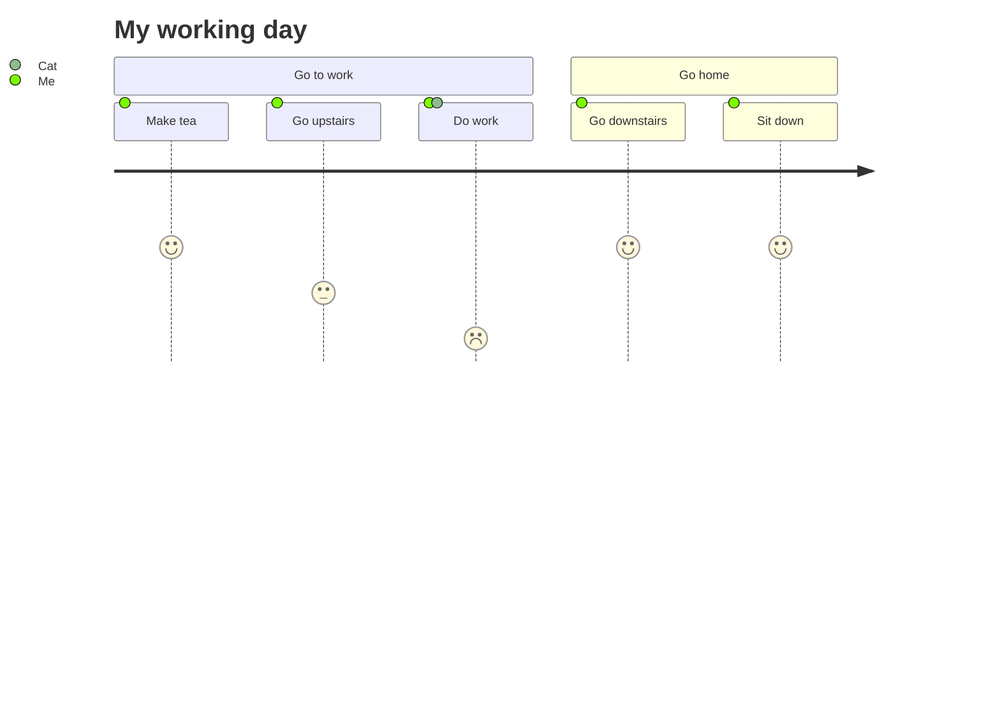

I'm a Lecturer at  [Universiti Teknologi Malaysia (UTM)](https://www.utm.my/)  **passionate** *about* ~~education~~ and fostering a love for software development. I'm constantly seeking opportunities to learn and contribute to the open-source community. Here's what I'm up to on GitHub:

The *Gamma function* satisfying $\Gamma(n) = (n-1)!\quad\forall n\in\mathbb N$ is via the Euler integral

$$
\Gamma(z) = \int_0^\infty t^{z-1}e^{-t}dt\,.
$$

