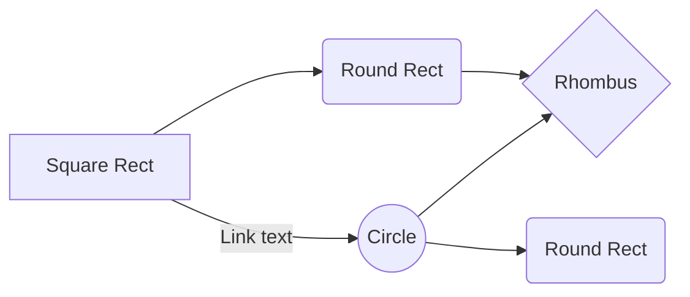

#Welcome to Adlina's World" 
Hi! I'm Adlina Binti Abdul Samad. Currently, pursueding Master of Philosophy (Computer Science). 
There are two types of languanges that I can read and understand: 
-Malay 
  >Bahasa Melayu
-Chinese
  >Cantonese,Mandarin and Hokkien

And this will produce a flow chart:

