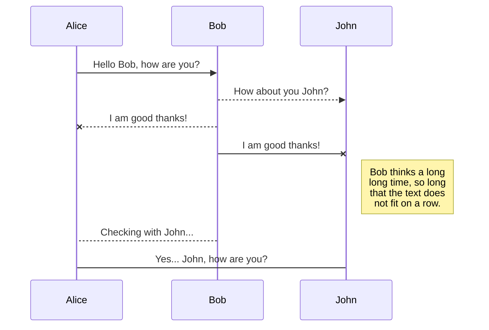
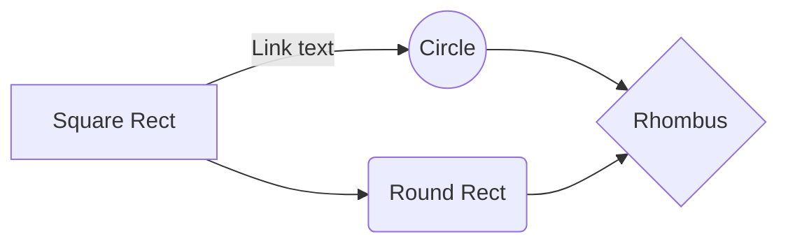

# Welcome to My Profile!

Hi, my name is Omar Mohammed currently studying a **master's in data science** 

You can render LaTeX mathematical expressions using [KaTeX](https://khan.github.io/KaTeX/):

The *Gamma function* satisfying $\Gamma(n) = (n-1)!\quad\forall n\in\mathbb N$ is via the Euler integral

$$
\Gamma(z) = \int_0^\infty t^{z-1}e^{-t}dt\,.
$$

> You can find more information about **LaTeX** mathematical expressions [here](http://meta.math.stackexchange.com/questions/5020/mathjax-basic-tutorial-and-quick-reference).

You can render UML diagrams using [Mermaid](https://mermaidjs.github.io/). For example, this will produce a sequence diagram:

And this will produce a flow chart:

Data Science is an interdisciplinary field that leverages scientific methods, processes, algorithms, and systems to extract knowledge and insights from both structured and unstructured data 📊12. It combines techniques from statistics, computer science, information science, and domain expertise to analyze and interpret complex data sets.

Key Components of Data Science
Data Collection: Gathering data from various sources such as databases, APIs, and web scraping 🌐.
Data Preparation: Cleaning and transforming raw data into a suitable format for analysis 🧹.
Data Analysis: Applying statistical and computational techniques to uncover patterns and insights 📈.
Data Visualization: Creating visual representations of data to communicate findings effectively 📊.
Machine Learning: Using algorithms to build predictive models and automate decision-making processes 🤖.
Applications of Data Science
Healthcare: Predicting disease outbreaks and personalizing treatment plans 🏥.
Finance: Fraud detection and risk management 💹.
Marketing: Customer segmentation and targeted advertising 📢.
Transportation: Optimizing routes and improving logistics 🚚.
Data science is pivotal in today’s digital era, driving innovation and efficiency across various industries23. It is often referred to as the “sexiest job of the 21st century” due to its high demand and impactful contributions to business and society 🌟2.
