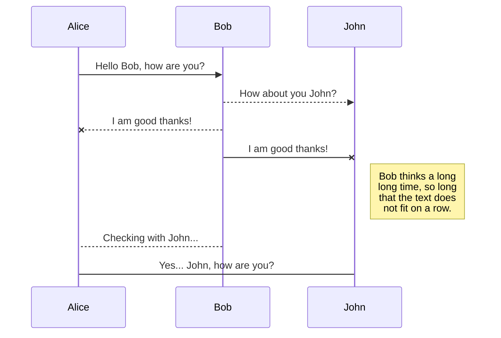

Hi! I'm your first ~~Markdown~~ file in **StackEdit**. If you want to learn about StackEdit, you can read me. If you want to play with Markdown, you can edit me. Once you have finished with me, you can create new files by opening the **file explorer** on the left corner of the navigation bar.

# Files
StackEdit stores your files in your browser, which means all your files are automatically saved locally and are accessible **offline!**

## Create files and folders
The file explorer is accessible using the button in left corner of the navigation bar. You can create a new file by clicking the **New file** button in the file explorer. You can also create folders by clicking the **New folder** button.

## SmartyPants
SmartyPants converts ASCII punctuation characters into "smart" typographic punctuation HTML entities. For example:

|                |ASCII                          |HTML                         |
|----------------|-------------------------------|-----------------------------|
|Single backticks|`'Isn't this fun?'`            |'Isn't this fun?'            |
|Quotes          |`"Isn't this fun?"`            |"Isn't this fun?"            |
|Dashes          |`-- is en-dash, --- is em-dash`|-- is en-dash, --- is em-dash|

## KaTeX
You can render LaTeX mathematical expressions using [KaTeX](https://khan.github.io/KaTeX/):

The *Gamma function* satisfying $\Gamma(n) = (n-1)!\quad\forall n\in\mathbb N$ is via the Euler integral

$$
\Gamma(z) = \int_0^\infty t^{z-1}e^{-t}dt\,.
$$

> You can find more information about **LaTeX** mathematical expressions [here](http://meta.math.stackexchange.com/questions/5020/mathjax-basic-tutorial-and-quick-reference).

## UML diagrams
You can render UML diagrams using [Mermaid](https://mermaidjs.github.io/). For example, this will produce a sequence diagram:



And this will produce a flow chart:

```mermaid
graph LR
A[Square Rect] -- Link text --> B((Circle))
A --> C(Round Rect)
B --> D{Rhombus}
C --> D


|   | Sports Personnel             | Sport                           |
|---|---------------------------|---------------------------------|
| 1 | Usain Bolt                  | Track and Field                 |
| 2 | Serena Williams          | Tennis                           |
| 3 | Michael Jordan          | Basketball                       |
| 4 | Cristiano Ronaldo      | Soccer                           |
| 5 | Lionel Messi               | Soccer                           |
| 6 | LeBron James              | Basketball                       |
| 7 | Roger Federer              | Tennis                           |
| 8 | Muhammad Ali             | Boxing                           |
| 9 | Tiger Woods               | Golf                             |
| 10 | Diego Maradona        | Soccer                           |
| 11 | Rafael Nadal               | Tennis                           |
| 12 | Michael Phelps         | Swimming                         |
| 13 | Kobe Bryant              | Basketball                       |
| 14 | Tom Brady                | American Football                |
| 15 | Novak Djokovic          | Tennis                           |
| 16 | Babe Ruth                | Baseball                         |
| 17 | Pelé                      | Soccer                           |
| 18 | Jackie Robinson       | Baseball                         |
| 19 | Kobe Bryant              | Basketball                       |
| 20 | Wayne Gretzky        | Ice Hockey                       |
| 21 | Simone Biles           | Gymnastics                       |
| 22 | Nadia Comăneci      | Gymnastics                       |
| 23 | Kareem Abdul-Jabbar | Basketball                       |
| 24 | Usain Bolt                | Track and Field                 |
| 25 | Usain Bolt                | Track and Field                 |
| 26 | Lindsey Vonn            | Alpine Skiing                    |
| 27 | Martina Navratilova   | Tennis                           |
| 28 | Ronda Rousey          | Mixed Martial Arts              |
| 29 | Mike Tyson               | Boxing                           |
| 30 | David Beckham        | Soccer                           |
| 31 | Eli Manning              | American Football                |
| 32 | Carl Lewis               | Track and Field                 |
| 33 | Martina Hingis         | Tennis                           |
| 34 | Larry Bird                | Basketball                       |
| 35 | Mia Hamm                | Soccer                           |
| 36 | Mia Hamm                | Soccer                           |
| 37 | Diego Maradona      | Soccer                           |
| 38 | John McEnroe        | Tennis                           |
| 39 | Zinedine Zidane     | Soccer                           |
| 40 | Peyton Manning      | American Football                |
| 41 | Allen Iverson          | Basketball                       |
| 42 | Marion Jones         | Track and Field                 |
| 43 | Dwyane Wade        | Basketball                       |
| 44 | Pele                      | Soccer                           |
| 45 | Martina Hingis         | Tennis                           |
| 46 | Kareem Abdul-Jabbar | Basketball                       |
| 47 | George Foreman     | Boxing                           |
| 48 | Mike Tyson             | Boxing                           |
| 49 | Jackie Joyner-Kersee | Track and Field                 |
| 50 | Magic Johnson        | Basketball                       |
| 51 | Chris Evert              | Tennis                           |
| 52 | Cristiano Ronaldo     | Soccer                           |
| 53 | Magic Johnson         | Basketball                       |
| 54 | Wayne Gretzky        | Ice Hockey                       |
| 55 | Serena Williams       | Tennis                           |
| 56 | Lewis Hamilton        | Formula 1                        |
| 57 | Manny Pacquiao       | Boxing                           |
| 58 | Billie Jean King        | Tennis                           |
| 59 | Tom Brady              | American Football                |
| 60 | Derek Jeter             | Baseball                         |
| 61 | Chris Froome         | Cycling                           |
| 62 | Floyd Mayweather Jr. | Boxing                          |
| 63 | Martina Navratilova   | Tennis                           |
| 64 | Arnold Palmer        | Golf                             |
| 65 | Cristiano Ronaldo     | Soccer                           |
| 66 | Lionel Messi           | Soccer                           |
| 67 | Alex Morgan           | Soccer                           |
| 68 | Kelly Slater             | Surfing                           |
| 69 | Tiger Woods           | Golf                             |
| 70 | Danica Patrick        | Auto Racing                      |
| 71 | Carl Lewis             | Track and Field                 |
| 72 | Rafael Nadal           | Tennis                           |
| 73 | Larry Bird              | Basketball                       |
| 74 | Kareem Abdul-Jabbar | Basketball                       |
| 75 | Usain Bolt             | Track and Field                 |
| 76 | Michael Jordan      | Basketball                       |
| 77 | Pele                    | Soccer                           |
| 78 | Magic Johnson       | Basketball                       |
| 79 | Wayne Gretzky      | Ice Hockey                       |
| 80 | Serena Williams     | Tennis                           |
| 81 | Mia Hamm            | Soccer                           |
| 82 | Babe Ruth            | Baseball                         |
| 83 | Ronda Rousey      | Mixed Martial Arts              |
| 84 | Michael Phelps    | Swimming                         |
| 85 | Cristiano Ronaldo | Soccer                           |
| 86 | LeBron James      | Basketball                       |
| 87 | Diego Maradona  | Soccer                           |
| 88 | Novak Djokovic    | Tennis                           |
| 89 | Martina Hingis    | Tennis                           |
| 90 | David Beckham    | Soccer                           |
| 91 | Kobe Bryant        | Basketball                       |
| 92 | Serena Williams    | Tennis                           |
| 93 | Cristiano Ronaldo | Soccer                           |
| 94 | Michael Jordan      | Basketball                       |
| 95 | Kobe Bryant          | Basketball                       |
| 96 | Roger Federer       | Tennis                           |
| 97 | LeBron James       | Basketball                       |
| 98 | Muhammad Ali      | Boxing                           |
| 99 | Tiger Woods         | Golf                             |
| 100 | Diego Maradona  | Soccer                           |

