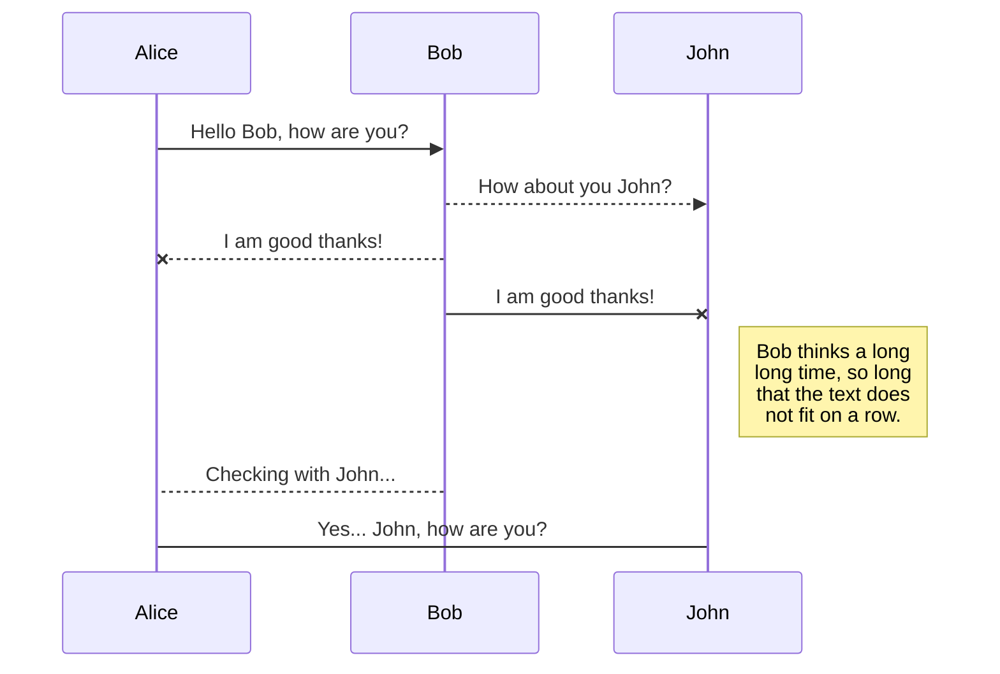

Hi! I'm your first ~~Markdown~~ file in **StackEdit**. If you want to learn about StackEdit, you can read me. If you want to play with Markdown, you can edit me. Once you have finished with me, you can create new files by opening the **file explorer** on the left corner of the navigation bar.

# Files
StackEdit stores your files in your browser, which means all your files are automatically saved locally and are accessible **offline!**

## Create files and folders
The file explorer is accessible using the button in left corner of the navigation bar. You can create a new file by clicking the **New file** button in the file explorer. You can also create folders by clicking the **New folder** button.

## SmartyPants
SmartyPants converts ASCII punctuation characters into "smart" typographic punctuation HTML entities. For example:

|                |ASCII                          |HTML                         |
|----------------|-------------------------------|-----------------------------|
|Single backticks|`'Isn't this fun?'`            |'Isn't this fun?'            |
|Quotes          |`"Isn't this fun?"`            |"Isn't this fun?"            |
|Dashes          |`-- is en-dash, --- is em-dash`|-- is en-dash, --- is em-dash|

## KaTeX
You can render LaTeX mathematical expressions using [KaTeX](https://khan.github.io/KaTeX/):

The *Gamma function* satisfying $\Gamma(n) = (n-1)!\quad\forall n\in\mathbb N$ is via the Euler integral

$$
\Gamma(z) = \int_0^\infty t^{z-1}e^{-t}dt\,.
$$

> You can find more information about **LaTeX** mathematical expressions [here](http://meta.math.stackexchange.com/questions/5020/mathjax-basic-tutorial-and-quick-reference).

## UML diagrams
You can render UML diagrams using [Mermaid](https://mermaidjs.github.io/). For example, this will produce a sequence diagram:



And this will produce a flow chart:

```mermaid
graph LR
A[Square Rect] -- Link text --> B((Circle))
A --> C(Round Rect)
B --> D{Rhombus}
C --> D

# Zuhayr Arif
### Data Science Enthusiast | Universiti Teknologi Malaysia

👋 Hello there! I'm Zuhayr Arif, a passionate data science student at Universiti Teknologi Malaysia, where I'm on a journey to explore the vast world of data and turn it into actionable insights. I believe in the power of data to drive informed decision-making and innovation.

## About Me
- 🔬 Aspiring Data Scientist with a strong foundation in data analysis, machine learning, and statistical modeling.
- 🌱 Currently pursuing a degree in Data Science at Universiti Teknologi Malaysia.
- 📊 Experienced in handling diverse datasets, cleaning and transforming data, and developing predictive models.
- 💻 Proficient in programming languages such as Python and R.
- 🧩 Enthusiastic problem solver with a knack for breaking down complex issues into manageable tasks.

## Connect with Me
- 🌐 [LinkedIn](https://www.linkedin.com/in/zuhayraz/) - Let's connect and discuss all things data!
- 📧 Email: [your@email.com](mailto:your@email.com)

## My Projects
- [Project 1: Predictive Analysis of X](link_to_project_1)
- [Project 2: Data Visualization for Y](link_to_project_2)
- [Project 3: Machine Learning in Z](link_to_project_3)

## Skills
- **Languages:** Python, R
- **Data Analysis:** Pandas, NumPy
- **Machine Learning:** Scikit-Learn, TensorFlow
- **Data Visualization:** Matplotlib, Seaborn
- **Version Control:** Git, GitHub

## Interests
- 📈 Data Analysis
- 🤖 Machine Learning
- 📊 Data Visualization
- 📚 Continuous Learning

I'm always open to collaboration and learning from others. Feel free to reach out, connect, or explore my projects. Let's harness the power of data together and make the world a more data-driven place!
