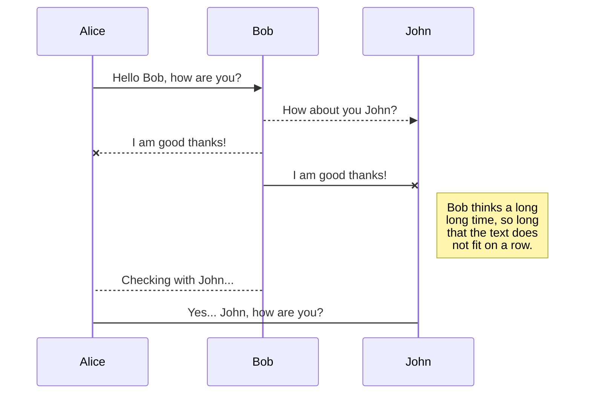
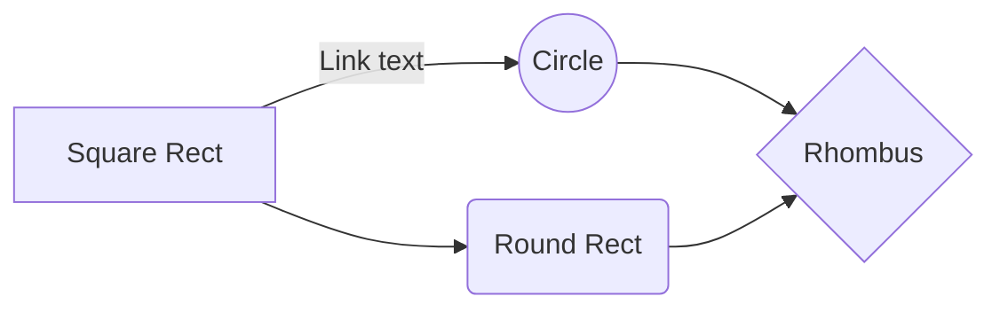

## KaTeX

You can render LaTeX mathematical expressions using [KaTeX](https://khan.github.io/KaTeX/):

The *Gamma function* satisfying $\Gamma(n) = (n-1)!\quad\forall n\in\mathbb N$ is via the Euler integral

$$
\Gamma(z) = \int_0^\infty t^{z-1}e^{-t}dt\,.
$$

> You can find more information about **LaTeX** mathematical expressions [here](http://meta.math.stackexchange.com/questions/5020/mathjax-basic-tutorial-and-quick-reference).

## UML diagrams

You can render UML diagrams using [Mermaid](https://mermaidjs.github.io/). For example, this will produce a sequence diagram:

And this will produce a flow chart:

KaTeX
You can render LaTeX mathematical expressions using KaTeX:

The Gamma function satisfying 
Γ
(
�
)
=
(
�
−
1
)
!
∀
�
∈
�
Γ(n)=(n−1)!∀n∈N is via the Euler integral

Γ
(
�
)
=
∫
0
∞
�
�
−
1
�
−
�
�
�
.
Γ(z)=∫ 
0
∞
​
 t 
z−1
 e 
−t
 dt.

You can find more information about LaTeX mathematical expressions here.

UML diagrams
You can render UML diagrams using Mermaid. For example, this will produce a sequence diagram:

Alice
Bob
John
Hello Bob, how are you?
How about you John?
I am good thanks!
I am good thanks!
Bob thinks a long
long time, so long
that the text does
not fit on a row.
Checking with John...
Yes... John, how are you?
Alice
Bob
John
And this will produce a flow chart:

Link text
Square Rect
Circle
Round Rect
Rhombus
