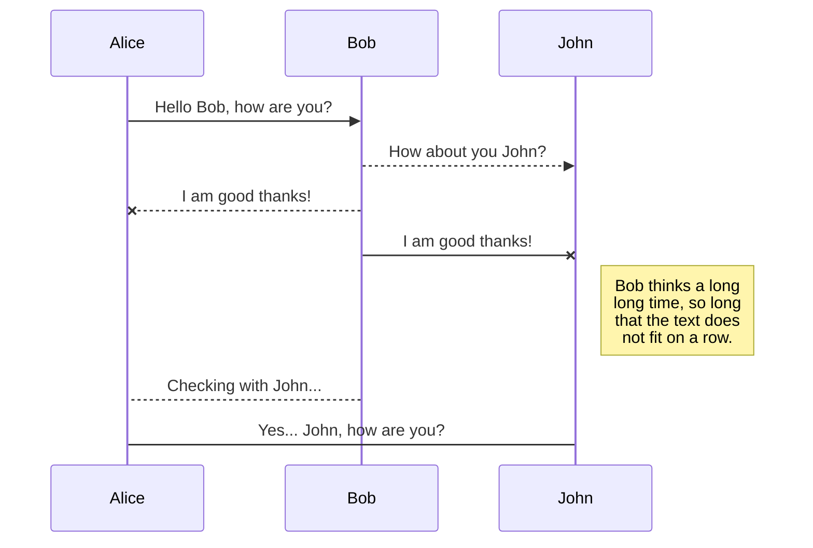
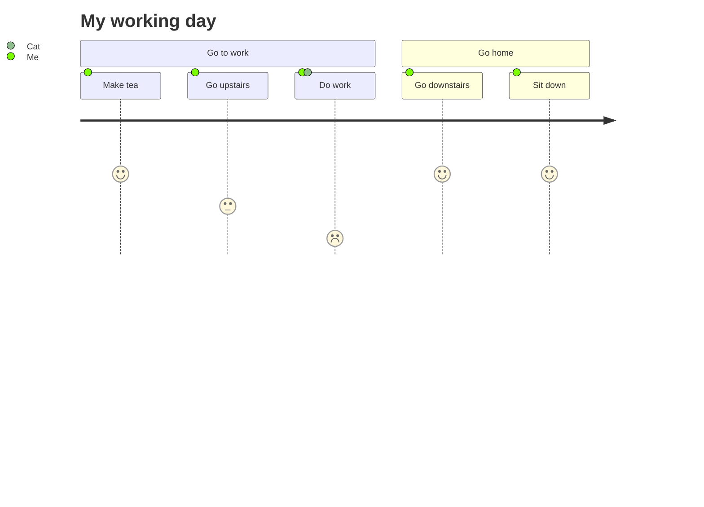

Hello, I'm Grace, a newbie in ***Python***. I'm using https://stackedit.io/app# and https://mermaid.js.org/syntax/userJourney.html to execute below functions.

The *Gamma function* satisfying $\Gamma(n) = (n-1)!\quad\forall n\in\mathbb N$ is via the Euler integral

$$
\Gamma(z) = \int_0^\infty t^{z-1}e^{-t}dt\,.
$$

