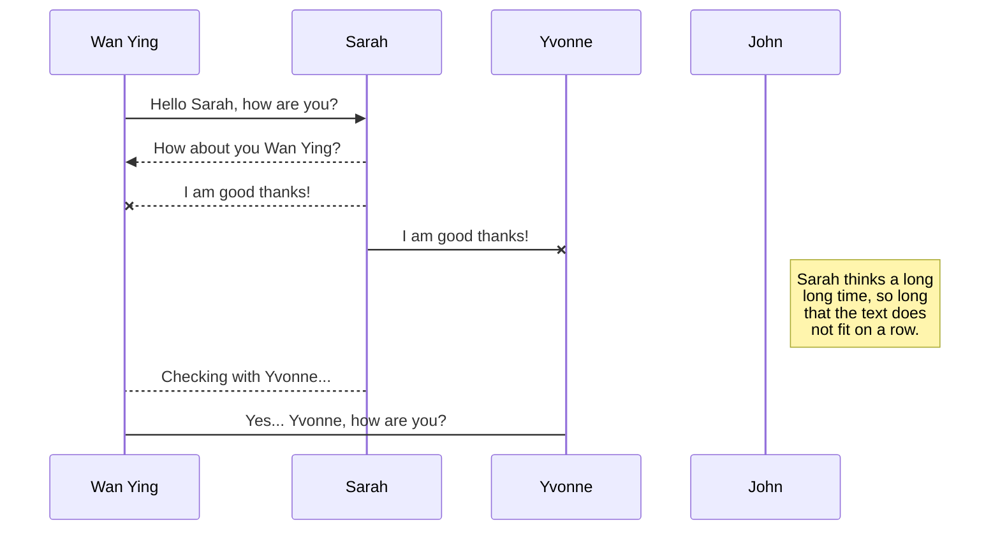
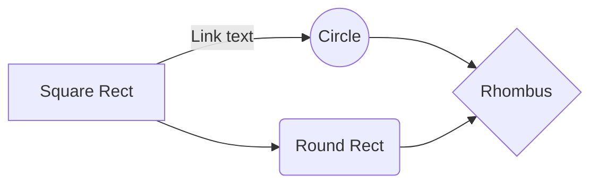

# Hello World
## Hello World
### Hello World
#### Hello World

StackEdit stores your files in your browser, which means all your files are automatically saved locally and are accessible **offline!**

There are two types of synchronization and they can complement each other:

- The workspace synchronization will sync all your files, folders and settings automatically. This will allow you to fetch your workspace on any other device.
	> To start syncing your workspace, just sign in with Google in the menu.

- The file synchronization will keep one file of the workspace synced with one or multiple files in **Google Drive**, **Dropbox** or **GitHub**.
	> Before starting to sync files, you must link an account in the **Synchronize** sub-menu.

 ## SmartyPants

SmartyPants converts ASCII punctuation characters into "smart" typographic punctuation HTML entities. For example:

|                |ASCII                          |HTML                         |
|----------------|-------------------------------|-----------------------------|
|Single backticks|`'Isn't this fun?'`            |'Isn't this fun?'            |
|Quotes          |`"Isn't this fun?"`            |"Isn't this fun?"            |
|Dashes          |`-- is en-dash, --- is em-dash`|-- is en-dash, --- is em-dash|

## KaTeX

You can render LaTeX mathematical expressions using [KaTeX](https://khan.github.io/KaTeX/):

The *Gamma function* satisfying $\Gamma(n) = (n-1)!\quad\forall n\in\mathbb N$ is via the Euler integral

$$
\Gamma(z) = \int_0^\infty t^{z-1}e^{-t}dt\,.
$$

> You can find more information about **LaTeX** mathematical expressions [here](http://meta.math.stackexchange.com/questions/5020/mathjax-basic-tutorial-and-quick-reference).

## UML diagrams

You can render UML diagrams using [Mermaid](https://mermaidjs.github.io/). For example, this will produce a sequence diagram:

And this will produce a flow chart:

# Ang Yi Qin: Unraveling the Enigma

Meet **Ang Yi Qin** - a name that exudes mystery and adventure. In this repository, we embark on a journey to explore the life and experiences of Ang Yi Qin. From the ordinary to the extraordinary, be prepared to be captivated by this unique world.

## Table of Contents

- [Introduction](#ang-yi-qin-unraveling-the-enigma)
- [About Ang Yi Qin](#about-ang-yi-qin)
- [Personal Journey](#personal-journey)
- [Projects and Achievements](#projects-and-achievements)
- [Get in Touch](#get-in-touch)

Stay tuned for an intriguing journey through the life of Ang Yi Qin!

