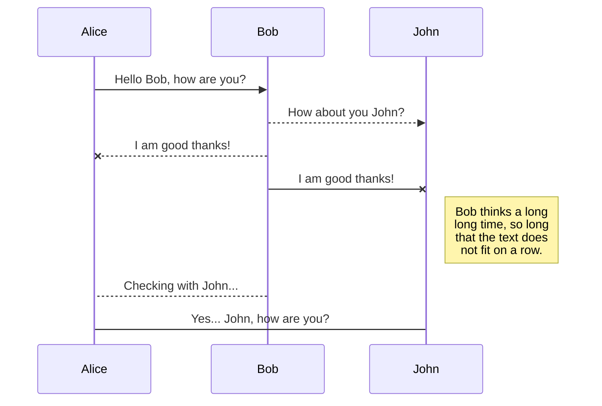
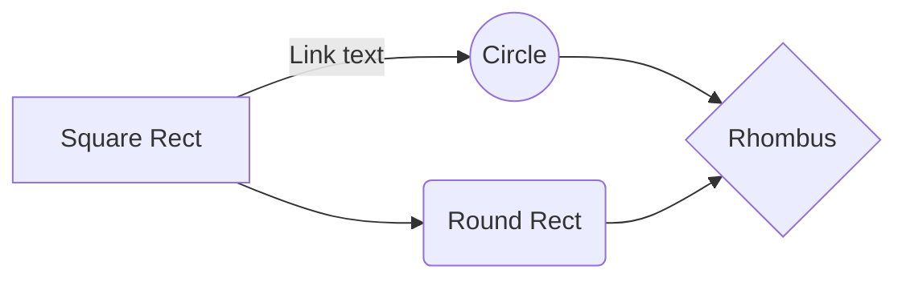

# hello world
## hello world
### hello world
#### hello world

# Welcome to StackEdit!

Hi! I'm your first Markdown file in **StackEdit**. If you want to learn about StackEdit, you can read me. If you want to play with Markdown, you can edit me. Once you have finished with me, you can create new files by opening the **file explorer** on the left corner of the navigation bar.

# Files

StackEdit stores your files in your browser, which means all your files are automatically saved locally and are accessible **offline!**

## Create files and folders

The file explorer is accessible using the button in left corner of the navigation bar. You can create a new file by clicking the **New file** button in the file explorer. You can also create folders by clicking the **New folder** button.

## Switch to another file

All your files and folders are presented as a tree in the file explorer. You can switch from one to another by clicking a file in the tree.

## Rename a file

You can rename the current file by clicking the file name in the navigation bar or by clicking the **Rename** button in the file explorer.

## Delete a file

You can delete the current file by clicking the **Remove** button in the file explorer. The file will be moved into the **Trash** folder and automatically deleted after 7 days of inactivity.

## KaTeX

You can render LaTeX mathematical expressions using [KaTeX](https://khan.github.io/KaTeX/):

The *Gamma function* satisfying $\Gamma(n) = (n-1)!\quad\forall n\in\mathbb N$ is via the Euler integral

$$
\Gamma(z) = \int_0^\infty t^{z-1}e^{-t}dt\,.
$$

> You can find more information about **LaTeX** mathematical expressions [here](http://meta.math.stackexchange.com/questions/5020/mathjax-basic-tutorial-and-quick-reference).

## UML diagrams

You can render UML diagrams using [Mermaid](https://mermaidjs.github.io/). For example, this will produce a sequence diagram:

And this will produce a flow chart:

**Data Science** is an interdisciplinary field that uses scientific methods, processes, algorithms, and systems to extract knowledge and insights from structured and unstructured data. It combines various techniques from statistics, computer science, and domain expertise to analyze and interpret complex data.

Here are some key terms in **bold** with suitable emojis:

- **Data** 📊: Raw facts and figures that are collected for analysis.
- **Statistics** 📈: The study of data collection, analysis, interpretation, presentation, and organization.
- **Machine Learning** 🤖: A subset of artificial intelligence that involves training algorithms to make predictions or decisions based on data.
- **Big Data** 🗄️: Extremely large datasets that may be analyzed computationally to reveal patterns, trends, and associations.
- **Data Mining** ⛏️: The process of discovering patterns and knowledge from large amounts of data.
- **Data Visualization** 📉: The graphical representation of data to help understand trends, outliers, and patterns.
- **Algorithm** 🧩: A set of rules or steps used to solve a problem or perform a task.
- **Artificial Intelligence (AI)** 🧠: The simulation of human intelligence in machines that are programmed to think and learn.
- **Predictive Analytics** 🔮: Techniques that use historical data to predict future outcomes.

