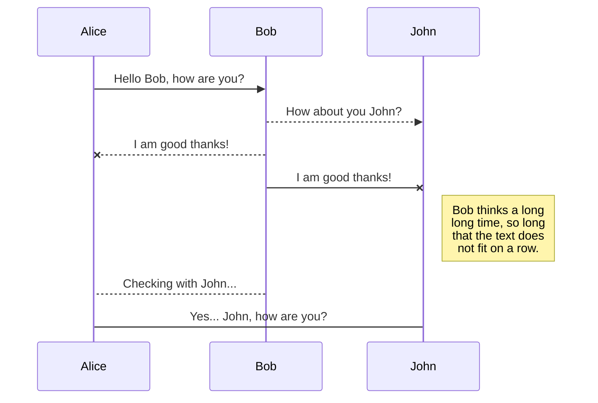
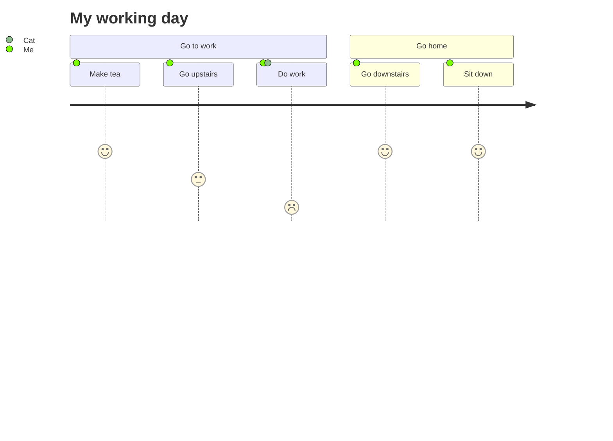

My name is [YAP QI YUAN](https://www.linkedin.com/in/yap-qi-yuan-35a7351a3/). I am a Master Student (**Data Science**) at [UTM](https://www.utm.my/).
Thank you !

| Title                                                | Publication      | Date       |
|------------------------------------------------------|------------------|------------|
| "The Role of Data Science in Healthcare"              | Health IT Analytics | March 2024 |
| "Data Science Trends to Watch in 2024"                | Towards Data Science | February 2024 |
| "The Future of Data Science: Emerging Technologies"   | Data Science Central | January 2024 |
| "Data Science for Social Good: Impact and Challenges" | KDnuggets        | December 2023 |
| "Ethical Considerations in Data Science"              | Analytics Vidhya | November 2023 |

Certainly! Here are some recent articles related to **Data Science**:

| **Article Title**                                                                                   | **Publication Date** |
|-----------------------------------------------------------------------------------------------------|-----------------------|
| "The ‘average’ revolutionized scientific research, but overreliance on it has led to discrimination and injury" | March 1, 2024         |
| "Data Science Changes, Trends, and Examples"                                                        | July 21, 2020         |
| "Five Key Trends in AI and Data Science for 2024"                                                   | MIT Sloan Management Review |

Feel free to explore these articles to stay informed about the latest developments in the field of data science! 📊🔍.

Source: Conversation with Bing, 02/04/2024
(1) Data Science Articles | DiscoverDataScience.org. https://www.discoverdatascience.org/articles/.
(2) Data science News, Research and Analysis - The Conversation. https://theconversation.com/us/topics/data-science-18784.
(3) Data Digest: Data Science Changes, Trends, and Examples. https://tdwi.org/articles/2020/07/21/adv-all-data-science-disruption-0721.aspx.
(4) data science Latest Research Papers | ScienceGate. https://www.sciencegate.app/keyword/40688.
(5) Five Key Trends in AI and Data Science for 2024 - MIT Sloan Management .... https://sloanreview.mit.edu/article/five-key-trends-in-ai-and-data-science-for-2024/.
(6) en.wikipedia.org. https://en.wikipedia.org/wiki/Data_science.
