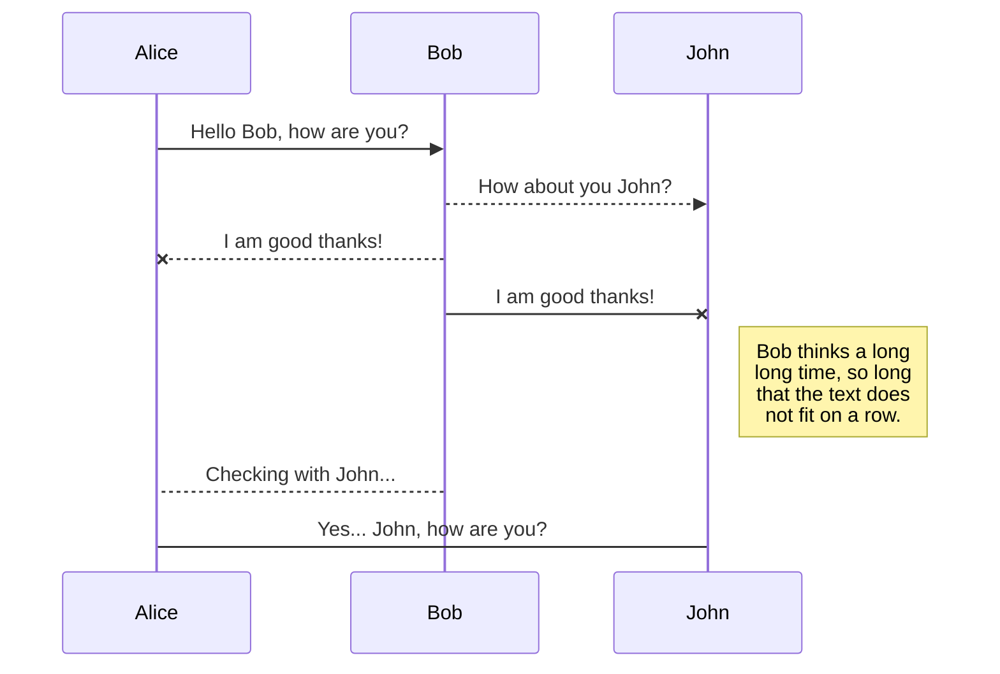
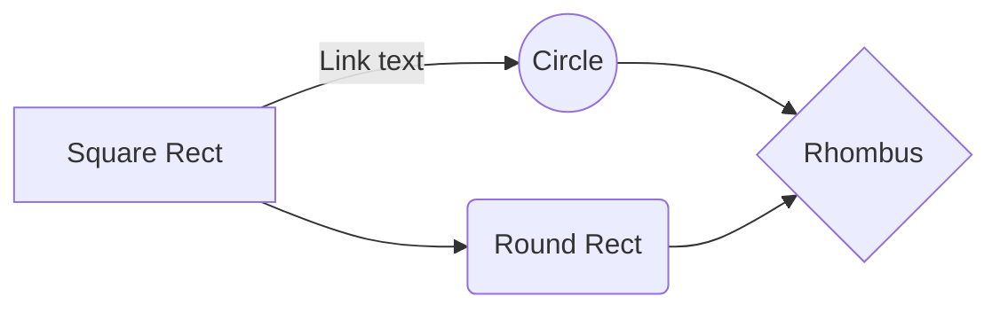

# about me
My name is **Raian Hafiz NIloy**. I am a data science student
## KaTeX

You can render LaTeX mathematical expressions using [KaTeX](https://khan.github.io/KaTeX/):

The *Gamma function* satisfying $\Gamma(n) = (n-1)!\quad\forall n\in\mathbb N$ is via the Euler integral

$$
\Gamma(z) = \int_0^\infty t^{z-1}e^{-t}dt\,.
$$

> You can find more information about **LaTeX** mathematical expressions [here](http://meta.math.stackexchange.com/questions/5020/mathjax-basic-tutorial-and-quick-reference).
You can render UML diagrams using [Mermaid](https://mermaidjs.github.io/). For example, this will produce a sequence diagram:

And this will produce a flow chart:

Data Science is an interdisciplinary field that uses scientific methods 🔬, processes 📊, algorithms 💻, and systems 🖥️ to extract knowledge and insights from structured and unstructured data. It combines aspects of statistics 📈, computer science 💾, and domain knowledge 🌐 to analyze and interpret complex data sets.

Key components include:

Data Collection 🗂️: Gathering data from various sources.

Data Cleaning 🧹: Removing noise and inconsistencies to improve data quality.

Data Exploration 🔎: Analyzing data to discover patterns and relationships.

Data Modeling 📐: Using algorithms and statistical models to make predictions or classifications.

Data Visualization 📊: Creating visual representations to communicate findings clearly.

Data science is vital in fields like healthcare 🏥, finance 💰, marketing 📈, and technology 🧑‍💻, driving decision-making and innovation.
