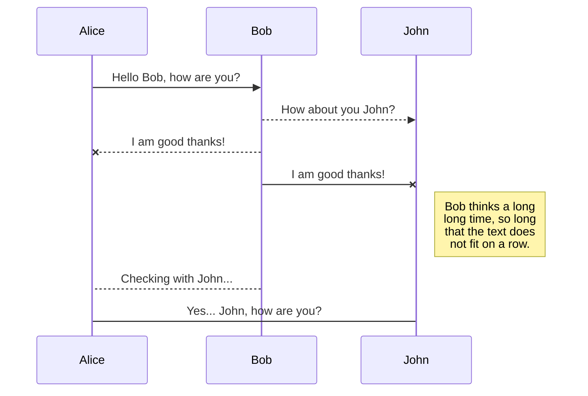

## KaTeX

You can render LaTeX mathematical expressions using [KaTeX](https## SmartyPants
SmartyPants converts ASCII punctuation characters into "smart" typographic punctuation HTML entities. For example:
|                |ASCII                          |HTML                         ||----------------|:-------------------------------:|-----------------------------:||Single backticks|`'Isn't this fun?'`            |'Isn't this fun?'            ||Quotes          |`"Isn't this fun?"`            |"Isn't this fun?"            ||Dashes          |`-- is en-dash, --- is em-dash`|-- is en-dash, --- is em-dash|://khan.github.io/KaTeX/):

The *Gamma function* satisfying $\Gamma(n) = (n-1)!\quad\forall n\in\mathbb N$ is via the Euler integral

$$
\Gamma(z) = \int_0^\infty t^{z-1}e^{-t}dt\,.
$$

> You can find more information about **LaTeX** mathematical expressions [here](http://meta.math.stackexchange.com/questions/5020/mathjax-basic-tutorial-and-quick-reference).

## UML diagrams

You can render UML diagrams using [Mermaid](https://mermaidjs.github.io/). For example, this will produce a sequence diagram:



And this will produce a flow chart:

```mermaid
graph LR
A[Square Rect] -- Link text --> B((Circle))
A --> C(Round Rect)
B --> D{Rhombus}
C --> D

**Data Science** is an interdisciplinary field that uses **scientific methods**, **processes**, **algorithms**, and **systems** to extract **knowledge** and **insights** from **structured** and **unstructured data**. 📊🔍

### Key Components of Data Science

1. **Data Collection**: Gathering data from various sources, including databases, web scraping, and sensors. 📥
2. **Data Cleaning**: Ensuring data quality by handling missing values, outliers, and inconsistencies. 🧹
3. **Data Analysis**: Applying statistical techniques to understand data patterns and relationships. 📈
4. **Machine Learning**: Using algorithms to build predictive models and automate decision-making. 🤖
5. **Data Visualization**: Creating visual representations of data to communicate findings effectively. 📊
6. **Big Data Technologies**: Utilizing tools like Hadoop and Spark to process large datasets. 💾

### Applications of Data Science

- **Healthcare**: Predicting disease outbreaks and personalizing treatment plans. 🏥
- **Finance**: Fraud detection and risk management. 💰
- **Marketing**: Customer segmentation and targeted advertising. 📢
- **Retail**: Inventory management and sales forecasting. 🛒

Data Science is a rapidly evolving field that combines **domain expertise**, **programming skills**, and **knowledge of mathematics and statistics** to solve complex problems and drive innovation. 🌟

Feel free to ask if you need more details on any specific aspect!
