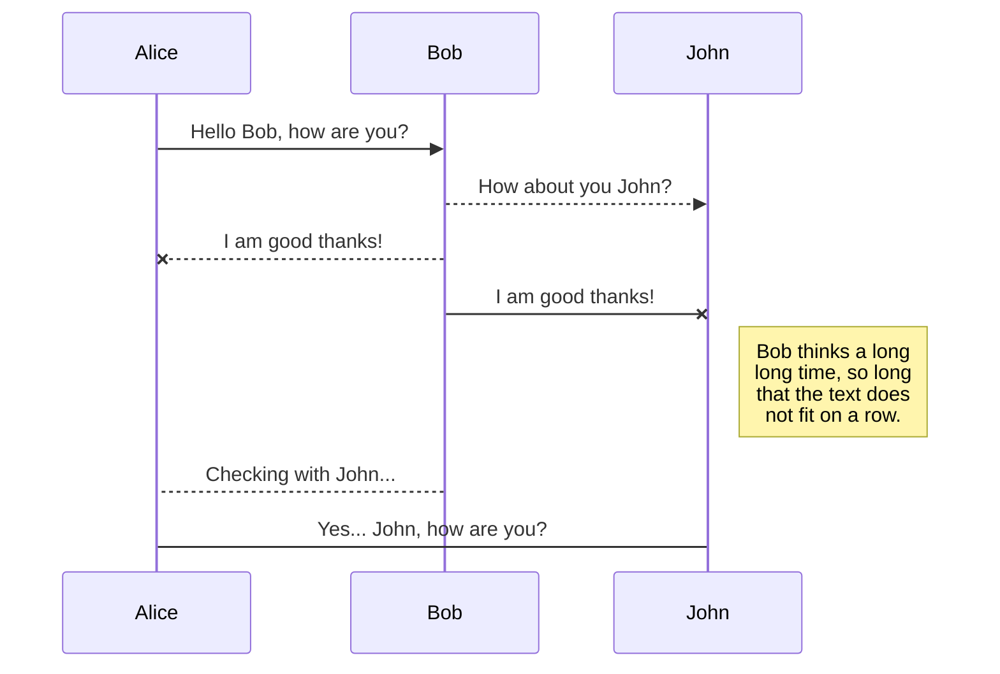
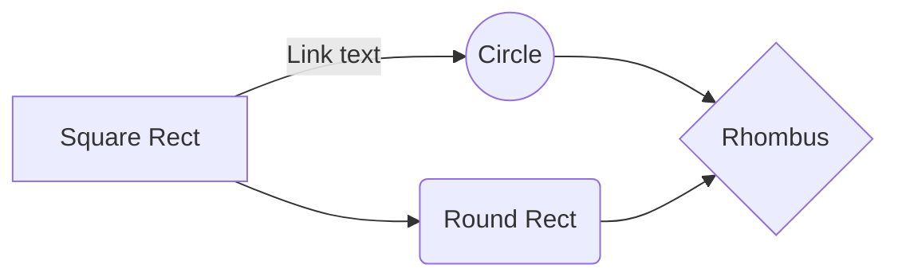

# hello world
## hello world
### hello world
#### hello world

# Welcome to StackEdit!

Hi! I'm your first Markdown file in **StackEdit**. If you want to learn about StackEdit, you can read me. If you want to play with Markdown, you can edit me. Once you have finished with me, you can create new files by opening the **file explorer** on the left corner of the navigation bar.

# Files

StackEdit stores your files in your browser, which means all your files are automatically saved locally and are accessible **offline!**

## Create files and folders

The file explorer is accessible using the button in left corner of the navigation bar. You can create a new file by clicking the **New file** button in the file explorer. You can also create folders by clicking the **New folder** button.

Data science is all about extracting insights from data using various tools, techniques, and algorithms. 📊🔍 It’s like being a detective, but instead of clues, you’ve got heaps of data. It combines statistics, computer science, and domain knowledge to analyze and interpret complex data sets. 🧑‍💻 Imagine diving into oceans of data to find patterns, predict outcomes, and help make data-driven decisions. In a way, data scientists are the modern-day alchemists—turning raw data into gold. 🔬💡

What part of data science piques your curiosity the most?

Here’s a neat table to further break down the different aspects of data science:

Aspect	Description	Emoji
Data Collection	Gathering data from various sources such as surveys, sensors, and databases.	📦
Data Cleaning	Removing inconsistencies and inaccuracies in data to ensure quality.	🧼
Data Exploration	Analyzing data patterns and trends to extract insights.	🔍
Data Modeling	Using algorithms and statistical methods to build predictive models.	📈
Data Visualization	Creating graphical representations of data to make it understandable.	📊
Deployment & Monitoring	Implementing models into production systems and continuously monitoring their performance.	🚀
That paints a clearer picture! Want to dive deeper into any specific aspect?

You
add related table
Copilot
Here’s a neat table to further break down the different aspects of data science:

Aspect	Description	Emoji
Data Collection	Gathering data from various sources such as surveys, sensors, and databases.	📦
Data Cleaning	Removing inconsistencies and inaccuracies in data to ensure quality.	🧼
Data Exploration	Analyzing data patterns and trends to extract insights.	🔍
Data Modeling	Using algorithms and statistical methods to build predictive models.	📈
Data Visualization	Creating graphical representations of data to make it understandable.	📊
Deployment & Monitoring	Implementing models into production systems and continuously monitoring their performance.	🚀
That paints a clearer picture! Want to dive deeper into any specific aspect?

## SmartyPants

SmartyPants converts ASCII punctuation characters into "smart" typographic punctuation HTML entities. For example:

|                |ASCII                          |HTML                         |
|----------------|-------------------------------|-----------------------------|
|Single backticks|`'Isn't this fun?'`            |'Isn't this fun?'            |
|Quotes          |`"Isn't this fun?"`            |"Isn't this fun?"            |
|Dashes          |`-- is en-dash, --- is em-dash`|-- is en-dash, --- is em-dash|

## KaTeX

You can render LaTeX mathematical expressions using [KaTeX](https://khan.github.io/KaTeX/):

The *Gamma function* satisfying $\Gamma(n) = (n-1)!\quad\forall n\in\mathbb N$ is via the Euler integral

$$
\Gamma(z) = \int_0^\infty t^{z-1}e^{-t}dt\,.
$$

> You can find more information about **LaTeX** mathematical expressions [here](http://meta.math.stackexchange.com/questions/5020/mathjax-basic-tutorial-and-quick-reference).

## UML diagrams

You can render UML diagrams using [Mermaid](https://mermaidjs.github.io/). For example, this will produce a sequence diagram:

And this will produce a flow chart:

