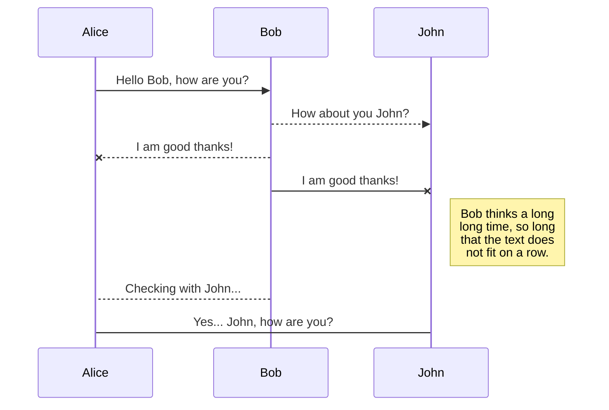

# Hello world
## Hello world
### Hello world
#### Hello world
abc

| Name           | Address        |  Salary  |
|----------------|:----------------:|--------------:|
| Example Name 1 | Example Address 1 | 50000000000
| Example Name 2 | Example Address 2 abvc 123  | 3000


## KaTeX

You can render LaTeX mathematical expressions using [KaTeX](https://khan.github.io/KaTeX/):

The *Gamma function* satisfying $\Gamma(n) = (n-1)!\quad\forall n\in\mathbb N$ is via the Euler integral


## UML diagrams

You can render UML diagrams using [Mermaid](https://mermaidjs.github.io/). For example, this will produce a sequence diagram:



And this will produce a flow chart:

```mermaid
graph LR
A[Square Rect] -- Link text --> B((Circle))
A --> C(Round Rect)
B --> D{Rhombus}
C --> D
