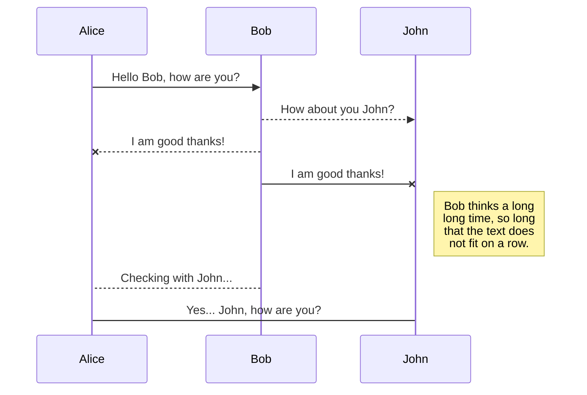

# Hello World!
## Hello World!
### Hello World!
#### Hello World!

# Welcome to StackEdit!

Hi! I'm your first Markdown file in **StackEdit**. If you want to learn about StackEdit, you can read me. If you want to play with Markdown, you can edit me. Once you have finished with me, you can create new files by opening the **file explorer** on the left corner of the navigation bar.

## KaTeX

You can render LaTeX mathematical expressions using [KaTeX](https://khan.github.io/KaTeX/):

The *Gamma function* satisfying $\Gamma(n) = (n-1)!\quad\forall n\in\mathbb N$ is via the Euler integral

$$
\Gamma(z) = \int_0^\infty t^{z-1}e^{-t}dt\,.
$$

## UML diagrams

You can render UML diagrams using [Mermaid](https://mermaidjs.github.io/). For example, this will produce a sequence diagram:

## Demonstration of AI (using a description of Data Science)

> The AI used is microsoft copilot.

Sure! Here’s a brief description of data science:

Data Science is an interdisciplinary field that uses scientific methods, processes, algorithms, and systems to extract knowledge and insights from structured and unstructured data. It combines aspects of statistics, computer science, and domain expertise to analyze and interpret complex data.

Key Components of Data Science:
-Data Collection 📊: Gathering data from various sources.
-Data Cleaning 🧹: Removing errors and inconsistencies to ensure data quality.
-Data Analysis 🔍: Using statistical methods to explore and understand data patterns.
-Machine Learning 🤖: Building models that can learn from data and make predictions.
-Data Visualization 📈: Creating visual representations of data to communicate findings effectively.
-Big Data 💾: Handling and processing large volumes of data that traditional methods can’t manage.
Data science is crucial in today’s world as it helps organizations make data-driven decisions, improve efficiency, and gain a competitive edge. 🌟

Feel free to ask if you want to dive deeper into any specific area!
