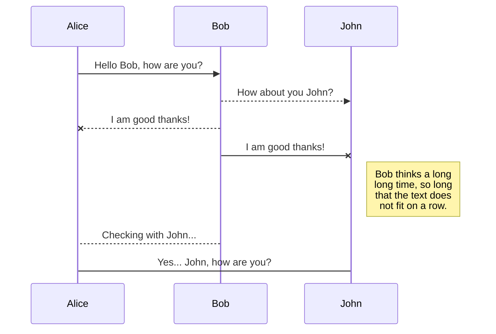
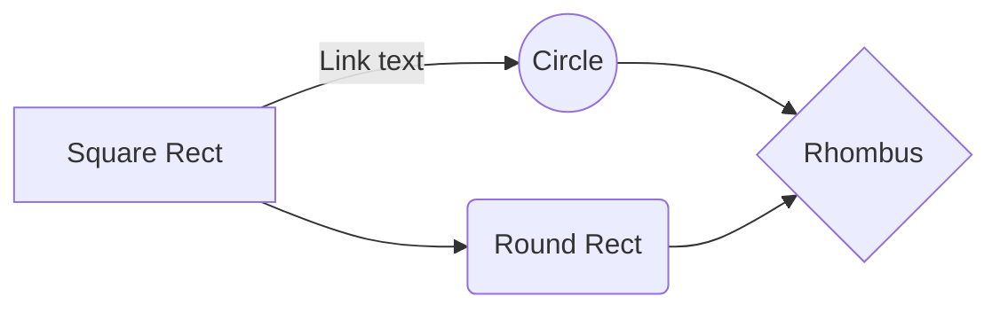

# Welcome to My Profile!

Hi! I'm Rizki Syaputra, Currently as **A Master Student at University Technology** in Malaysia. 

Data Science is an interdisciplinary field that uses scientific methods, algorithms, and systems to extract knowledge and insights from structured and unstructured data. 📊💡

Data Collection: Gathering data from various sources, both internal and external. 📚

Data Cleaning: Ensuring data quality by handling missing values, outliers, and inconsistencies. 🧹

Data Analysis: Applying statistical and computational techniques to analyze data patterns and trends. 🔍

Data Visualization: Presenting data in visual formats like charts and graphs to communicate findings effectively. 📈

Machine Learning: Using algorithms to build models that can predict future trends based on past data. 🤖

Data Science plays a critical role in decision-making processes, transforming raw data into valuable insights. 🌟

Feel a little more knowledgeable about it now?

| **Metric**          | **Description**                           | **Example**                  |
|---------------------|-------------------------------------------|------------------------------|
| **Accuracy**        | Proportion of correct predictions         | 0.95                         |
| **Precision**       | Proportion of true positives among predicted positives | 0.92                         |
| **Recall**          | Proportion of true positives among actual positives | 0.88                         |
| **F1 Score**        | Harmonic mean of precision and recall     | 0.90                         |
| **ROC AUC**         | Area under the receiver operating characteristic curve | 0.96                         |
| **Confusion Matrix**| Table showing true vs. predicted values   | [[50, 10], [5, 100]]         |
| **Support**         | Number of actual occurrences of each class | [60, 105]                    |

## KaTeX

You can render LaTeX mathematical expressions using [KaTeX](https://khan.github.io/KaTeX/):

The *Gamma function* satisfying $\Gamma(n) = (n-1)!\quad\forall n\in\mathbb N$ is via the Euler integral

$$
\Gamma(z) = \int_0^\infty t^{z-1}e^{-t}dt\,.
$$

> You can find more information about **LaTeX** mathematical expressions [here](http://meta.math.stackexchange.com/questions/5020/mathjax-basic-tutorial-and-quick-reference).

## UML diagrams

You can render UML diagrams using [Mermaid](https://mermaidjs.github.io/). For example, this will produce a sequence diagram:

And this will produce a flow chart:

