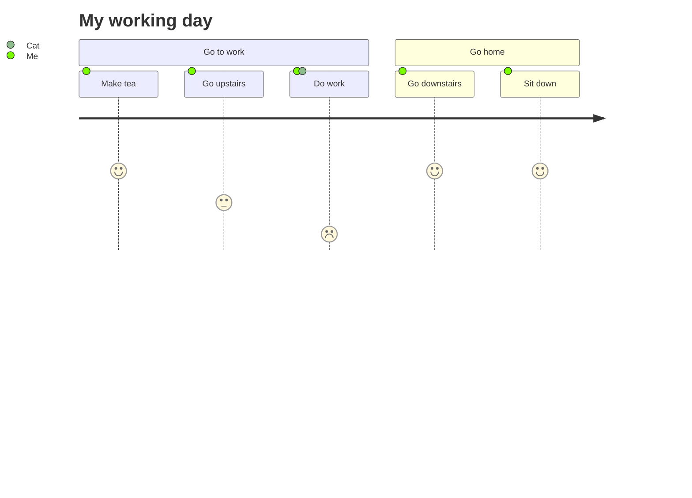

The *Gamma function* satisfying $\Gamma(n) = (n-1)!\quad\forall n\in\mathbb N$ is via the Euler integral

$$
\Gamma(z) = \int_0^\infty t^{z-1}e^{-t}dt\,.
$$

# Chatagpt Prompt

# Data Science

Data science is an interdisciplinary field that utilizes scientific methods, algorithms, processes, and systems to extract insights and knowledge from structured and unstructured data. It combines various domains including statistics, mathematics, computer science, and domain expertise to analyze and interpret complex data sets.

## Key Components of Data Science:

### 1. Data Collection:
   - Gathering raw data from various sources such as databases, APIs, sensors, or files.

### 2. Data Cleaning and Preprocessing:
   - Handling missing values, removing duplicates, and transforming data into a usable format.

### 3. Exploratory Data Analysis (EDA):
   - Analyzing and visualizing data to discover patterns, trends, and relationships.

### 4. Feature Engineering:
   - Selecting, extracting, or transforming features to improve model performance.

### 5. Modeling:
   - Building predictive or descriptive models using machine learning, statistical techniques, or other algorithms.

### 6. Evaluation and Validation:
   - Assessing model performance using metrics and validating the results.

### 7. Deployment:
   - Integrating models into production systems for real-world applications.

## Applications of Data Science:

- **Business Analytics**: Making data-driven decisions to improve business operations and strategies.
- **Healthcare**: Predictive modeling for disease diagnosis, patient care optimization, and drug discovery.
- **Finance**: Fraud detection, risk management, algorithmic trading, and customer segmentation.
- **Marketing**: Targeted advertising, customer segmentation, and personalized recommendations.
- **Social Sciences**: Analyzing social media data for sentiment analysis, opinion mining, and trend prediction.

## Tools and Technologies:

- **Programming Languages**: Python, R, SQL.
- **Libraries and Frameworks**: Pandas, NumPy, SciPy, Scikit-learn, TensorFlow, PyTorch.
- **Visualization Tools**: Matplotlib, Seaborn, Plotly.
- **Big Data Technologies**: Hadoop, Spark, Kafka.
- **Data Management Tools**: MySQL, PostgreSQL, MongoDB.
- **Cloud Platforms**: AWS, Azure, Google Cloud Platform.

Data science plays a crucial role in leveraging data to gain actionable insights and drive decision-making across various industries.
