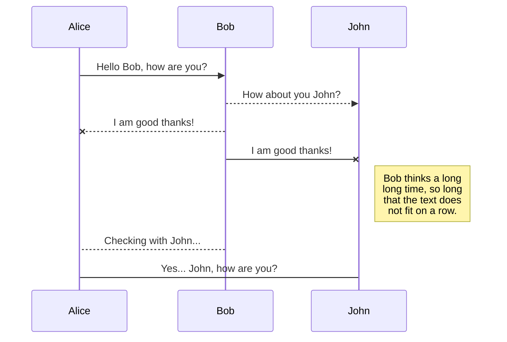
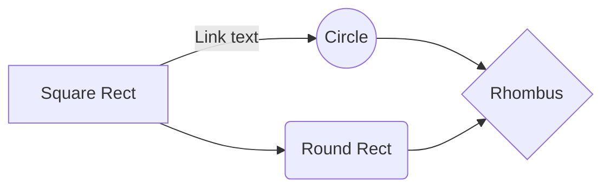

# Hello World!
## Hello World!
### Hello World!
#### Hello World!

abc

| Name      | Address              | Role         |  Salary|
|-----------|----------------------|:--------------:|---------:|
| Tong920   | github.com/tong920   | Developer    | 500000  |
| John Doeghnb  | github.com/johndoe   | Collaborator | 20000  |
| Jane Devevep  | github.com/janedev   | Designer     | 3000   |

# **Hello World!**

## KaTeX

You can render LaTeX mathematical expressions using [KaTeX](https://khan.github.io/KaTeX/):

The *Gamma function* satisfying $\Gamma(n) = (n-1)!\quad\forall n\in\mathbb N$ is via the Euler integral

## UML diagrams

You can render UML diagrams using [Mermaid](https://mermaidjs.github.io/). For example, this will produce a sequence diagram:

And this will produce a flow chart:

