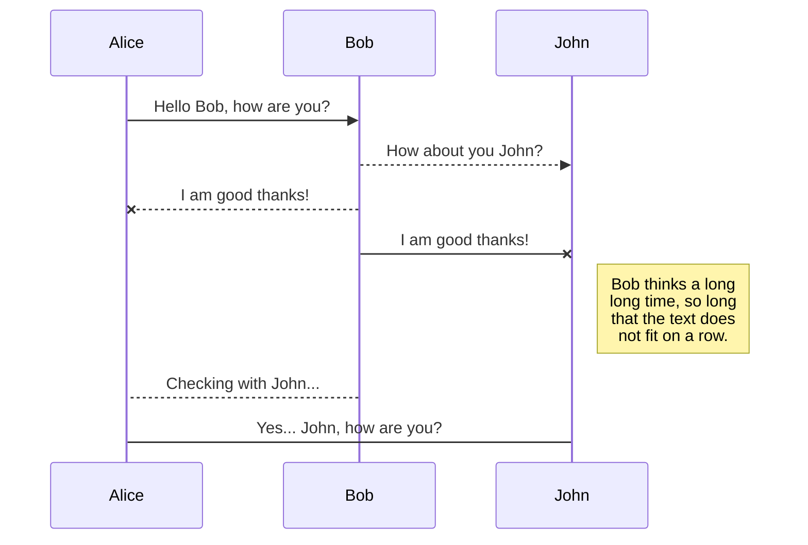

My name is **Gui Yu Xuan**. I am a student who studying *Master in Data Science* at UTM. 

## KaTeX

You can render LaTeX mathematical expressions using [KaTeX](https://khan.github.io/KaTeX/):

The *Gamma function* satisfying $\Gamma(n) = (n-1)!\quad\forall n\in\mathbb N$ is via the Euler integral

$$
\Gamma(z) = \int_0^\infty t^{z-1}e^{-t}dt\,.
$$

> You can find more information about **LaTeX** mathematical expressions [here](http://meta.math.stackexchange.com/questions/5020/mathjax-basic-tutorial-and-quick-reference).


## UML diagrams

You can render UML diagrams using [Mermaid](https://mermaidjs.github.io/). For example, this will produce a sequence diagram:



And this will produce a flow chart:

```

**Data Science** is an interdisciplinary field that uses **scientific methods**, **processes**, **algorithms**, and **systems** to extract **knowledge** and **insights** from **structured** and **unstructured data**. 📊🔍

### Key Components of Data Science

1. **Data Collection**: Gathering data from various sources, such as databases, web scraping, and sensors. 🗂️
2. **Data Cleaning**: Ensuring the data is accurate and usable by removing errors and inconsistencies. 🧹
3. **Data Analysis**: Applying statistical and computational techniques to understand patterns and trends. 📈
4. **Machine Learning**: Using algorithms to build models that can make predictions or decisions based on data. 🤖
5. **Data Visualization**: Creating visual representations of data to communicate findings effectively. 📊

### Applications of Data Science

- **Healthcare**: Predicting disease outbreaks and personalizing treatment plans. 🏥
- **Finance**: Fraud detection and risk management. 💰
- **Marketing**: Customer segmentation and targeted advertising. 🎯
- **Transportation**: Optimizing routes and improving safety. 🚗

Data Science is a powerful tool that drives innovation and efficiency across various industries. 🌟

Feel free to ask if you want to dive deeper into any specific area!

Sure! Here's a table summarizing the key components and applications of **Data Science**:

| **Component**         | **Description**                                                                 | **Emoji** |
|-----------------------|---------------------------------------------------------------------------------|-----------|
| **Data Collection**   | Gathering data from various sources, such as databases, web scraping, and sensors. | 🗂️        |
| **Data Cleaning**     | Ensuring the data is accurate and usable by removing errors and inconsistencies.  | 🧹        |
| **Data Analysis**     | Applying statistical and computational techniques to understand patterns and trends. | 📈        |
| **Machine Learning**  | Using algorithms to build models that can make predictions or decisions based on data. | 🤖        |
| **Data Visualization**| Creating visual representations of data to communicate findings effectively.      | 📊        |

| **Application**       | **Description**                                                                 | **Emoji** |
|-----------------------|---------------------------------------------------------------------------------|-----------|
| **Healthcare**        | Predicting disease outbreaks and personalizing treatment plans.                  | 🏥        |
| **Finance**           | Fraud detection and risk management.                                            | 💰        |
| **Marketing**         | Customer segmentation and targeted advertising.                                 | 🎯        |
| **Transportation**    | Optimizing routes and improving safety.                                         | 🚗        |

Data Science is a powerful tool that drives innovation and efficiency across various industries. 🌟

If you have any more questions or need further details, feel free to ask!
