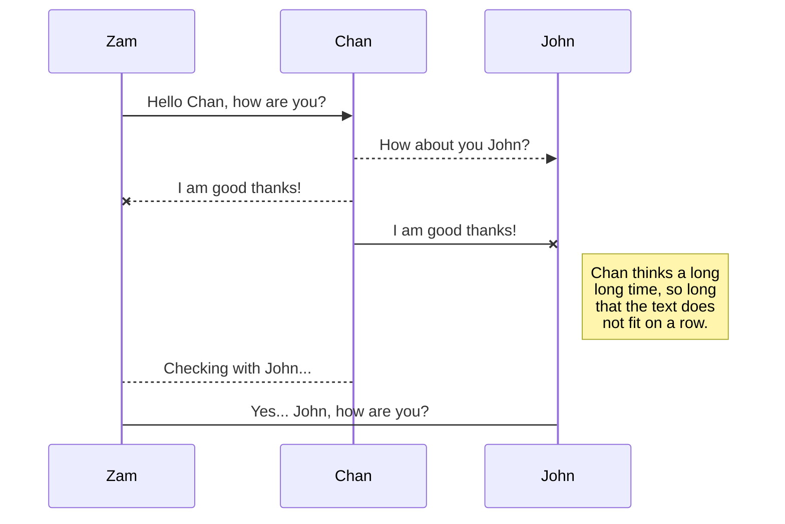

```mermaid
sequenceDiagram
Zam ->> Chan: Hello Chan, how are you?
Chan -->>John: How about you John?
Chan--x Zam: I am good thanks!
Chan-x John: I am good thanks!
Note right of John: Chan thinks a long<br/>long time, so long<br/>that the text does<br/>not fit on a row.

Chan-->Zam: Checking with John...
Zam->John: Yes... John, how are you?
```
