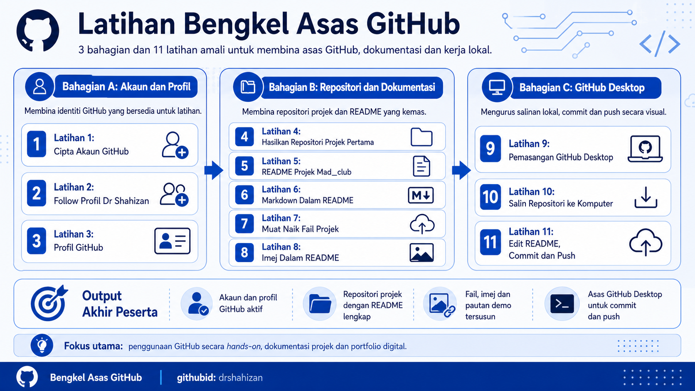

# Latihan Bengkel Asas GitHub

Modul latihan ini disediakan untuk peserta **Bengkel Asas GitHub**. Fokus latihan ialah penggunaan GitHub secara praktikal melalui pelayar web, GitHub Desktop. Latihan ini menekankan pembinaan profil profesional, repositori projek, dokumentasi README, pengurusan tugasan, portfolio digital, keselamatan dan etika akademik.

## Objektif Latihan

Selepas melengkapkan latihan, peserta dapat:

- Membina profil GitHub yang profesional sebagai portfolio digital.
- Menghasilkan repositori projek yang tersusun dengan dokumentasi README yang lengkap menggunakan Markdown asas.
- Mengurus dan menerbitkan bahan projek melalui GitHub web, GitHub Desktop serta amalan keselamatan dan etika akademik yang sesuai.

## Jadual Kandungan Latihan

### Bahagian A: Persediaan Akaun dan Profil

| No. | Latihan | Fokus Utama |
|---:|---|---|
| 1. | [Cipta Akaun GitHub](fail/lat1.md) | Daftar akaun, sahkan emel dan simpan pautan profil. |
| 2. | [Follow Profil GitHub Dr Shahizan](fail/lat2.md) | Follow profil rujukan dan fahami kebaikan fungsi Follow. |
| 3. | [Profil GitHub](fail/lat3.md) | Kemas kini gambar, nama, bio, pautan dan paparan profil. |

### Bahagian B: Repositori dan Dokumentasi

| No. | Latihan | Fokus Utama |
|---:|---|---|
| 4. | [Hasilkan Repositori Projek Pertama](fail/lat4.md) | Cipta repositori, aktifkan README dan tambah maklumat awal. |
| 5. | [Repositori Mad_club](fail/lat5.md) | Tulis README projek lengkap untuk Mad_club. |
| 6. | [Penggunaan Markdown Dalam Fail README](fail/lat6.md) | Tajuk, senarai, pautan, imej, jadual dan kod ringkas. |
| 7. | [Muat Naik Fail Projek](fail/lat7.md) | Tambah fail melalui GitHub web, susun folder dan commit. |
| 8. | [Imej Dalam README](fail/lat8.md) | Muat naik tangkapan skrin, paparkan imej dan tambah pautan demo. |

### Bahagian C: GitHub Desktop

| No. | Latihan | Fokus Utama |
|---:|---|---|
| 9. | [Pemasangan, Log Masuk dan Tetapkan GitHub Desktop](fail/lat9.md) | Muat turun GitHub Desktop, log masuk akaun GitHub dan semak akaun aktif. |
| 10. | [Clone Repositori ke Komputer](fail/lat10.md) | Clone repositori latihan ke komputer dan semak fail projek secara lokal. |
| 11. | [Edit README, Commit dan Push](fail/lat11.md) | Edit fail README, commit perubahan dan push ke GitHub. |

## Contribution 🛠️
Please create an [Issue](https://github.com/drshahizan/learn-github/issues) for any improvements, suggestions or errors in the content.

You can also contact me using [Linkedin](https://www.linkedin.com/in/drshahizan/) for any other queries or feedback.

