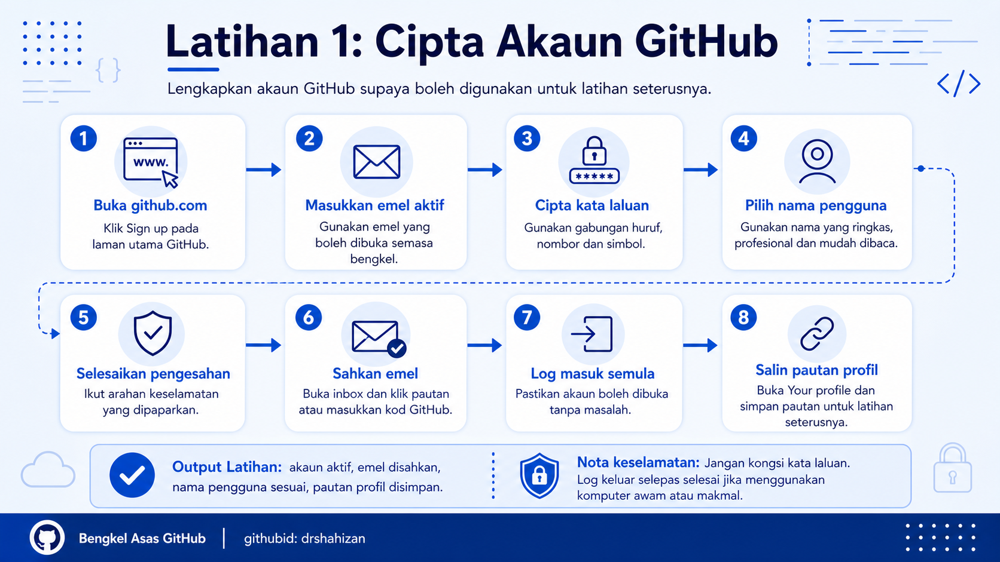

<a href="https://github.com/drshahizan/learn-github/stargazers"></a>
<a href="https://github.com/drshahizan/learn-github/network/members"></a>
<a href="https://github.com/drshahizan/learn-github/pulls"></a>
<a href="https://github.com/drshahizan/learn-github/issues"></a>
<a href="https://github.com/drshahizan/learn-github/graphs/contributors"></a>


<p align="center">

</p>

# Latihan 1: Cipta Akaun GitHub

## Objektif Latihan

Peserta dapat mencipta akaun GitHub baharu menggunakan emel aktif dan memastikan akaun tersebut boleh digunakan untuk aktiviti bengkel seterusnya.

## Langkah 1: Buka Laman GitHub

1. Buka pelayar web.
2. Taip alamat `https://github.com`.
3. Tekan `Enter`.
4. Pastikan laman utama GitHub dipaparkan.
5. Klik butang `Sign up`.

## Langkah 2: Masukkan Emel

1. Pada ruangan emel, masukkan emel aktif.
2. Gunakan emel yang selalu digunakan untuk pembelajaran atau kerja profesional.
3. Elakkan menggunakan emel sementara atau emel yang sukar diakses.
4. Klik butang untuk meneruskan proses pendaftaran.

## Langkah 3: Cipta Kata Laluan

1. Masukkan kata laluan yang kuat.
2. Gunakan gabungan huruf besar, huruf kecil, nombor dan simbol.
3. Elakkan menggunakan kata laluan yang terlalu mudah seperti nama sendiri, nombor matrik atau tarikh lahir.
4. Simpan kata laluan di tempat yang selamat.
5. Jangan kongsi kata laluan dengan rakan semasa bengkel.

## Langkah 4: Pilih Nama Pengguna GitHub

1. Masukkan nama pengguna yang ingin digunakan.
2. Pilih nama yang ringkas, profesional dan mudah dibaca.
3. Elakkan nama yang terlalu santai, sukar dieja atau tidak sesuai untuk portfolio.
4. Jika nama pengguna telah digunakan oleh orang lain, cuba variasi yang masih kelihatan profesional.

Contoh nama pengguna yang sesuai:

```text
amirulazman
nurainitech
farahdev
hafiz-data
```

## Langkah 5: Pilih Tetapan Emel dan Notifikasi

1. GitHub mungkin bertanya sama ada peserta mahu menerima emel promosi atau kemas kini.
2. Pilih tetapan mengikut kesesuaian.
3. Untuk bengkel, tetapan ini tidak kritikal.
4. Teruskan proses pendaftaran.

## Langkah 6: Selesaikan Pengesahan Keselamatan

1. GitHub mungkin memaparkan cabaran keselamatan.
2. Ikut arahan yang dipaparkan pada skrin.
3. Lengkapkan pengesahan sehingga GitHub membenarkan proses pendaftaran diteruskan.
4. Jika gagal, cuba semula dengan teliti.

## Langkah 7: Sahkan Emel

1. Buka inbox emel yang digunakan untuk pendaftaran.
2. Cari emel daripada GitHub.
3. Buka emel tersebut.
4. Klik pautan pengesahan atau salin kod pengesahan jika diminta.
5. Kembali ke laman GitHub.
6. Pastikan akaun telah disahkan.

## Langkah 8: Log Masuk Ke Akaun GitHub

1. Buka semula `https://github.com`.
2. Klik `Sign in`.
3. Masukkan nama pengguna atau emel.
4. Masukkan kata laluan.
5. Klik butang log masuk.
6. Pastikan dashboard GitHub dipaparkan.

## Langkah 9: Semak Akaun Berjaya Dicipta

1. Klik ikon profil di bahagian atas kanan.
2. Pilih menu `Your profile`.
3. Pastikan halaman profil GitHub peserta boleh dibuka.
4. Semak nama pengguna yang dipaparkan pada pautan profil.
5. Salin pautan profil GitHub untuk kegunaan latihan seterusnya.

## Langkah 10: Catat Maklumat Penting

Peserta perlu mencatat maklumat berikut:

1. Nama pengguna GitHub.
2. Pautan profil GitHub.
3. Emel yang digunakan.
4. Status pengesahan emel.
5. Sebarang isu yang berlaku semasa pendaftaran.

## Output Latihan

Pada akhir latihan ini, peserta perlu mempunyai:

1. Akaun GitHub yang aktif.
2. Emel yang telah disahkan.
3. Nama pengguna GitHub yang sesuai.
4. Pautan profil GitHub.
5. Keupayaan untuk log masuk ke GitHub semula.

## Semakan Latihan

Tandakan jika selesai:

1. Saya berjaya membuka laman GitHub.
2. Saya berjaya mencipta akaun GitHub.
3. Saya telah memilih nama pengguna yang sesuai.
4. Saya telah mengesahkan emel.
5. Saya boleh log masuk ke akaun GitHub.
6. Saya boleh membuka halaman profil GitHub.
7. Saya telah menyalin pautan profil GitHub.

## Masalah Biasa dan Cara Mengatasi

| Masalah | Cadangan Penyelesaian |
|---|---|
| Tidak menerima emel pengesahan | Semak folder Spam, Junk atau Promotions. Pastikan emel yang dimasukkan betul. |
| Nama pengguna telah digunakan | Cuba tambah nama bidang, nombor kecil yang sesuai atau singkatan institusi. |
| Terlupa kata laluan | Gunakan fungsi `Forgot password` pada halaman log masuk. |
| Cabaran keselamatan gagal | Baca arahan dengan teliti dan cuba semula. |
| Tidak boleh log masuk | Semak emel, nama pengguna dan kata laluan. Pastikan akaun telah disahkan. |

## Nota Keselamatan

1. Jangan kongsi kata laluan dengan sesiapa.
2. Jangan gunakan kata laluan yang sama dengan akaun penting lain.
3. Gunakan emel yang boleh diakses semula selepas bengkel.
4. Jika menggunakan komputer awam atau komputer makmal, pastikan log keluar selepas selesai.

## Contribution 🛠️
Please create an [Issue](https://github.com/drshahizan/learn-github/issues) for any improvements, suggestions or errors in the content.

You can also contact me using [Linkedin](https://www.linkedin.com/in/drshahizan/) for any other queries or feedback.

[](https://visitorbadge.io/status?path=https%3A%2F%2Fgithub.com%2Fdrshahizan)


