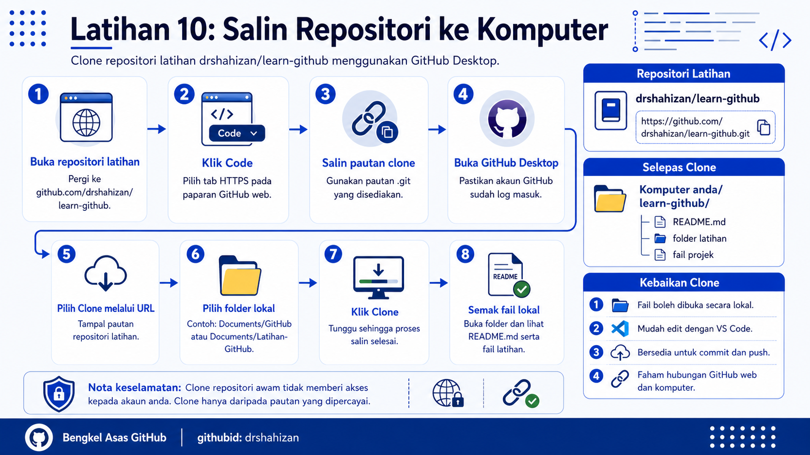

<a href="https://github.com/drshahizan/learn-github/stargazers"></a>
<a href="https://github.com/drshahizan/learn-github/network/members"></a>
<a href="https://github.com/drshahizan/learn-github/pulls"></a>
<a href="https://github.com/drshahizan/learn-github/issues"></a>
<a href="https://github.com/drshahizan/learn-github/graphs/contributors"></a>


<p align="center">

</p>

# Latihan 10: Salin Repositori ke Komputer

## Objektif Latihan

Peserta dapat menyalin repositori `drshahizan/learn-github` ke komputer menggunakan GitHub Desktop dan menyemak fail latihan secara lokal.

## Langkah 1: Buka Repositori Latihan

1. Buka pelayar web.
2. Pergi ke pautan berikut:

```text
https://github.com/drshahizan/learn-github
```

3. Pastikan halaman repositori `drshahizan/learn-github` dipaparkan.
4. Semak nama pemilik repositori iaitu `drshahizan`.
5. Semak nama repositori iaitu `learn-github`.

## Langkah 2: Salin Pautan Repositori

1. Pada halaman repositori, klik butang `Code`.
2. Pastikan tab `HTTPS` dipilih.
3. Salin pautan repositori yang dipaparkan.
4. Pautan yang digunakan ialah:

```text
https://github.com/drshahizan/learn-github.git
```

5. Simpan pautan ini untuk digunakan dalam GitHub Desktop.

## Langkah 3: Buka GitHub Desktop

1. Buka aplikasi GitHub Desktop.
2. Pastikan peserta telah log masuk menggunakan akaun GitHub sendiri.
3. Jika belum log masuk, lengkapkan proses log masuk terlebih dahulu.
4. Semak akaun aktif pada GitHub Desktop.
5. Pastikan aplikasi boleh digunakan tanpa ralat.

## Langkah 4: Pilih Fungsi Clone Repositori

1. Pada GitHub Desktop, klik menu `File`.
2. Pilih fungsi untuk clone repositori.
3. GitHub Desktop akan memaparkan tetingkap untuk memilih repositori.
4. Jika repositori tidak muncul dalam senarai akaun sendiri, gunakan pilihan `URL`.
5. Pilihan `URL` sesuai digunakan kerana repositori latihan berada di akaun `drshahizan`.

## Langkah 5: Masukkan Pautan Repositori

1. Pada tab `URL`, tampal pautan berikut:

```text
https://github.com/drshahizan/learn-github.git
```

2. Semak semula ejaan pautan.
3. Pastikan tiada ruang kosong tambahan pada awal atau akhir pautan.
4. GitHub Desktop akan memaparkan nama repositori `learn-github`.
5. Jika pautan tidak diterima, salin semula pautan daripada GitHub web.

## Langkah 6: Pilih Lokasi Simpanan Lokal

1. Cari bahagian `Local path`.
2. Pilih folder kerja yang mudah dicari.
3. Contoh lokasi yang sesuai:
   - `Documents/GitHub`
   - `Documents/Latihan-GitHub`
   - `Desktop/GitHub`
4. Pastikan peserta ingat lokasi folder tersebut.
5. Elakkan menyimpan dalam folder yang sukar dicari atau folder sistem.

## Langkah 7: Clone Repositori

1. Klik butang `Clone`.
2. Tunggu sehingga proses clone selesai.
3. Tempoh proses bergantung kepada saiz repositori dan sambungan internet.
4. Jangan tutup GitHub Desktop semasa proses sedang berjalan.
5. Jika proses berjaya, repositori `learn-github` akan dibuka dalam GitHub Desktop.

## Langkah 8: Buka Folder Repositori

1. Dalam GitHub Desktop, klik menu `Repository`.
2. Pilih `Show in Finder` untuk macOS atau `Show in Explorer` untuk Windows.
3. Folder `learn-github` akan dibuka pada komputer.
4. Semak fail dan folder yang terdapat di dalamnya.
5. Cari fail seperti `README.md` atau folder latihan yang tersedia.

## Langkah 9: Buka Fail README.md

1. Dalam folder `learn-github`, cari fail `README.md`.
2. Klik dua kali fail tersebut atau buka menggunakan editor seperti Visual Studio Code.
3. Baca kandungan ringkas dalam fail README.
4. Perhatikan struktur tajuk, pautan, imej dan jadual jika ada.
5. Jangan ubah fail dahulu jika fasilitator belum meminta peserta membuat perubahan.

## Langkah 10: Semak Status Dalam GitHub Desktop

1. Kembali ke GitHub Desktop.
2. Pastikan repositori aktif ialah `learn-github`.
3. Buka tab `Changes`.
4. Jika belum ada perubahan, paparan biasanya menunjukkan tiada fail berubah.
5. Ini bermaksud repositori telah berjaya disalin dan masih sama seperti versi asal di GitHub.

## Kebaikan Clone Repositori

1. Peserta boleh melihat fail projek secara lokal pada komputer.
2. Peserta boleh membuka fail menggunakan editor seperti Visual Studio Code.
3. Peserta boleh belajar struktur folder projek sebenar.
4. Peserta boleh membuat perubahan, commit dan push dalam latihan seterusnya.
5. Peserta memahami hubungan antara GitHub web, GitHub Desktop dan fail lokal.

## Masalah Biasa dan Cara Mengatasi

| Masalah | Cadangan Penyelesaian |
|---|---|
| Pautan repositori tidak diterima | Pastikan pautan ialah `https://github.com/drshahizan/learn-github.git`. |
| Butang Clone tidak boleh diklik | Semak pautan dan lokasi folder lokal. |
| Folder lokal sudah wujud | Pilih lokasi lain atau padam folder lama jika tidak diperlukan. |
| Proses clone terlalu lama | Semak sambungan internet dan cuba semula. |
| Repositori tidak muncul dalam akaun sendiri | Gunakan tab `URL` kerana repositori berada di akaun `drshahizan`. |

## Contribution 🛠️
Please create an [Issue](https://github.com/drshahizan/learn-github/issues) for any improvements, suggestions or errors in the content.

You can also contact me using [Linkedin](https://www.linkedin.com/in/drshahizan/) for any other queries or feedback.

[](https://visitorbadge.io/status?path=https%3A%2F%2Fgithub.com%2Fdrshahizan)

