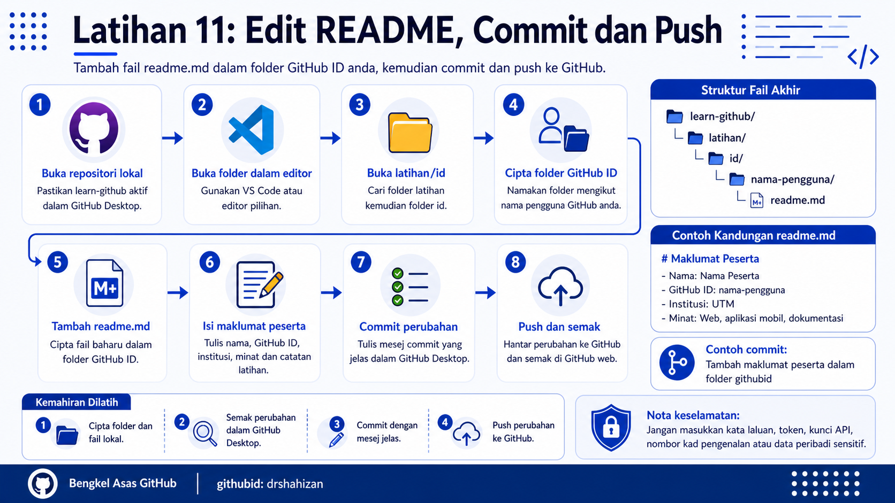

<a href="https://github.com/drshahizan/learn-github/stargazers"></a>
<a href="https://github.com/drshahizan/learn-github/network/members"></a>
<a href="https://github.com/drshahizan/learn-github/pulls"></a>
<a href="https://github.com/drshahizan/learn-github/issues"></a>
<a href="https://github.com/drshahizan/learn-github/graphs/contributors"></a>


<p align="center">

</p>

# Latihan 11: Edit README, Commit dan Push

## Objektif Latihan

Peserta dapat menambah fail `readme.md` dalam folder GitHub ID masing-masing, merekod perubahan menggunakan commit dan menghantar perubahan tersebut ke GitHub melalui GitHub Desktop.

## Langkah 1: Buka Repositori Dalam GitHub Desktop

1. Buka aplikasi GitHub Desktop.
2. Pastikan repositori aktif ialah `learn-github`.
3. Jika repositori lain sedang dibuka, pilih repositori `learn-github` daripada senarai repositori.
4. Pastikan akaun GitHub yang digunakan ialah akaun peserta sendiri.
5. Semak tab `Changes` untuk memastikan tiada perubahan lama yang belum diselesaikan.

## Langkah 2: Buka Folder Repositori

1. Klik menu `Repository` dalam GitHub Desktop.
2. Pilih `Show in Finder` untuk macOS atau `Show in Explorer` untuk Windows.
3. Folder lokal `learn-github` akan dipaparkan.
4. Semak fail dan folder yang terdapat dalam repositori.
5. Cari fail `README.md`.

## Langkah 3: Buka Folder Repositori Dalam Editor

1. Buka folder `learn-github` menggunakan editor yang sesuai.
2. Editor yang dicadangkan ialah Visual Studio Code.
3. Pastikan keseluruhan folder `learn-github` dibuka, bukan satu fail sahaja.
4. Semak struktur folder yang dipaparkan dalam editor.
5. Jangan ubah fail lain jika fasilitator belum meminta perubahan tambahan.

## Langkah 4: Buka Folder latihan/id

1. Dalam editor, cari folder `latihan`.
2. Buka folder `latihan`.
3. Cari folder `id`.
4. Buka folder `id`.
5. Folder `id` akan digunakan untuk menyimpan folder peserta berdasarkan GitHub ID masing-masing.

## Langkah 5: Kenal Pasti GitHub ID Sendiri

1. Buka profil GitHub sendiri.
2. Lihat nama pengguna pada pautan profil.
3. Contoh pautan profil:

```text
https://github.com/nama-pengguna
```

4. Dalam contoh tersebut, GitHub ID ialah `nama-pengguna`.
5. Gunakan GitHub ID sendiri untuk menamakan folder latihan.

## Langkah 6: Cipta Folder GitHub ID Anda

1. Dalam folder `latihan/id`, cipta satu folder baharu.
2. Namakan folder tersebut menggunakan GitHub ID anda.
3. Gunakan huruf yang sama seperti nama pengguna GitHub.
4. Elakkan ruang kosong dalam nama folder.
5. Contoh struktur folder:

```text
latihan/
└── id/
    └── nama-pengguna/
```

## Langkah 7: Tambah Fail readme.md Dalam Folder Anda

1. Buka folder GitHub ID yang telah dicipta.
2. Cipta fail baharu bernama `readme.md`.
3. Pastikan nama fail menggunakan huruf kecil.
4. Pastikan fail berada dalam folder GitHub ID anda.
5. Contoh lokasi fail:

```text
latihan/id/nama-pengguna/readme.md
```

6. Tambah catatan maklumat anda dalam fail `readme.md`.
7. Gunakan format Markdown yang kemas.
8. Jangan masukkan maklumat sensitif.

Contoh kandungan `readme.md`:

```markdown
# Maklumat Peserta

- Nama: Nama Peserta
- GitHub ID: nama-pengguna
- Institusi: Universiti Kebangsaan Malaysia
- Minat: Pembangunan web, aplikasi mobil dan dokumentasi projek

## Catatan Latihan

Saya telah berjaya menyalin repositori `learn-github` ke komputer dan menambah fail `readme.md` dalam folder GitHub ID saya.
```

Contoh struktur akhir:

```text
learn-github/
└── latihan/
    └── id/
        └── nama-pengguna/
            └── readme.md
```

## Langkah 8: Simpan Fail readme.md

1. Klik `Save` dalam editor.
2. Pastikan perubahan benar-benar disimpan.
3. Kembali ke GitHub Desktop.
4. Buka tab `Changes`.
5. Pastikan fail `latihan/id/nama-pengguna/readme.md` muncul dalam senarai perubahan.

## Langkah 9: Semak Perubahan Dalam GitHub Desktop

1. Klik fail `readme.md` dalam tab `Changes`.
2. Lihat bahagian perubahan yang dipaparkan.
3. Semak teks yang ditambah.
4. Pastikan laluan fail berada dalam folder GitHub ID anda.
5. Jika ada kesilapan, kembali ke editor, baiki fail dan simpan semula.

## Langkah 10: Tulis Mesej Commit

1. Cari ruangan `Summary` dalam GitHub Desktop.
2. Tulis mesej commit yang ringkas dan jelas.
3. Mesej commit perlu menerangkan perubahan yang dibuat.
4. Elakkan mesej yang terlalu umum seperti `update`, `test` atau `edit`.

Contoh mesej commit yang baik:

```text
Tambah maklumat peserta dalam folder githubid
```

Contoh lain:

```text
Tambah readme latihan GitHub Desktop
```

## Langkah 11: Commit Perubahan

1. Pastikan fail `readme.md` telah ditanda untuk commit.
2. Semak mesej commit.
3. Klik butang `Commit to main`.
4. Tunggu sehingga proses commit selesai.
5. Selepas commit, perubahan telah direkodkan pada komputer peserta.

## Langkah 12: Push Perubahan Ke GitHub

1. Selepas commit selesai, cari butang `Push origin`.
2. Klik `Push origin`.
3. Tunggu sehingga proses push selesai.
4. Jangan tutup GitHub Desktop semasa proses push sedang berjalan.
5. Jika push berjaya, perubahan telah dihantar ke GitHub.

## Langkah 13: Semak Perubahan Di GitHub Web

1. Buka pelayar web.
2. Pergi ke repositori `learn-github` di GitHub.
3. Buka folder `latihan`.
4. Buka folder `id`.
5. Buka folder GitHub ID anda.
6. Buka fail `readme.md`.
7. Semak sama ada kandungan yang ditambah telah dipaparkan.
8. Jika perubahan tidak muncul, refresh halaman atau semak semula sama ada proses push telah berjaya.

## Kebaikan Commit dan Push

1. Commit merekod sejarah perubahan projek.
2. Mesej commit membantu peserta memahami perubahan yang telah dibuat.
3. Push menghantar perubahan lokal ke GitHub.
4. Fail dalam komputer dan GitHub web dapat diselaraskan.
5. Peserta mula membina aliran kerja sebenar menggunakan GitHub Desktop.

## Masalah Biasa dan Cara Mengatasi

| Masalah | Cadangan Penyelesaian |
|---|---|
| Fail `readme.md` tidak muncul dalam tab Changes | Pastikan fail telah disimpan dalam editor. |
| Butang Commit tidak aktif | Pastikan ada fail yang berubah dan mesej commit telah ditulis. |
| Push gagal | Semak sambungan internet dan pastikan akaun GitHub masih aktif. |
| Perubahan tidak muncul di GitHub web | Refresh halaman dan pastikan proses push berjaya. |
| Fail berada di folder yang salah | Pastikan fail berada dalam `latihan/id/githubid-anda/readme.md`. |
| Fail lain turut berubah | Semak perubahan dan jangan commit fail yang tidak berkaitan dengan latihan. |

## Nota Keselamatan

1. Jangan masukkan kata laluan, token atau kunci API dalam `readme.md`.
2. Jangan commit fail sulit atau data peribadi.
3. Semak perubahan sebelum klik commit.
4. Gunakan mesej commit yang sopan, jelas dan profesional.
5. Jika menggunakan komputer awam atau makmal, pastikan log keluar selepas selesai.

## Contribution 🛠️
Please create an [Issue](https://github.com/drshahizan/learn-github/issues) for any improvements, suggestions or errors in the content.

You can also contact me using [Linkedin](https://www.linkedin.com/in/drshahizan/) for any other queries or feedback.

[](https://visitorbadge.io/status?path=https%3A%2F%2Fgithub.com%2Fdrshahizan)

