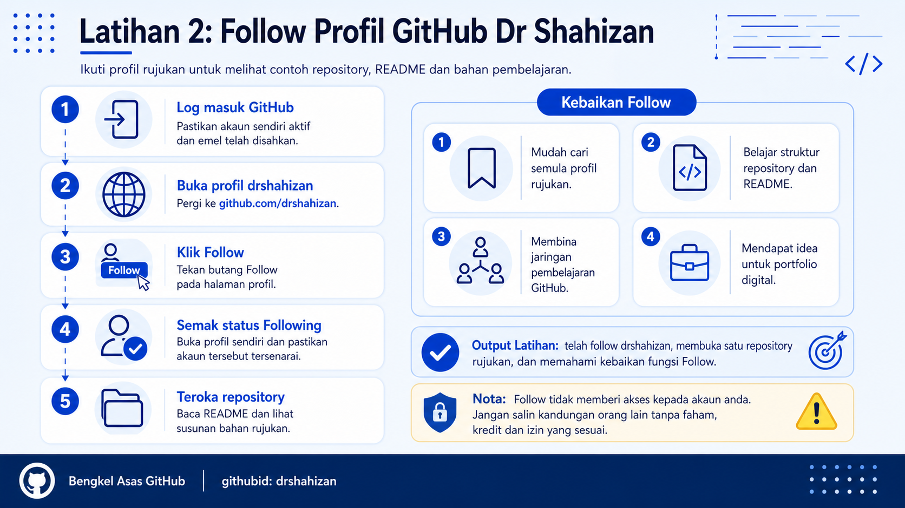

<a href="https://github.com/drshahizan/learn-github/stargazers"></a>
<a href="https://github.com/drshahizan/learn-github/network/members"></a>
<a href="https://github.com/drshahizan/learn-github/pulls"></a>
<a href="https://github.com/drshahizan/learn-github/issues"></a>
<a href="https://github.com/drshahizan/learn-github/graphs/contributors"></a>


<p align="center">

</p>

# Exercise 2: Follow Dr Shahizan's GitHub Profile

## Learning Objective

Participants will be able to follow the GitHub profile `drshahizan` and understand the benefits of the Follow feature in GitHub for learning, project references and digital portfolio development.

## Step 1: Sign In to GitHub

1. Open a web browser.
2. Go to `https://github.com`.
3. Click `Sign in`.
4. Enter your GitHub email address or username.
5. Enter your password.
6. Make sure you have successfully signed in to your own GitHub account.

## Step 2: Open Dr Shahizan's Profile

1. Open a new tab in the web browser.
2. Type the following link:

```text
https://github.com/drshahizan
```

3. Press `Enter`.
4. Make sure the GitHub profile page for `drshahizan` is displayed.
5. Check the profile name, profile picture and the list of visible repositories.

## Step 3: Click the Follow Button

1. Find the `Follow` button on the profile page.
2. This button is usually located near the profile name or user information.
3. Click the `Follow` button.
4. Make sure the button changes to a status that shows you are now following the profile.
5. If the button still displays `Follow`, click it again or refresh the page.

## Step 4: Check the Following Status

1. Click your profile icon at the top right of GitHub.
2. Select `Your profile`.
3. On your own profile page, look for the `following` section or the list of accounts you are following.
4. Check whether `drshahizan` is listed.
5. If it is listed, the follow process has been completed successfully.

## Step 5: Explore Reference Repositories

1. Return to the profile `https://github.com/drshahizan`.
2. View the list of repositories displayed.
3. Open one repository that appears to be related to learning or the workshop.
4. Read the repository's `README.md` file.
5. Observe how the repository is organised, including the title, description, files, folders and documentation.

## Benefits of Following a GitHub Profile

### 1. Easier to Find a Reference Profile Again

When participants follow the `drshahizan` profile, they can find the account more easily when they want to view materials, repositories and documentation examples again.

### 2. Exposure to Repository Examples

Participants can see how repositories are organised, how README files are written and how learning materials are shared through GitHub.

### 3. Learning Through Observation

Participants can learn from project structures, file names, folder organisation, Markdown usage and the way documentation is prepared.

### 4. Building a Learning Network

GitHub is not only a place to store code. It can also be used to follow lecturers, mentors, communities, organisations and other developers.

### 5. Becoming Familiar with GitHub Culture

The Follow feature helps participants understand that GitHub has a community element. Participants can follow individuals or organisations that produce useful materials.

### 6. Supporting Digital Portfolio Development

By viewing good examples of profiles and repositories, participants can gain ideas to improve their own profile, choose their best repositories and write cleaner README files.

## Exercise Output

At the end of this exercise, participants should have:

1. Followed the GitHub profile `drshahizan`.
2. The ability to open the profile `https://github.com/drshahizan` again.
3. The ability to identify at least one reference repository.
4. The ability to state at least three benefits of following a GitHub profile.
5. Initial ideas on how profiles and repositories can be used as learning materials.

## Common Problems and How to Solve Them

| Problem | Suggested Solution |
|---|---|
| Cannot find the Follow button | Make sure you have signed in to your GitHub account. |
| Profile cannot be opened | Check the spelling of the link `https://github.com/drshahizan`. |
| Follow button does not change | Refresh the page and check the status again. |
| Cannot see the following list | Open your own profile and look for the following section. |
| Too many repositories | Choose only one repository to explore first. |

## Contribution 🛠️
Please create an [Issue](https://github.com/drshahizan/learn-github/issues) for any improvements, suggestions or errors in the content.

You can also contact me using [Linkedin](https://www.linkedin.com/in/drshahizan/) for any other queries or feedback.

[](https://visitorbadge.io/status?path=https%3A%2F%2Fgithub.com%2Fdrshahizan)

