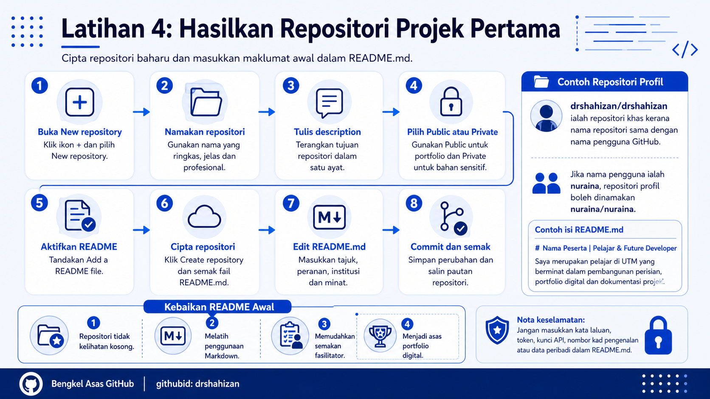

<a href="https://github.com/drshahizan/learn-github/stargazers"></a>
<a href="https://github.com/drshahizan/learn-github/network/members"></a>
<a href="https://github.com/drshahizan/learn-github/pulls"></a>
<a href="https://github.com/drshahizan/learn-github/issues"></a>
<a href="https://github.com/drshahizan/learn-github/graphs/contributors"></a>


<p align="center">

</p>

# Exercise 4: Create Your First Project Repository

## Learning Objective

Participants will be able to create their first project repository in GitHub, enable the `README.md` file and add initial information so that the repository has a clear description.

## Step 1: Open Your Own GitHub Account

1. Open a web browser.
2. Go to `https://github.com`.
3. Sign in to your own GitHub account.
4. Make sure you are on the GitHub homepage.
5. Click the profile icon at the top right to make sure the correct account is being used.

## Step 2: Open the Create New Repository Page

1. Click the `+` icon at the top right of GitHub.
2. Select the menu to create a new repository.
3. GitHub will display the page for creating a new repository.
4. Make sure your account name is displayed in the `Owner` section.

## Step 3: Name the Repository

1. Find the `Repository name` field.
2. Enter a suitable repository name.
3. Use a name that is short, clear and easy to understand.
4. Avoid names that are too general, such as `test`, `exercise1` or `project`.

Examples of suitable project repository names:

```text
my-portfolio
personal-web-project
github-notes
mobile-app-demo
data-analytics-mini
```

## GitHub Profile Repository Option

The repository `drshahizan/drshahizan` is an example of a special repository because the repository name is the same as the GitHub username. This type of repository can be used to display a special README on the GitHub profile page.

Example:

```text
https://github.com/drshahizan/drshahizan
```

If a participant's username is `nuraina`, the profile repository can be named:

```text
nuraina/nuraina
```

For this exercise, participants are encouraged to try a profile repository if the facilitator wants them to start building a digital profile immediately.

## Step 4: Write the Repository Description

1. Find the `Description` field.
2. Write a short description of the repository.
3. The description should answer the question about the purpose of the repository.
4. Use one short and clear sentence.

Example descriptions:

```text
GitHub profile repository for a digital portfolio.
Student digital portfolio repository.
Basic GitHub exercise for project documentation.
Mini web application project for learning.
Collection of notes and exercises for the Basic GitHub Workshop.
```

## Step 5: Choose Public or Private

1. Choose `Public` if the repository is suitable to be shared with others.
2. Choose `Private` if the repository contains sensitive assignments, confidential data or materials that are not yet suitable to display.
3. For a GitHub profile repository, choose `Public` so that the README can be displayed on the profile.
4. If unsure, choose `Private` first and discuss it with the facilitator.

## Step 6: Enable README

1. Find the `Add a README file` option.
2. Tick that option.
3. The README will become the main document of the repository.
4. The README helps others understand the purpose of the repository.
5. This option is important because participants will update the content of `README.md`.

## Step 7: Click Create Repository

1. Review the repository name.
2. Review the description.
3. Review the public or private option.
4. Make sure the `Add a README file` option has been selected.
5. Click the button to create the repository.

## Step 8: Open the README.md File

1. Make sure the new repository page is displayed.
2. Find the `README.md` file in the file list.
3. Click the `README.md` file.
4. Click the pencil icon or edit button to change the file content.
5. GitHub will open the editor for the file.

## Step 9: Add Initial Information in README.md

1. Delete the original content if it only contains an empty title.
2. Enter a main title using Markdown format.
3. Add one short paragraph about yourself, your area of interest or the purpose of the repository.
4. Use the examples below as a reference.
5. Change the name, role, institution and interests so that they suit you.

Example README for reference:

```markdown
# Dr Shahizan | Lecturer, Academic Speaker & Tech Educator  

Educating future leaders as a Lecturer at [Universiti Teknologi Malaysia (UTM)](https://www.utm.my/), with a strong passion for software development, innovation, and empowering students through dedicated supervision and impactful academic talks.
```

Example README for participants:

```markdown
# Participant Name | Student, Learner & Future Developer

I am a student at [Universiti Teknologi Malaysia (UTM)](https://www.utm.my/) with an interest in software development, digital portfolios, web technology, data analytics and collaborative project documentation.
```

Example README in Malay:

```markdown
# Nama Peserta | Pelajar, Pembelajar & Pembangun Masa Hadapan

Saya merupakan pelajar di [Universiti Teknologi Malaysia (UTM)](https://www.utm.my/) yang berminat dalam pembangunan perisian, portfolio digital, teknologi web, analitik data dan dokumentasi projek secara kolaboratif.
```

## Step 10: Commit README.md Changes

1. Scroll to the bottom of the editor.
2. Find the `Commit changes` section.
3. Write a clear commit message.

Example commit message:

```text
Add initial profile README information
```

4. Choose to commit directly to the main branch if that option is displayed.
5. Click `Commit changes`.
6. Wait until GitHub saves the changes.

## Step 11: Check the README Display

1. Return to the main repository page.
2. Check the `README.md` display.
3. Make sure the title is displayed correctly.
4. Make sure the UTM link can be clicked.
5. If using the `wave.gif` image, make sure the small image appears.
6. If there are spelling mistakes, click edit and fix them.

## Step 12: Copy the Repository Link

1. Copy the repository link from the address bar.
2. The link usually looks like this:

```text
https://github.com/username/repository-name
```

3. Save the link for the next exercise.
4. If the repository is a profile repository, open your own profile and check whether the README is displayed on the profile page.

## Benefits of Filling in README.md from the Start

1. The repository does not look empty.
2. Participants begin building a digital identity.
3. Participants practise using Markdown.
4. Facilitators can review the work more easily.
5. README content can be developed into the foundation of a portfolio.

## Common Problems and How to Solve Them

| Problem | Suggested Solution |
|---|---|
| README is not displayed | Make sure the file is named `README.md` and is located at the repository root. |
| The `wave.gif` image does not appear | Check the image link and make sure the internet connection works. |
| UTM link cannot be clicked | Make sure the Markdown format is correct, such as `[text](link)`. |
| Spelling mistake in README | Click the pencil icon, fix the text and commit the new changes. |
| Profile README does not appear on the profile | Make sure the repository name is the same as the GitHub username and that the repository is public. |

## Contribution 🛠️
Please create an [Issue](https://github.com/drshahizan/learn-github/issues) for any improvements, suggestions or errors in the content.

You can also contact me using [Linkedin](https://www.linkedin.com/in/drshahizan/) for any other queries or feedback.

[](https://visitorbadge.io/status?path=https%3A%2F%2Fgithub.com%2Fdrshahizan)

