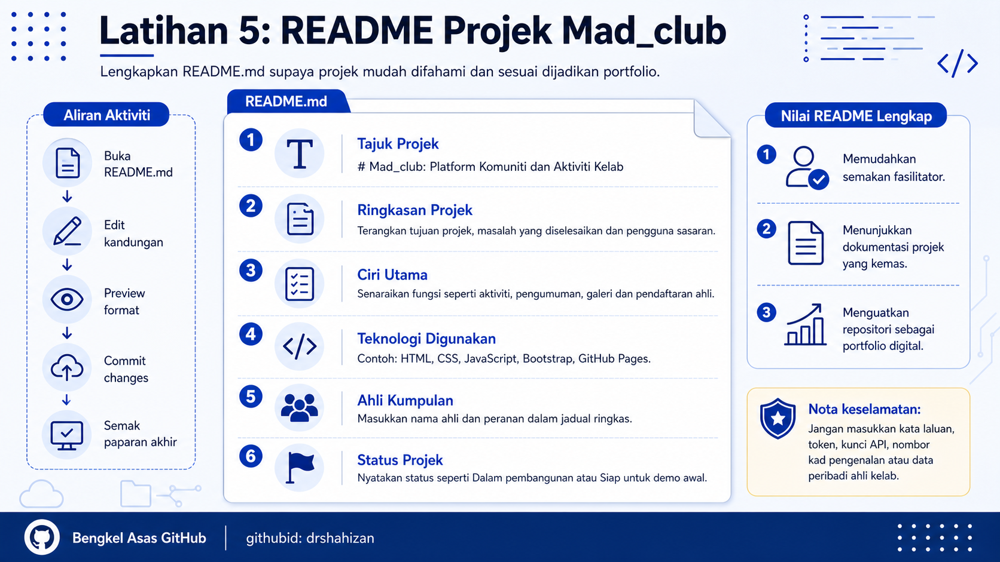

<a href="https://github.com/drshahizan/learn-github/stargazers"></a>
<a href="https://github.com/drshahizan/learn-github/network/members"></a>
<a href="https://github.com/drshahizan/learn-github/pulls"></a>
<a href="https://github.com/drshahizan/learn-github/issues"></a>
<a href="https://github.com/drshahizan/learn-github/graphs/contributors"></a>


<p align="center">

</p>

# Latihan 5: Repositori Mad_club

## Objektif Latihan

Peserta dapat menulis `README.md` untuk repositori `Mad_club` dengan struktur yang jelas, lengkap dan sesuai untuk dijadikan dokumentasi projek.

## Langkah 1: Buka Repositori Mad_club

1. Log masuk ke akaun GitHub.
2. Buka repositori `Mad_club`.
3. Pastikan peserta berada pada halaman utama repositori.
4. Cari fail `README.md`.
5. Klik fail `README.md` untuk membukanya.

## Langkah 2: Edit Fail README.md

1. Klik ikon pensel atau butang `Edit`.
2. GitHub akan membuka editor untuk fail `README.md`.
3. Padam teks lama jika kandungan masih kosong atau tidak lengkap.
4. Sediakan struktur README menggunakan tajuk, sub-tajuk dan senarai.
5. Pastikan semua maklumat projek ditulis dengan kemas.

## Langkah 3: Tulis Tajuk Projek

1. Mulakan README dengan tajuk utama.
2. Gunakan simbol `#` untuk tajuk utama dalam Markdown.
3. Tajuk perlu ringkas dan menggambarkan nama projek.

Contoh:

```markdown
# Mad_club
```

Contoh yang lebih jelas:

```markdown
# Mad_club: Platform Komuniti dan Aktiviti Kelab
```

## Langkah 4: Tulis Ringkasan Projek

1. Tambah bahagian `Ringkasan Projek`.
2. Terangkan tujuan projek dalam satu atau dua perenggan.
3. Nyatakan masalah yang ingin diselesaikan.
4. Nyatakan pengguna sasaran projek.

Contoh:

```markdown
## Ringkasan Projek

Mad_club ialah projek sistem pengurusan kelab yang membantu ahli kelab mendapatkan maklumat aktiviti, pengumuman dan program yang dijalankan. Projek ini bertujuan memudahkan urusan komunikasi antara pengurusan kelab dan ahli.

Sistem ini sesuai digunakan oleh kelab pelajar, persatuan kampus atau komuniti kecil yang ingin menyusun maklumat aktiviti secara lebih sistematik.
```

## Langkah 5: Senaraikan Ciri Utama

1. Tambah bahagian `Ciri Utama`.
2. Senaraikan fungsi penting yang dicadangkan untuk projek.
3. Gunakan bullet supaya mudah dibaca.
4. Pastikan ciri yang disenaraikan sesuai dengan projek `Mad_club`.

Contoh:

```markdown
## Ciri Utama

- Paparan maklumat kelab
- Senarai aktiviti dan program
- Pengumuman terkini
- Maklumat ahli jawatankuasa
- Galeri gambar aktiviti
- Pautan media sosial kelab
- Borang atau pautan pendaftaran ahli
```

## Langkah 6: Nyatakan Teknologi Digunakan

1. Tambah bahagian `Teknologi Digunakan`.
2. Senaraikan bahasa pengaturcaraan, framework, library atau tools yang digunakan.
3. Jika projek masih pada peringkat awal, senaraikan teknologi yang dirancang.
4. Jangan masukkan teknologi yang tidak digunakan.

Contoh:

```markdown
## Teknologi Digunakan

- HTML
- CSS
- JavaScript
- Bootstrap
- GitHub Pages
- GitHub untuk dokumentasi dan pengurusan projek
```

## Langkah 7: Tambah Ahli Kumpulan

1. Tambah bahagian `Ahli Kumpulan`.
2. Senaraikan nama ahli kumpulan.
3. Tambah peranan setiap ahli jika sudah ditentukan.
4. Jika belum ada peranan, tulis peranan umum dahulu dan kemas kini kemudian.

Contoh:

```markdown
## Ahli Kumpulan

| Nama | Peranan |
|---|---|
| Nama Ahli 1 | Ketua projek |
| Nama Ahli 2 | Pembangun frontend |
| Nama Ahli 3 | Pembangun backend |
| Nama Ahli 4 | Dokumentasi dan pengujian |
```

## Langkah 8: Nyatakan Status Projek

1. Tambah bahagian `Status Projek`.
2. Nyatakan sama ada projek masih dirancang, sedang dibangunkan atau telah siap.
3. Gunakan status yang mudah difahami.
4. Status ini boleh dikemas kini sepanjang projek berjalan.

Contoh:

```markdown
## Status Projek

Status: Dalam pembangunan
```

## Langkah 9: Susun README Lengkap

Peserta boleh menggunakan template berikut untuk repositori `Mad_club`:

```markdown
# Mad_club: Platform Komuniti dan Aktiviti Kelab

## Ringkasan Projek

Mad_club ialah projek sistem pengurusan kelab yang membantu ahli kelab mendapatkan maklumat aktiviti, pengumuman dan program yang dijalankan. Projek ini bertujuan memudahkan urusan komunikasi antara pengurusan kelab dan ahli.

Sistem ini sesuai digunakan oleh kelab pelajar, persatuan kampus atau komuniti kecil yang ingin menyusun maklumat aktiviti secara lebih sistematik.

## Ciri Utama

- Paparan maklumat kelab
- Senarai aktiviti dan program
- Pengumuman terkini
- Maklumat ahli jawatankuasa
- Galeri gambar aktiviti
- Pautan media sosial kelab
- Borang atau pautan pendaftaran ahli

## Teknologi Digunakan

- HTML
- CSS
- JavaScript
- Bootstrap
- GitHub Pages
- GitHub untuk dokumentasi dan pengurusan projek

## Ahli Kumpulan

| Nama | Peranan |
|---|---|
| Nama Ahli 1 | Ketua projek |
| Nama Ahli 2 | Pembangun frontend |
| Nama Ahli 3 | Pembangun backend |
| Nama Ahli 4 | Dokumentasi dan pengujian |

## Status Projek

Projek ini masih dalam pembangunan awal. Struktur README, senarai ciri utama dan susunan repositori sedang dikemaskini.
```

## Langkah 10: Preview README

1. Klik tab `Preview` jika tersedia.
2. Semak paparan tajuk projek.
3. Semak jadual ahli kumpulan.
4. Pastikan bullet list dipaparkan dengan betul.
5. Baiki ejaan, format atau susunan jika perlu.

## Langkah 11: Commit Perubahan

1. Scroll ke bahagian bawah editor.
2. Cari bahagian `Commit changes`.
3. Tulis mesej commit yang jelas.

Contoh mesej commit:

```text
Tambah README projek Mad_club
```

4. Klik `Commit changes`.
5. Tunggu sehingga perubahan disimpan.

## Langkah 12: Semak Paparan Akhir README

1. Kembali ke halaman utama repositori `Mad_club`.
2. Semak paparan README di bawah senarai fail.
3. Pastikan semua bahagian utama wujud.
4. Jika ada kesilapan, klik edit dan kemas kini semula.

## Kebaikan README Yang Lengkap

1. Memudahkan orang lain memahami projek.
2. Membantu fasilitator membuat semakan.
3. Menunjukkan kematangan dokumentasi.
4. Menjadi asas portfolio digital.

## Masalah Biasa dan Cara Mengatasi

| Masalah | Cadangan Penyelesaian |
|---|---|
| README tidak dipaparkan | Pastikan fail dinamakan `README.md` dan berada di root repositori. |
| Jadual tidak menjadi | Pastikan simbol `|` dan baris pemisah `|---|---|` ditulis dengan betul. |
| Tajuk tidak besar | Pastikan tajuk menggunakan `#` pada permulaan baris. |
| Senarai tidak kemas | Gunakan `-` pada setiap item senarai. |
| Terlupa commit | Scroll ke bawah dan klik `Commit changes` selepas mengedit. |


## Contribution 🛠️
Please create an [Issue](https://github.com/drshahizan/learn-github/issues) for any improvements, suggestions or errors in the content.

You can also contact me using [Linkedin](https://www.linkedin.com/in/drshahizan/) for any other queries or feedback.

[](https://visitorbadge.io/status?path=https%3A%2F%2Fgithub.com%2Fdrshahizan)

