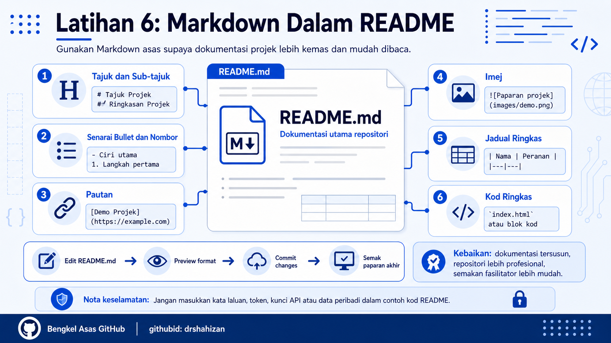

<a href="https://github.com/drshahizan/learn-github/stargazers"></a>
<a href="https://github.com/drshahizan/learn-github/network/members"></a>
<a href="https://github.com/drshahizan/learn-github/pulls"></a>
<a href="https://github.com/drshahizan/learn-github/issues"></a>
<a href="https://github.com/drshahizan/learn-github/graphs/contributors"></a>


<p align="center">

</p>

# Latihan 6: Penggunaan Markdown Dalam Fail README

## Objektif Latihan

Peserta dapat menggunakan format Markdown asas dalam fail `README.md` supaya dokumentasi projek lebih tersusun, mudah dibaca dan kelihatan profesional.

## Langkah 1: Buka Fail README.md

1. Log masuk ke akaun GitHub.
2. Buka repositori projek, contohnya `Mad_club`.
3. Cari fail `README.md`.
4. Klik fail tersebut untuk melihat kandungan sedia ada.
5. Klik ikon pensel atau butang `Edit` untuk mengemaskini kandungan.

## Langkah 2: Tambah Tajuk dan Sub-tajuk

1. Gunakan simbol `#` untuk tajuk utama.
2. Gunakan `##` untuk sub-tajuk utama.
3. Gunakan `###` untuk sub-tajuk kecil.
4. Pastikan ada ruang selepas simbol `#`.

Contoh:

```markdown
# Mad_club: Platform Komuniti dan Aktiviti Kelab

## Ringkasan Projek

### Objektif Projek
```

## Langkah 3: Tambah Senarai Bullet

1. Gunakan simbol `-` untuk senarai bullet.
2. Setiap item perlu ditulis pada baris baharu.
3. Gunakan senarai bullet untuk ciri utama, teknologi atau tugasan.

Contoh:

```markdown
## Ciri Utama

- Paparan maklumat kelab
- Senarai aktiviti dan program
- Pengumuman terkini
- Galeri gambar aktiviti
- Pautan media sosial kelab
```

## Langkah 4: Tambah Senarai Bernombor

1. Gunakan nombor diikuti tanda titik.
2. Senarai bernombor sesuai untuk langkah penggunaan atau proses kerja.
3. Pastikan nombor disusun mengikut turutan.

Contoh:

```markdown
## Cara Penggunaan

1. Buka laman utama projek.
2. Pilih menu aktiviti.
3. Semak pengumuman terkini.
4. Isi borang pendaftaran jika berminat.
```

## Langkah 5: Tambah Pautan

1. Gunakan format `[teks pautan](alamat pautan)`.
2. Teks pautan perlu menerangkan destinasi pautan.
3. Pastikan alamat pautan lengkap dan betul.
4. Uji pautan selepas README disimpan.

Contoh:

```markdown
[Laman Universiti Teknologi Malaysia](https://www.utm.my/)
[Demo Projek Mad_club](https://nama-pengguna.github.io/Mad_club/)
```

## Langkah 6: Tambah Imej

1. Sediakan imej seperti screenshot projek.
2. Muat naik imej ke folder `images` atau `assets` dalam repositori.
3. Gunakan format ``.
4. Teks alternatif perlu menerangkan imej secara ringkas.

Contoh:

```markdown
## Paparan Projek


```

## Langkah 7: Tambah Jadual Ringkas

1. Gunakan simbol `|` untuk membina jadual.
2. Baris pertama ialah tajuk kolum.
3. Baris kedua ialah pemisah kolum.
4. Baris seterusnya ialah kandungan jadual.

Contoh:

```markdown
## Ahli Kumpulan

| Nama | Peranan |
|---|---|
| Nama Ahli 1 | Ketua projek |
| Nama Ahli 2 | Pembangun frontend |
| Nama Ahli 3 | Dokumentasi dan pengujian |
```

## Langkah 8: Tambah Kod Ringkas

1. Gunakan backtick tunggal untuk kod pendek dalam satu baris.
2. Gunakan tiga backtick untuk blok kod.
3. Kod ringkas sesuai untuk nama fail, arahan pendek atau contoh struktur.
4. Jangan masukkan kata laluan, token atau kunci API dalam blok kod.

Contoh kod dalam ayat:

```markdown
Fail utama projek ialah `index.html`.
```

Contoh blok kod:

````markdown
```html
<h1>Selamat Datang ke Mad_club</h1>
<p>Platform komuniti dan aktiviti kelab.</p>
```
````

## Langkah 9: Preview README

1. Klik tab `Preview`.
2. Semak paparan tajuk dan sub-tajuk.
3. Semak senarai bullet dan nombor.
4. Semak pautan dan imej.
5. Semak jadual ringkas.
6. Semak paparan kod ringkas.
7. Baiki format jika ada bahagian yang tidak dipaparkan dengan betul.

## Langkah 10: Commit Perubahan

1. Scroll ke bahagian bawah editor.
2. Cari bahagian `Commit changes`.
3. Tulis mesej commit yang jelas.

Contoh mesej commit:

```text
Tambah format Markdown dalam README
```

4. Klik `Commit changes`.
5. Buka semula halaman utama repositori untuk melihat paparan akhir.

## Masalah Biasa dan Cara Mengatasi

| Masalah | Cadangan Penyelesaian |
|---|---|
| Tajuk tidak dipaparkan besar | Pastikan ada ruang selepas simbol `#`. Contoh: `# Tajuk`, bukan `#Tajuk`. |
| Senarai tidak menjadi | Pastikan setiap item berada pada baris baharu dan bermula dengan `-` atau nombor. |
| Pautan tidak boleh diklik | Semak format `[teks](pautan)` dan pastikan pautan lengkap. |
| Imej tidak muncul | Semak nama fail, lokasi folder dan format ``. |
| Jadual tidak kemas | Pastikan baris pemisah `|---|---|` wujud dan bilangan kolum sepadan. |
| Blok kod tidak tertutup | Pastikan tiga backtick pembuka dan penutup ditulis dengan betul. |

## Contribution 🛠️
Please create an [Issue](https://github.com/drshahizan/learn-github/issues) for any improvements, suggestions or errors in the content.

You can also contact me using [Linkedin](https://www.linkedin.com/in/drshahizan/) for any other queries or feedback.

[](https://visitorbadge.io/status?path=https%3A%2F%2Fgithub.com%2Fdrshahizan)

