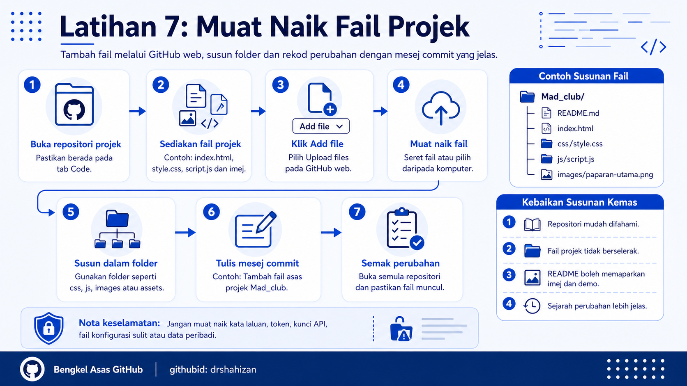

<a href="https://github.com/drshahizan/learn-github/stargazers"></a>
<a href="https://github.com/drshahizan/learn-github/network/members"></a>
<a href="https://github.com/drshahizan/learn-github/pulls"></a>
<a href="https://github.com/drshahizan/learn-github/issues"></a>
<a href="https://github.com/drshahizan/learn-github/graphs/contributors"></a>


<p align="center">

</p>

# Latihan 7: Muat Naik Fail Projek

## Objektif Latihan

Peserta dapat memuat naik fail projek ke dalam repositori melalui GitHub web, menyusun fail dalam folder yang sesuai, menulis mesej commit yang jelas dan menyemak perubahan pada repositori.

## Langkah 1: Buka Repositori Projek

1. Log masuk ke akaun GitHub.
2. Buka repositori projek yang ingin dikemas kini, contohnya `Mad_club`.
3. Pastikan peserta berada pada tab `Code`.
4. Semak senarai fail yang telah wujud dalam repositori.
5. Pastikan repositori yang dibuka ialah repositori yang betul.

## Langkah 2: Sediakan Fail Projek Di Komputer

1. Sediakan fail yang ingin dimuat naik.
2. Pastikan nama fail ringkas dan mudah difahami.
3. Elakkan nama fail yang terlalu panjang.
4. Elakkan ruang kosong dalam nama fail.
5. Gunakan tanda sempang seperti `paparan-utama.png`.

Contoh fail projek:

```text
index.html
style.css
script.js
README.md
logo.png
paparan-utama.png
```

## Langkah 3: Rancang Susunan Folder

1. Tentukan folder yang sesuai untuk fail projek.
2. Fail utama seperti `index.html` boleh diletakkan di bahagian utama repositori.
3. Fail CSS boleh diletakkan dalam folder `css`.
4. Fail JavaScript boleh diletakkan dalam folder `js`.
5. Imej boleh diletakkan dalam folder `images` atau `assets`.

Contoh susunan folder:

```text
Mad_club/
├── README.md
├── index.html
├── css/
│   └── style.css
├── js/
│   └── script.js
└── images/
    └── paparan-utama.png
```

## Langkah 4: Pilih Fungsi Upload Files

1. Pada halaman repositori, klik butang `Add file`.
2. Pilih `Upload files`.
3. GitHub akan membuka halaman untuk memuat naik fail.
4. Pastikan halaman tersebut menunjukkan nama repositori yang betul.
5. Jika tersalah repositori, kembali dahulu sebelum memuat naik fail.

## Langkah 5: Muat Naik Fail

1. Seret fail dari komputer ke kawasan upload.
2. Peserta juga boleh klik `choose your files`.
3. Pilih fail yang ingin dimuat naik.
4. Tunggu sehingga semua fail selesai dimuat naik.
5. Pastikan tiada fail yang gagal dimuat naik.

## Langkah 6: Susun Fail Dalam Folder

1. Jika mahu mencipta folder melalui GitHub web, klik `Add file` dan pilih `Create new file`.
2. Pada ruangan nama fail, taip nama folder diikuti tanda `/`.
3. Contoh:

```text
images/paparan-utama.png
```

4. Untuk fail baharu, GitHub akan mencipta folder `images`.
5. Jika fail telah dimuat naik tanpa folder, peserta boleh biarkan dahulu atau susun semula dalam latihan lanjutan.

## Langkah 7: Tulis Mesej Commit Yang Jelas

1. Scroll ke bahagian bawah halaman upload.
2. Cari bahagian `Commit changes`.
3. Tulis mesej commit yang ringkas dan menerangkan perubahan.
4. Elakkan mesej commit yang terlalu umum seperti `update`, `test` atau `new file`.

Contoh mesej commit yang baik:

```text
Tambah fail asas projek Mad_club
Tambah imej paparan utama projek
Tambah fail HTML dan CSS awal
```

## Langkah 8: Commit Perubahan

1. Semak senarai fail yang akan dimuat naik.
2. Pastikan mesej commit telah ditulis.
3. Pilih commit terus ke branch utama jika pilihan tersebut dipaparkan.
4. Klik `Commit changes`.
5. Tunggu sehingga GitHub selesai menyimpan perubahan.

## Langkah 9: Semak Perubahan Pada Repositori

1. Kembali ke tab `Code`.
2. Semak sama ada fail baharu telah muncul.
3. Buka fail yang dimuat naik untuk memastikan kandungannya betul.
4. Jika ada folder baharu, buka folder tersebut dan semak fail di dalamnya.
5. Semak sama ada README masih dipaparkan dengan baik.

## Langkah 10: Kemas Kini README Jika Perlu

1. Jika fail baharu berkaitan dengan projek, tambah penerangan dalam README.
2. Jika imej telah dimuat naik, paparkan imej tersebut dalam README.
3. Jika fail demo seperti `index.html` telah dimuat naik, nyatakan dalam README.
4. Commit perubahan README selepas dikemas kini.

Contoh menambah imej dalam README:

```markdown
## Paparan Projek


```

## Kebaikan Muat Naik Fail Projek

1. Repositori menjadi lebih lengkap.
2. Fail lebih tersusun.
3. Dokumentasi projek lebih mudah disokong dengan fail sebenar.
4. Fasilitator lebih mudah membuat semakan.
5. Peserta melatih amalan commit yang baik.

## Masalah Biasa dan Cara Mengatasi

| Masalah | Cadangan Penyelesaian |
|---|---|
| Fail tidak berjaya dimuat naik | Semak sambungan internet dan cuba muat naik semula. |
| Fail terlalu besar | Kecilkan saiz fail atau gunakan fail contoh yang lebih ringan. |
| Fail berada di lokasi yang salah | Susun semula fail atau muat naik semula dalam folder yang betul. |
| Imej tidak muncul dalam README | Semak nama folder, nama fail dan format Markdown imej. |
| Mesej commit terlalu umum | Gunakan mesej yang menerangkan perubahan, contohnya `Tambah fail HTML awal`. |

## Nota Keselamatan

1. Jangan muat naik kata laluan, token, kunci API atau fail konfigurasi sulit.
2. Jangan muat naik data peribadi, data pelanggan atau maklumat ahli kelab tanpa kebenaran.
3. Semak fail sebelum commit.
4. Elakkan memuat naik fail yang terlalu besar tanpa keperluan.
5. Pastikan fail yang dikongsi sesuai untuk dilihat oleh pensyarah, rakan dan pihak luar.

## Contribution 🛠️
Please create an [Issue](https://github.com/drshahizan/learn-github/issues) for any improvements, suggestions or errors in the content.

You can also contact me using [Linkedin](https://www.linkedin.com/in/drshahizan/) for any other queries or feedback.

[](https://visitorbadge.io/status?path=https%3A%2F%2Fgithub.com%2Fdrshahizan)

