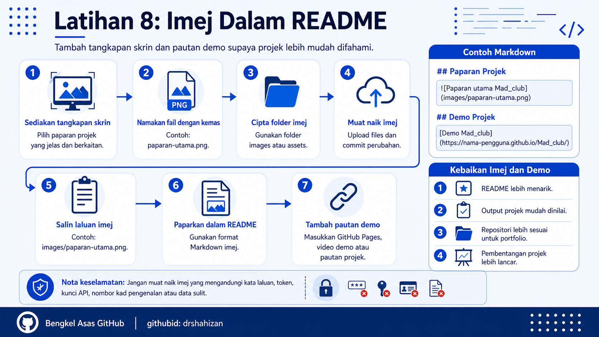

<a href="https://github.com/drshahizan/learn-github/stargazers"></a>
<a href="https://github.com/drshahizan/learn-github/network/members"></a>
<a href="https://github.com/drshahizan/learn-github/pulls"></a>
<a href="https://github.com/drshahizan/learn-github/issues"></a>
<a href="https://github.com/drshahizan/learn-github/graphs/contributors"></a>


<p align="center">

</p>

# Latihan 8: Imej Dalam README

## Objektif Latihan

Peserta dapat menyediakan folder imej dalam repositori, memuat naik tangkapan skrin projek, memaparkan imej dalam fail `README.md` dan menambah pautan demo jika ada.

## Langkah 1: Sediakan Tangkapan Skrin Projek

1. Buka projek yang ingin dipaparkan.
2. Ambil tangkapan skrin halaman utama, paparan sistem atau output projek.
3. Pilih imej yang paling jelas dan mewakili projek.
4. Elakkan imej yang kabur, terlalu kecil atau tidak berkaitan.
5. Simpan imej dalam format yang sesuai seperti `.png`, `.jpg` atau `.jpeg`.

Contoh nama fail yang sesuai:

```text
paparan-utama.png
demo-madclub.png
halaman-aktiviti.png
```

## Langkah 2: Namakan Fail Imej Dengan Kemas

1. Gunakan nama fail yang ringkas.
2. Gunakan huruf kecil jika boleh.
3. Elakkan ruang kosong dalam nama fail.
4. Gunakan tanda sempang untuk memisahkan perkataan.
5. Pastikan nama fail mudah dirujuk dalam README.

Contoh nama fail yang baik:

```text
paparan-utama.png
senarai-aktiviti.png
borang-pendaftaran.png
```

Contoh nama fail yang kurang sesuai:

```text
Screenshot 2026-05-27 at 10.30.11 PM.png
image final latest betul.png
gambar projek baru copy.png
```

## Langkah 3: Sediakan Folder images atau assets

1. Buka repositori projek dalam GitHub.
2. Klik `Add file`.
3. Pilih `Create new file`.
4. Pada ruangan nama fail, taip nama folder diikuti tanda `/`.

Contoh:

```text
images/paparan-utama.png
assets/paparan-utama.png
```

GitHub web tidak mencipta folder kosong. Folder hanya wujud apabila ada fail di dalamnya.

## Langkah 4: Muat Naik Tangkapan Skrin Ke Folder Imej

1. Buka folder `images` atau `assets` dalam repositori.
2. Klik `Add file`.
3. Pilih `Upload files`.
4. Seret fail imej ke ruang upload.
5. Pastikan fail imej berjaya dimuat naik.
6. Scroll ke bahagian bawah dan tulis mesej commit.

Contoh mesej commit:

```text
Tambah tangkapan skrin projek
```

7. Klik `Commit changes`.

## Langkah 5: Salin Laluan Fail Imej

1. Buka fail imej yang telah dimuat naik.
2. Semak lokasi fail dalam repositori.
3. Jika imej berada dalam folder `images`, laluan biasanya seperti berikut:

```text
images/paparan-utama.png
```

4. Jika imej berada dalam folder `assets`, laluan biasanya seperti berikut:

```text
assets/paparan-utama.png
```

5. Salin laluan tersebut untuk digunakan dalam README.

## Langkah 6: Paparkan Imej Dalam README

1. Buka fail `README.md`.
2. Klik ikon pensel atau butang `Edit`.
3. Cari bahagian yang sesuai untuk meletakkan imej.
4. Tambah bahagian baharu seperti `Paparan Projek`.
5. Gunakan format Markdown berikut:

```markdown
## Paparan Projek


```

Jika menggunakan folder `assets`, gunakan:

```markdown
## Paparan Projek


```

## Langkah 7: Preview README

1. Klik tab `Preview`.
2. Semak sama ada imej dipaparkan.
3. Jika imej tidak muncul, semak nama folder.
4. Semak nama fail dan huruf besar atau kecil.
5. Semak sama ada format Markdown betul.
6. Baiki laluan imej jika perlu.

## Langkah 8: Tambah Pautan Demo Jika Ada

1. Jika projek mempunyai demo, tambah bahagian `Demo Projek`.
2. Demo boleh berbentuk GitHub Pages, video demonstrasi, laman web projek, Google Colab atau fail APK yang dibenarkan.
3. Gunakan format pautan Markdown.

Contoh:

```markdown
## Demo Projek

[Demo Mad_club](https://nama-pengguna.github.io/Mad_club/)
```

Contoh untuk video:

```markdown
## Demo Projek

[Video Demo Mad_club](https://example.com/video-demo)
```

## Langkah 9: Commit Perubahan README

1. Scroll ke bahagian bawah editor README.
2. Cari bahagian `Commit changes`.
3. Tulis mesej commit yang jelas.

Contoh mesej commit:

```text
Tambah imej dan pautan demo dalam README
```

4. Klik `Commit changes`.
5. Tunggu sehingga GitHub menyimpan perubahan.

## Langkah 10: Semak Paparan Akhir

1. Kembali ke halaman utama repositori.
2. Semak paparan README.
3. Pastikan imej muncul dengan jelas.
4. Klik pautan demo jika ada.
5. Pastikan pautan demo berfungsi.
6. Jika ada masalah, edit README dan commit perubahan baharu.

## Kebaikan Menambah Imej Dalam README

1. Projek lebih mudah difahami.
2. README lebih menarik.
3. Fasilitator boleh melihat output projek dengan cepat.
4. Repositori lebih kuat sebagai portfolio digital.
5. Peserta lebih mudah membentangkan projek.

## Masalah Biasa dan Cara Mengatasi

| Masalah | Cadangan Penyelesaian |
|---|---|
| Imej tidak muncul dalam README | Semak laluan imej, nama folder dan nama fail. |
| Nama fail ada ruang kosong | Tukar nama fail menggunakan tanda sempang seperti `paparan-utama.png`. |
| Huruf besar dan kecil tidak sepadan | Pastikan ejaan dalam README sama dengan nama fail sebenar. |
| Imej terlalu besar | Kecilkan saiz imej sebelum muat naik. |
| Pautan demo tidak berfungsi | Buka pautan dalam tab baharu dan semak semula alamat URL. |

## Nota Keselamatan

1. Jangan muat naik tangkapan skrin yang mengandungi kata laluan, token, kunci API atau data sulit.
2. Elakkan memaparkan maklumat peribadi seperti nombor telefon, alamat rumah atau nombor kad pengenalan.
3. Semak imej sebelum dimuat naik.
4. Gunakan imej milik sendiri atau imej yang dibenarkan.
5. Jika imej menunjukkan maklumat ahli kumpulan, pastikan semua ahli bersetuju untuk dipaparkan.

## Contribution 🛠️
Please create an [Issue](https://github.com/drshahizan/learn-github/issues) for any improvements, suggestions or errors in the content.

You can also contact me using [Linkedin](https://www.linkedin.com/in/drshahizan/) for any other queries or feedback.

[](https://visitorbadge.io/status?path=https%3A%2F%2Fgithub.com%2Fdrshahizan)

