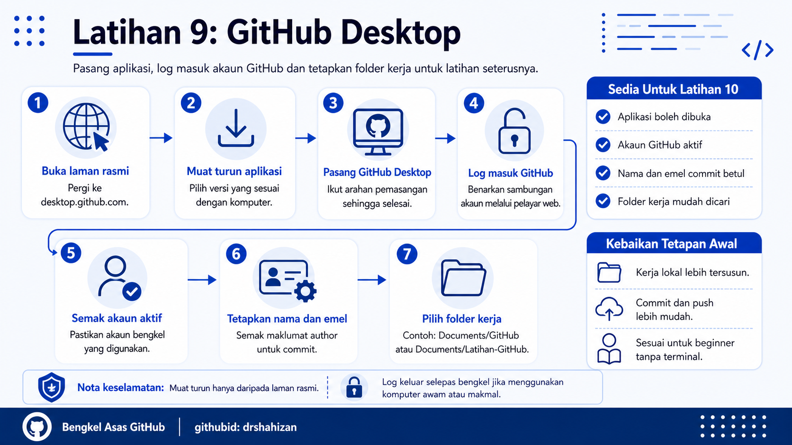

<a href="https://github.com/drshahizan/learn-github/stargazers"></a>
<a href="https://github.com/drshahizan/learn-github/network/members"></a>
<a href="https://github.com/drshahizan/learn-github/pulls"></a>
<a href="https://github.com/drshahizan/learn-github/issues"></a>
<a href="https://github.com/drshahizan/learn-github/graphs/contributors"></a>


<p align="center">

</p>

# Latihan 9: Pemasangan, Log Masuk dan Tetapkan GitHub Desktop

## Objektif Latihan

Peserta dapat memasang GitHub Desktop, log masuk menggunakan akaun GitHub dan membuat tetapan asas supaya aplikasi boleh digunakan untuk latihan seterusnya.

## Langkah 1: Buka Laman GitHub Desktop

1. Buka pelayar web.
2. Pergi ke laman rasmi GitHub Desktop:

```text
https://desktop.github.com/
```

3. Pastikan laman GitHub Desktop dipaparkan.
4. Elakkan memuat turun aplikasi daripada laman yang tidak rasmi.
5. Klik butang muat turun yang sesuai dengan sistem operasi komputer.

## Langkah 2: Muat Turun GitHub Desktop

1. Klik butang `Download`.
2. Tunggu sehingga fail pemasangan selesai dimuat turun.
3. Semak lokasi fail muat turun, biasanya dalam folder `Downloads`.
4. Pastikan fail yang dimuat turun ialah GitHub Desktop.
5. Jika muat turun gagal, semak sambungan internet dan cuba semula.

## Langkah 3: Pasang GitHub Desktop

1. Buka fail pemasangan yang telah dimuat turun.
2. Ikut arahan pemasangan yang dipaparkan.
3. Tunggu sehingga proses pemasangan selesai.
4. Buka aplikasi GitHub Desktop selepas pemasangan selesai.
5. Jika komputer meminta kebenaran keselamatan, benarkan aplikasi dibuka jika sumbernya daripada laman rasmi GitHub Desktop.

## Langkah 4: Log Masuk Akaun GitHub

1. Pada paparan GitHub Desktop, klik pilihan untuk log masuk ke GitHub.
2. GitHub Desktop akan membuka pelayar web untuk proses pengesahan.
3. Masukkan nama pengguna atau emel GitHub.
4. Masukkan kata laluan.
5. Benarkan GitHub Desktop mengakses akaun GitHub apabila diminta.
6. Kembali semula ke aplikasi GitHub Desktop selepas proses log masuk selesai.

## Langkah 5: Semak Akaun Aktif

1. Buka GitHub Desktop.
2. Pergi ke bahagian tetapan akaun.
3. Semak nama pengguna GitHub yang sedang aktif.
4. Pastikan akaun tersebut ialah akaun yang digunakan untuk bengkel.
5. Jika tersalah akaun, log keluar dan log masuk semula menggunakan akaun yang betul.

## Langkah 6: Tetapkan Nama dan Emel Commit

1. Buka tetapan GitHub Desktop.
2. Cari bahagian berkaitan `Git` atau `Author`.
3. Semak nama yang akan digunakan untuk commit.
4. Semak emel yang akan digunakan untuk commit.
5. Pastikan nama dan emel sesuai dengan akaun GitHub peserta.
6. Jika perlu, kemas kini nama dan emel tersebut.

## Langkah 7: Tetapkan Folder Kerja

1. Pilih lokasi folder yang mudah dicari pada komputer.
2. Contoh lokasi yang sesuai:
   - `Documents/GitHub`
   - `Desktop/GitHub`
   - `Documents/Latihan-GitHub`
3. Elakkan memilih folder yang sukar dicari.
4. Jika menggunakan komputer makmal, pastikan lokasi folder boleh diakses semula sepanjang bengkel.
5. Gunakan folder yang sama untuk latihan clone repositori nanti.

## Langkah 8: Semak Aplikasi Sedia Digunakan

1. Pastikan GitHub Desktop boleh dibuka tanpa masalah.
2. Pastikan akaun GitHub peserta aktif.
3. Pastikan nama dan emel commit telah disemak.
4. Pastikan folder kerja telah dipilih.
5. Jika semua perkara selesai, peserta boleh meneruskan Latihan 10.

## Kebaikan Menetapkan GitHub Desktop Dengan Betul

1. Memudahkan kerja dengan repositori secara lokal.
2. Mengurangkan kebergantungan kepada arahan terminal.
3. Membantu peserta melihat perubahan fail dengan lebih jelas.
4. Memudahkan proses commit dan push.
5. Menyediakan aliran kerja yang lebih sesuai untuk beginner.

## Masalah Biasa dan Cara Mengatasi

| Masalah | Cadangan Penyelesaian |
|---|---|
| Tidak boleh muat turun GitHub Desktop | Semak sambungan internet dan gunakan laman rasmi `https://desktop.github.com/`. |
| Aplikasi tidak boleh dibuka | Pastikan pemasangan selesai dan benarkan aplikasi melalui tetapan keselamatan komputer. |
| Tidak boleh log masuk | Semak nama pengguna, emel, kata laluan dan pengesahan dua faktor jika diaktifkan. |
| Akaun salah digunakan | Log keluar daripada GitHub Desktop dan log masuk semula menggunakan akaun bengkel. |
| Emel commit tidak sepadan | Buka tetapan GitHub Desktop dan kemas kini nama serta emel commit. |

## Nota Keselamatan

1. Muat turun GitHub Desktop hanya daripada laman rasmi.
2. Jangan kongsi kata laluan GitHub semasa proses log masuk.
3. Jika menggunakan komputer awam atau komputer makmal, log keluar daripada GitHub Desktop selepas bengkel.
4. Jangan simpan fail projek yang mengandungi kata laluan, token atau kunci API.
5. Pastikan folder kerja berada di lokasi yang selamat dan mudah dicari.

## Contribution 🛠️
Please create an [Issue](https://github.com/drshahizan/learn-github/issues) for any improvements, suggestions or errors in the content.

You can also contact me using [Linkedin](https://www.linkedin.com/in/drshahizan/) for any other queries or feedback.

[](https://visitorbadge.io/status?path=https%3A%2F%2Fgithub.com%2Fdrshahizan)

