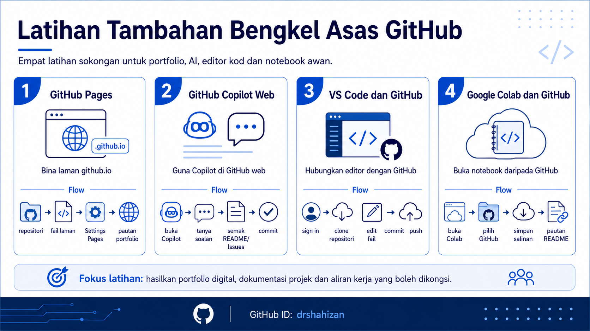

# Additional Exercises for the Basic GitHub Workshop

These additional exercises are prepared for participants of the **Basic GitHub Workshop** who want to expand their use of GitHub into web portfolios, AI assistance, code editors and cloud notebooks. The main focus of these exercises is to produce materials that can be shared, reviewed and reused in participants' digital portfolios.

These exercises are suitable to be completed after participants understand the basics of GitHub profiles, repositories, README files, commits and project links.

## Additional Exercise Objectives

After completing these additional exercises, participants will be able to:

1. Build a `github.io` website using GitHub Pages.
2. Use GitHub Copilot through GitHub web responsibly.
3. Connect Microsoft Visual Studio Code with a GitHub account.
4. Use Google Colab with GitHub for exercise notebooks.
5. Add links to exercise outputs in the project README.
6. Produce more complete digital portfolio materials.

## Additional Exercise Table of Contents

| No. | Exercise | Main Focus |
|---:|---|---|
| 1. | [Build and Publish a github.io Website](tambahan1.md) | Create a portfolio website using GitHub Pages and a `github.io` link. |
| 2. | [GitHub Copilot in GitHub Web](tambahan2.md) | Use Copilot Chat to review README files, suggest Issues and perform simple code reviews. |
| 3. | [Connect VS Code with GitHub](tambahan3.md) | Sign in to GitHub, clone a repository, edit files, commit and push through VS Code. |
| 4. | [Google Colab and GitHub](tambahan4.md) | Open a notebook from GitHub, save a copy, run code and add the link in README. |

## Contribution 🛠️
Please create an [Issue](https://github.com/drshahizan/learn-github/issues) for any improvements, suggestions or errors in the content.

You can also contact me using [Linkedin](https://www.linkedin.com/in/drshahizan/) for any other queries or feedback.
