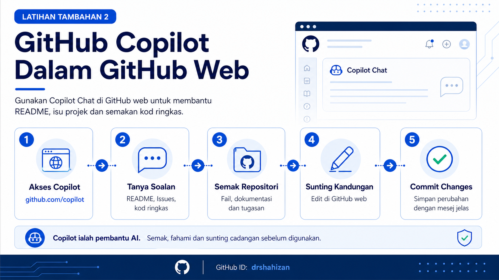

<a href="https://github.com/drshahizan/learn-github/stargazers"></a>
<a href="https://github.com/drshahizan/learn-github/network/members"></a>
<a href="https://github.com/drshahizan/learn-github/pulls"></a>
<a href="https://github.com/drshahizan/learn-github/issues"></a>
<a href="https://github.com/drshahizan/learn-github/graphs/contributors"></a>


<p align="center">

</p>

# Additional Exercise 2: GitHub Copilot in GitHub Web

This exercise guides participants in using **GitHub Copilot through GitHub web**. The focus is on using Copilot Chat to understand repository content, get README improvement suggestions, generate issue ideas, review simple code and develop responsible AI usage practices.

## Learning Objectives

After completing this exercise, participants will be able to:

1. Access GitHub Copilot Chat through the GitHub website.
2. Use Copilot to ask questions related to a repository.
3. Get suggestions to improve a README.
4. Get suggestions for project issues and tasks.
5. Review Copilot's answers before using them in a repository.

## Step 1: Open GitHub Copilot on the Web

1. Open a web browser.
2. Go to the following link:

```text
https://github.com/copilot
```

3. Sign in using your GitHub account.
4. Make sure the Copilot Chat page is displayed.
5. If Copilot is not available, inform the facilitator so that account access can be checked.

## Step 2: Start the First Question

1. Click the question field in Copilot Chat.
2. Type a short question related to GitHub.
3. Use the following example question:

```text
What is the purpose of a README in a GitHub repository?
```

4. Press `Enter`.
5. Read the answer given by Copilot.
6. Identify the important points that are suitable for use in the exercise.

## Step 3: Open the Training Repository

1. Open a new tab in the web browser.
2. Go to your training repository.
3. Example reference repository:

```text
https://github.com/drshahizan/learn-github
```

4. Check the files and folders in the repository.
5. Open the `README.md` file if available.

## Step 4: Ask Copilot About the Repository

1. Return to Copilot Chat.
2. Write a clear prompt based on the training repository.
3. Use the following example prompt:

```text
Based on a GitHub training repository for students, suggest suitable README sections to include.
```

4. Read Copilot's suggestions.
5. Select only the sections that are suitable.
6. Do not copy the entire answer without reviewing it.

## Step 5: Get Suggestions to Improve the README

1. Copy the content of your project README.
2. Paste the content into Copilot Chat if appropriate.
3. Use the following example prompt:

```text
Review this README and suggest improvements in terms of structure, clarity and project information. Use professional English.
```

4. Review the suggestions given.
5. Select only the suggestions that truly suit your project.
6. Update the README manually in GitHub web.

## Step 6: Edit the README Through GitHub Web

1. Open the `README.md` file in your repository.
2. Click the pencil icon to edit the file.
3. Add the improvements that you have reviewed.
4. Make sure the README structure includes important sections such as:

| Section | Content |
|---|---|
| Project title | A clear project name. |
| Summary | A short explanation of the project purpose. |
| Main features | Important project functions. |
| Technologies used | A list of technologies or applications used. |
| Group members | Names of members involved. |
| Project status | Examples: Under development, completed or prototype. |

5. Check the Markdown preview before committing.

## Step 7: Use Copilot for Issue Suggestions

1. Open Copilot Chat.
2. Use the following example prompt:

```text
Suggest 5 suitable issues for a student portfolio website project on GitHub.
```

3. Choose one or two of the most suitable issues.
4. Open the **Issues** tab in the repository.
5. Create a new issue based on the reviewed suggestion.
6. Write a short and clear issue title.

## Step 8: Use Copilot for a Simple Code Review

1. Open a simple code file in the repository, for example `index.html`.
2. Copy the part of the code you want to review.
3. Return to Copilot Chat.
4. Use the following example prompt:

```text
Review this HTML code. Suggest simple improvements in terms of structure, readability and suitability for a student portfolio website.
```

5. Read Copilot's suggestions.
6. Use only suggestions that you understand.
7. Do not add code that you do not understand into the repository.

## Step 9: Record AI Usage in the README

1. Add a short section in `README.md`.
2. Use the following heading:

```markdown
## AI Usage
```

3. Add a note like the following example:

```markdown
Some suggestions for the README structure and project issue ideas were assisted by GitHub Copilot through GitHub web. All content was reviewed and edited by the author before being used.
```

4. Make sure this note is clear, honest and suitable for academic requirements.

## Step 10: Commit Changes in GitHub Web

1. After editing `README.md`, scroll to the bottom of the page.
2. Write a clear commit message.
3. Example commit message:

```text
Add README improvements using Copilot suggestions
```

4. Choose to commit directly to the branch currently being used.
5. Click **Commit changes**.
6. Check the README display again after the commit.

## Responsible Practices

| Item | Recommended Practice |
|---|---|
| Copilot answers | Review them before use. |
| README content | Make sure the project information is true. |
| Code | Understand the code before saving it in the repository. |
| Issues | Choose issues that match the project scope. |
| Academic ethics | State AI usage if it is used in an assignment. |
| Sensitive data | Do not enter passwords, tokens, API keys or personal data. |

## Common Problems and How to Solve Them

| Problem | Action |
|---|---|
| Copilot cannot be accessed | Check GitHub sign-in and Copilot access status. |
| Answer is too general | Provide clearer project context. |
| Suggestion is not suitable | Ignore the suggestion and rewrite the prompt. |
| README is not neat | Use headings, bullet lists and Markdown tables. |
| Unsure about code | Ask the facilitator before committing. |

## Contribution 🛠️
Please create an [Issue](https://github.com/drshahizan/learn-github/issues) for any improvements, suggestions or errors in the content.

You can also contact me using [Linkedin](https://www.linkedin.com/in/drshahizan/) for any other queries or feedback.

[](https://visitorbadge.io/status?path=https%3A%2F%2Fgithub.com%2Fdrshahizan)

