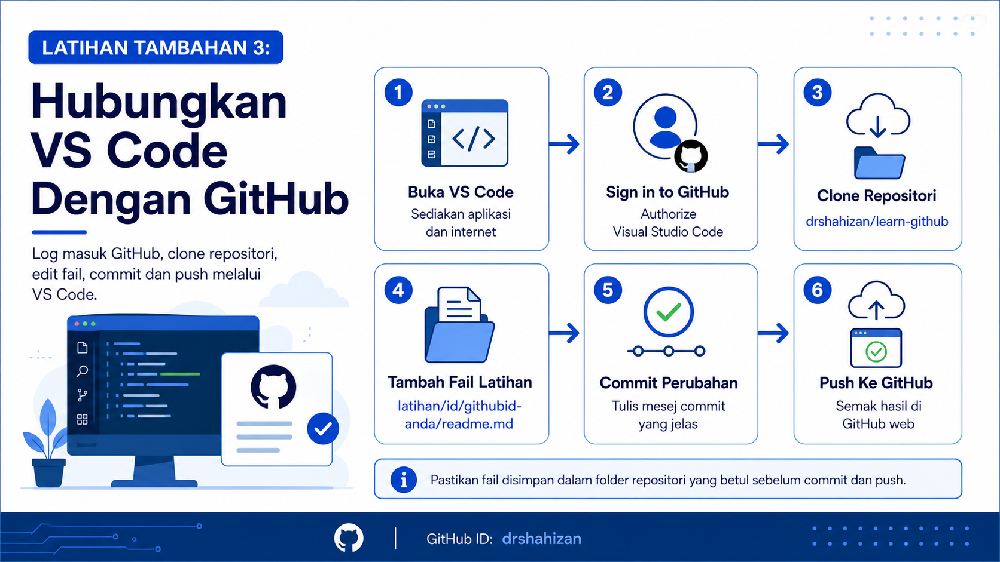

<a href="https://github.com/drshahizan/learn-github/stargazers"></a>
<a href="https://github.com/drshahizan/learn-github/network/members"></a>
<a href="https://github.com/drshahizan/learn-github/pulls"></a>
<a href="https://github.com/drshahizan/learn-github/issues"></a>
<a href="https://github.com/drshahizan/learn-github/graphs/contributors"></a>


<p align="center">

</p>

# Latihan Tambahan 3: Hubungkan VS Code Dengan GitHub

Latihan ini membimbing peserta menghubungkan **Microsoft Visual Studio Code** dengan akaun **GitHub**. Fokus latihan ialah log masuk akaun GitHub dalam VS Code, membuka repositori latihan, membuat perubahan fail dan menghantar perubahan semula ke GitHub melalui antara muka grafik.

## Objektif Latihan

Selepas melengkapkan latihan ini, peserta dapat:

1. Log masuk akaun GitHub melalui VS Code.
2. Menghubungkan VS Code dengan akaun GitHub.
3. Menyalin repositori latihan ke komputer.
4. Mengedit fail dalam VS Code.
5. Membuat commit dan push perubahan ke GitHub.

## Langkah 1: Buka VS Code

1. Buka aplikasi **Visual Studio Code** pada komputer.
2. Pastikan komputer mempunyai sambungan internet.
3. Pastikan anda telah mempunyai akaun GitHub yang aktif.
4. Jika VS Code belum dipasang, maklumkan kepada fasilitator.

## Langkah 2: Log Masuk Akaun GitHub

1. Klik ikon **Accounts** pada bahagian kiri bawah VS Code.
2. Pilih **Sign in to GitHub**.
3. Pelayar web akan dibuka secara automatik.
4. Log masuk menggunakan akaun GitHub anda.
5. Klik **Authorize Visual Studio Code** jika diminta.
6. Kembali semula ke VS Code selepas proses log masuk selesai.

## Langkah 3: Semak Status Log Masuk

1. Klik semula ikon **Accounts**.
2. Pastikan nama akaun GitHub anda dipaparkan.
3. Jika akaun tidak dipaparkan, ulang semula proses log masuk.
4. Pastikan tiada mesej ralat berkaitan sambungan akaun.

## Langkah 4: Salin Pautan Repositori Latihan

1. Buka pelayar web.
2. Pergi ke repositori latihan berikut:

```text
https://github.com/drshahizan/learn-github
```

3. Klik butang **Code**.
4. Pilih tab **HTTPS**.
5. Salin pautan repositori yang dipaparkan.

## Langkah 5: Clone Repositori Dalam VS Code

1. Kembali ke VS Code.
2. Klik ikon **Source Control** pada panel kiri.
3. Klik **Clone Repository**.
4. Tampal pautan repositori yang telah disalin.
5. Pilih lokasi folder pada komputer untuk menyimpan fail latihan.
6. Tunggu sehingga proses clone selesai.
7. Klik **Open** apabila VS Code meminta untuk membuka folder repositori.

## Langkah 6: Semak Fail Repositori

1. Lihat panel **Explorer** di sebelah kiri.
2. Pastikan fail dan folder repositori dipaparkan.
3. Buka fail `README.md`.
4. Baca kandungan fail tersebut.
5. Pastikan anda berada dalam folder repositori yang betul.

## Langkah 7: Tambah Folder Dan Fail Latihan

1. Dalam panel **Explorer**, cari folder `latihan`.
2. Jika folder `latihan` belum wujud, cipta folder baharu bernama `latihan`.
3. Di dalam folder `latihan`, cipta folder baharu bernama `id`.
4. Di dalam folder `id`, cipta folder baharu menggunakan GitHub ID anda.
5. Contoh nama folder:

```text
latihan/id/githubid-anda
```

6. Di dalam folder GitHub ID anda, cipta fail baharu bernama `readme.md`.
7. Masukkan maklumat ringkas diri anda dalam fail tersebut.
8. Contoh kandungan:

```markdown
# Profil Ringkas

Nama: Nama Anda
GitHub ID: githubid-anda
Bidang Minat: Pembangunan web, aplikasi mobil atau data
Tujuan Bengkel: Belajar menggunakan GitHub untuk portfolio dan kolaborasi projek
```

9. Simpan fail selepas selesai menulis maklumat.

## Langkah 8: Semak Perubahan Dalam Source Control

1. Klik ikon **Source Control** pada panel kiri VS Code.
2. Semak senarai fail yang berubah.
3. Pastikan fail `readme.md` dalam folder GitHub ID anda dipaparkan.
4. Jika fail tidak dipaparkan, pastikan fail telah disimpan.

## Langkah 9: Tulis Mesej Commit

1. Dalam ruang mesej commit, tulis mesej yang jelas.
2. Contoh mesej commit:

```text
Tambah profil latihan GitHub ID
```

3. Pastikan mesej commit menerangkan perubahan yang dibuat.
4. Elakkan mesej yang terlalu umum seperti `update` atau `test`.

## Langkah 10: Commit Perubahan

1. Klik butang **Commit**.
2. Jika VS Code meminta pengesahan, pilih pilihan yang sesuai untuk meneruskan commit.
3. Semak bahawa perubahan telah direkodkan.
4. Jika terdapat ralat, baca mesej ralat dan maklumkan kepada fasilitator.

## Langkah 11: Push Perubahan Ke GitHub

1. Klik **Sync Changes** atau **Push** dalam VS Code.
2. Tunggu sehingga proses selesai.
3. Jika diminta log masuk semula, ikut arahan yang dipaparkan.
4. Pastikan tiada mesej ralat selepas proses push.

## Langkah 12: Semak Di GitHub Web

1. Buka repositori latihan melalui pelayar web.
2. Semak folder `latihan/id`.
3. Cari folder GitHub ID anda.
4. Buka fail `readme.md`.
5. Pastikan maklumat yang anda tambah dipaparkan dengan betul.
6. Salin pautan fail tersebut jika diminta oleh fasilitator.

## Ringkasan Aliran Kerja

| Langkah | Tindakan |
|---|---|
| 1 | Log masuk GitHub dalam VS Code. |
| 2 | Clone repositori latihan ke komputer. |
| 3 | Tambah folder dan fail latihan. |
| 4 | Semak perubahan dalam Source Control. |
| 5 | Commit perubahan. |
| 6 | Push perubahan ke GitHub. |
| 7 | Semak hasil di GitHub web. |

## Masalah Biasa dan Cara Mengatasi

| Masalah | Tindakan |
|---|---|
| Tidak boleh log masuk GitHub | Semak emel, kata laluan dan sambungan internet. |
| Butang Clone tidak muncul | Buka tab Source Control atau gunakan Command Palette. |
| Fail tidak muncul dalam Source Control | Pastikan fail telah disimpan dalam folder repositori. |
| Push gagal | Semak log masuk GitHub dan pastikan anda mempunyai akses kepada repositori. |
| Folder tersalah lokasi | Semak semula struktur folder sebelum commit. |

## Contribution 🛠️
Please create an [Issue](https://github.com/drshahizan/learn-github/issues) for any improvements, suggestions or errors in the content.

You can also contact me using [Linkedin](https://www.linkedin.com/in/drshahizan/) for any other queries or feedback.

[](https://visitorbadge.io/status?path=https%3A%2F%2Fgithub.com%2Fdrshahizan)

