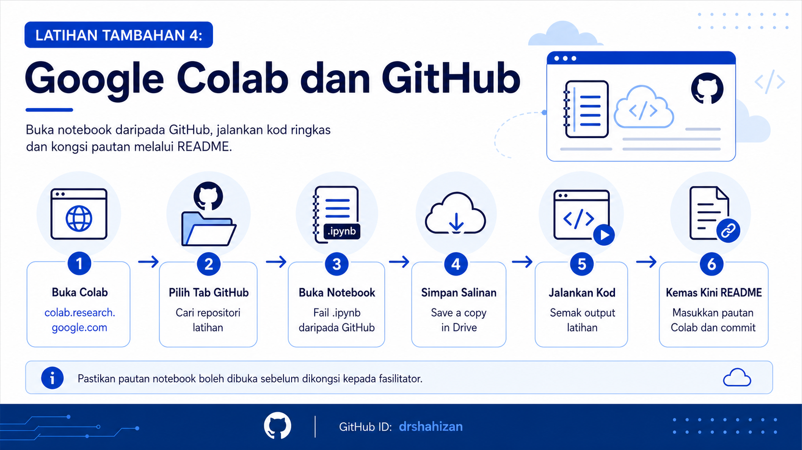

<a href="https://github.com/drshahizan/learn-github/stargazers"></a>
<a href="https://github.com/drshahizan/learn-github/network/members"></a>
<a href="https://github.com/drshahizan/learn-github/pulls"></a>
<a href="https://github.com/drshahizan/learn-github/issues"></a>
<a href="https://github.com/drshahizan/learn-github/graphs/contributors"></a>


<p align="center">

</p>

# Latihan Tambahan 4: Google Colab dan GitHub

Latihan ini membimbing peserta menggunakan **Google Colab** bersama **GitHub**. Fokus latihan ialah membuka notebook daripada GitHub, membuat salinan notebook, menjalankan kod ringkas dan menyimpan pautan notebook sebagai sebahagian daripada dokumentasi projek.

## Objektif Latihan

Selepas melengkapkan latihan ini, peserta dapat:

1. Membuka Google Colab melalui pelayar web.
2. Mengakses notebook daripada GitHub.
3. Menjalankan kod ringkas dalam notebook.
4. Menyimpan salinan notebook ke Google Drive.
5. Menambah pautan Google Colab ke dalam README projek.

## Langkah 1: Buka Google Colab

1. Buka pelayar web.
2. Pergi ke pautan berikut:

```text
https://colab.research.google.com
```

3. Log masuk menggunakan akaun Google anda.
4. Pastikan halaman Google Colab berjaya dibuka.
5. Jika diminta memilih akaun, pilih akaun yang akan digunakan untuk latihan.

## Langkah 2: Buka Tab GitHub Dalam Colab

1. Pada tetingkap permulaan Colab, pilih tab **GitHub**.
2. Jika tetingkap tidak muncul, klik menu **File**.
3. Pilih **Open notebook**.
4. Pilih tab **GitHub**.
5. Pastikan ruang carian GitHub dipaparkan.

## Langkah 3: Cari Repositori Latihan

1. Dalam ruang carian GitHub, masukkan pautan repositori latihan.
2. Gunakan pautan berikut sebagai contoh:

```text
https://github.com/drshahizan/learn-github
```

3. Tekan `Enter`.
4. Jika terdapat notebook dalam repositori, senarai fail notebook akan dipaparkan.
5. Pilih notebook yang ingin dibuka.

## Langkah 4: Buka Notebook Daripada GitHub

1. Klik nama fail notebook yang ingin digunakan.
2. Pastikan notebook dibuka dalam Google Colab.
3. Semak tajuk notebook dan kandungan sel.
4. Jangan ubah fail asal tanpa membuat salinan.
5. Gunakan notebook sebagai bahan latihan atau rujukan.

## Langkah 5: Simpan Salinan Notebook

1. Klik menu **File**.
2. Pilih **Save a copy in Drive**.
3. Google Colab akan membuka salinan notebook baharu.
4. Salinan ini disimpan dalam Google Drive anda.
5. Tukar nama notebook supaya lebih jelas.
6. Contoh nama fail:

```text
latihan-colab-github-nama-anda.ipynb
```

## Langkah 6: Jalankan Kod Ringkas

1. Tambah satu sel kod baharu dalam notebook.
2. Masukkan kod ringkas berikut:

```python
nama = "Nama Anda"
github_id = "githubid-anda"

print("Nama:", nama)
print("GitHub ID:", github_id)
print("Saya sedang belajar menghubungkan Google Colab dengan GitHub.")
```

3. Klik butang run pada sel tersebut.
4. Pastikan output dipaparkan dengan betul.
5. Tukar `Nama Anda` dan `githubid-anda` kepada maklumat sebenar anda.

## Langkah 7: Tambah Sel Markdown

1. Tambah satu sel teks atau Markdown.
2. Masukkan maklumat ringkas seperti berikut:

```markdown
# Latihan Google Colab dan GitHub

Nama: Nama Anda

GitHub ID: githubid-anda

Tujuan latihan: Membuka, menjalankan dan berkongsi notebook Google Colab yang berkaitan dengan GitHub.
```

3. Pastikan teks dipaparkan dengan kemas.
4. Gunakan tajuk dan jarak baris yang sesuai.

## Langkah 8: Dapatkan Pautan Notebook

1. Klik butang **Share** pada bahagian kanan atas Google Colab.
2. Tetapkan akses mengikut arahan fasilitator.
3. Jika latihan perlu dikongsi, pilih tetapan pautan yang sesuai.
4. Salin pautan notebook.
5. Simpan pautan tersebut untuk dimasukkan ke dalam README projek.

## Langkah 9: Tambah Pautan Colab Dalam README

1. Buka repositori latihan anda di GitHub.
2. Buka fail `README.md`.
3. Klik ikon pensel untuk mengedit fail.
4. Tambah bahagian baharu seperti berikut:

```markdown
## Google Colab

Pautan notebook latihan:

[Buka Notebook Google Colab](pautan-notebook-anda)
```

5. Gantikan `pautan-notebook-anda` dengan pautan sebenar notebook anda.
6. Semak paparan Markdown sebelum commit.

## Langkah 10: Commit Perubahan Di GitHub

1. Skrol ke bahagian bawah halaman edit README.
2. Tulis mesej commit yang jelas.
3. Contoh mesej commit:

```text
Tambah pautan Google Colab dalam README
```

4. Klik **Commit changes**.
5. Semak semula README selepas commit.
6. Pastikan pautan Google Colab boleh dibuka.

## Ringkasan Aliran Kerja

| Langkah | Tindakan |
|---|---|
| 1 | Buka Google Colab. |
| 2 | Pilih tab GitHub. |
| 3 | Cari repositori latihan. |
| 4 | Buka notebook daripada GitHub. |
| 5 | Simpan salinan notebook ke Google Drive. |
| 6 | Jalankan kod ringkas. |
| 7 | Salin pautan notebook. |
| 8 | Tambah pautan dalam README. |
| 9 | Commit perubahan di GitHub. |

## Masalah Biasa dan Cara Mengatasi

| Masalah | Tindakan |
|---|---|
| Tidak boleh buka Google Colab | Semak sambungan internet dan akaun Google. |
| Tab GitHub tidak memaparkan fail | Pastikan pautan repositori betul dan repositori boleh diakses. |
| Notebook tidak boleh disimpan | Pastikan akaun Google Drive mempunyai ruang mencukupi. |
| Kod tidak berjalan | Semak semula sintaks kod dan jalankan sel satu demi satu. |
| Pautan Colab tidak boleh dibuka | Semak tetapan perkongsian notebook. |

## Contribution 🛠️
Please create an [Issue](https://github.com/drshahizan/learn-github/issues) for any improvements, suggestions or errors in the content.

You can also contact me using [Linkedin](https://www.linkedin.com/in/drshahizan/) for any other queries or feedback.

[](https://visitorbadge.io/status?path=https%3A%2F%2Fgithub.com%2Fdrshahizan)

