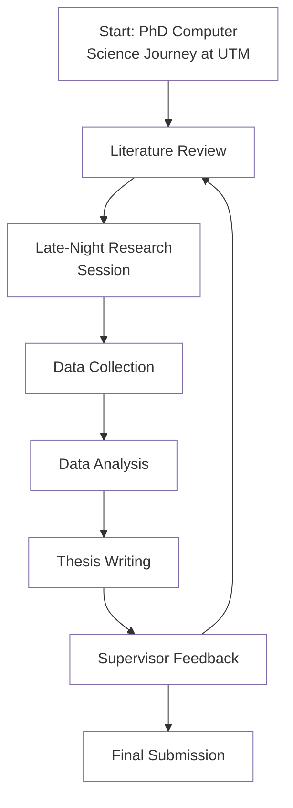

# Hello World
## Hello World
### Hello World
#### Hello World

My name is **Anton**. I'm at *UKM*.

| Column 1 | Column 2 | Kandungan |
|---:|:---:|---|
| 1 | Slaid Pembentangan | [Bengkel Asas GitHub](https://liveutm-my.sharepoint.com/) |
[FTSM](https://ftsm.ukm.my/)

