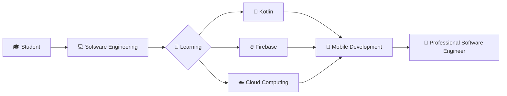

# 👋 About Me

My name is **Amir Aizat**. I'm a 🎓 Software Engineering student at *UKM*.

## 🚀 Profile

| 🏷️ Category | 📌 Details |
|------------|------------|
| 👤 Name | Amir Aizat |
| 🎓 University | Universiti Kebangsaan Malaysia (UKM) |
| 💻 Program | Software Engineering |
| 🌱 Currently Learning | Kotlin, Firebase, Cloud Computing |
| 🔥 Interests | Mobile Development, Web Development, Cybersecurity |
| 🛠️ Technologies | Java, Kotlin, PHP, Python, MySQL, Firebase |
| 🎯 Goal | Become a skilled Software Engineer |

## 📫 Connect With Me
- 💼 GitHub: @Aizat200
- 🌐 Open to collaboration and learning opportunities

> ✨ Turning ideas into software solutions, one project at a time.

## 📈 Learning Journey

