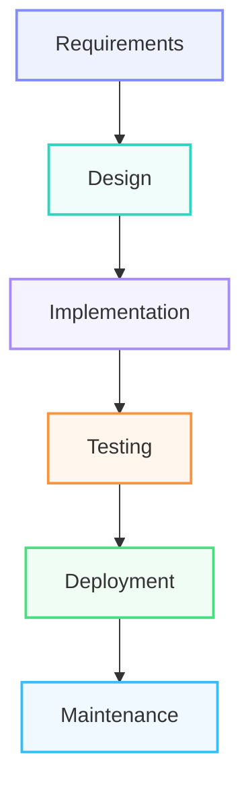

# Hello World
## Hello World
### Hello World
#### Hello World

## 👋 About Me

🎓 My name is LI HUILIANG 😋. Software Engineering Undergraduate at FTSM, Universiti Kebangsaan Malaysia (UKM)

💻 Interested in:

* Software Development
* Software Design & Architecture
* Database Systems
* Computer Networks
* Web & Mobile Applications

🌱 Currently Learning:

* Java Programming
* Data Structures & Algorithms
* Software Testing
* Software Project Management
* Software Security

| Course | Language | Status |
|----------|----------|----------|
| Database | SQL | Completed |
| OOP | Java | Learning |
| Networking | Cisco PT | Learning |

[My faculty: FTSM](https://www.ukm.my/ftsm/)

🚀 Passionate about building practical software solutions and continuously improving my engineering skills.

