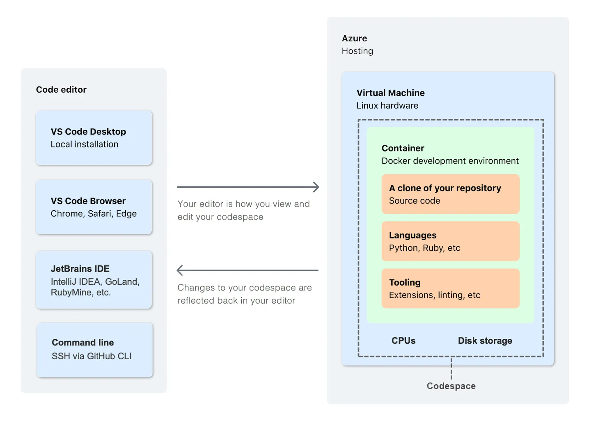

<a href="https://github.com/drshahizan/learn-github/stargazers"></a>
<a href="https://github.com/drshahizan/learn-github/network/members"></a>
<a href="https://github.com/drshahizan/learn-github/pulls"></a>
<a href="https://github.com/drshahizan/learn-github/issues"></a>
<a href="https://github.com/drshahizan/learn-github/graphs/contributors"></a>


🌟 Hit star button to save this repo in your profile

# Github Education: Codespaces

## History
GitHub Codespaces was introduced by GitHub in 2020 as a cloud-based development environment that allows developers to write, review, and ship code directly from their web browser or integrated development environment (IDE). It provides a fully configured development environment in the cloud, eliminating the need for developers to set up and maintain local development environments.

Before the launch of GitHub Codespaces, developers typically had to set up their local development environments with the necessary dependencies, tools, and configurations. This process often involved complex installation procedures and could be time-consuming, especially when working with multiple projects or collaborating with other developers.

GitHub Codespaces aimed to simplify this process and provide developers with a consistent and reproducible development environment that could be accessed from anywhere with an internet connection. By moving the development environment to the cloud, developers could save time on initial setup, easily switch between projects, and collaborate more seamlessly with others.

https://res.cloudinary.com/practicaldev/image/fetch/s--Dx9tPPRf--/c_limit%2Cf_auto%2Cfl_progressive%2Cq_auto%2Cw_880/https://dev-to-uploads.s3.amazonaws.com/i/xm8bkn7j9qp9jhj2vqsu.png

The history of GitHub Codespaces can be traced back to Visual Studio Codespaces, which was initially introduced by Microsoft as Visual Studio Online in 2019. Visual Studio Codespaces provided a similar cloud-based development environment but was primarily focused on Visual Studio IDE users.

GitHub, being a subsidiary of Microsoft, leveraged the technology behind Visual Studio Codespaces and integrated it into their platform to create GitHub Codespaces. This integration brought the benefits of cloud-based development environments to the GitHub ecosystem, allowing developers to work on their GitHub repositories directly from the browser or their preferred IDE, including Visual Studio Code.

https://res.cloudinary.com/practicaldev/image/fetch/s--1OETLAua--/c_limit%2Cf_auto%2Cfl_progressive%2Cq_auto%2Cw_880/https://dev-to-uploads.s3.amazonaws.com/i/f4npb6tqeve28klcos69.png

GitHub Codespaces has continued to evolve since its launch, with regular updates and enhancements to improve the developer experience. It has gained popularity among developers who prefer the convenience and flexibility of cloud-based development environments, enabling them to work on their projects from various devices without the need for complex setup processes.

## Development environment

GitHub Codespaces provides a customizable development environment that can be tailored to meet the specific needs of developers. The development environment specification for GitHub Codespaces includes the following features:

1. Operating System: Codespaces supports both Linux and Windows operating systems, allowing developers to choose the environment that aligns with their project requirements.

2. Code Editor: Codespaces provides a built-in code editor with a rich set of features and functionalities. By default, it includes Visual Studio Code, a popular and highly extensible code editor. Developers can leverage the powerful editing capabilities, syntax highlighting, debugging tools, and extensions available within the code editor.

3. Terminal Access: Codespaces offers an integrated terminal that allows developers to execute commands and run scripts directly within the development environment. This enables seamless interaction with the codebase and execution of various tasks.

4. Language Support: GitHub Codespaces supports a wide range of programming languages and frameworks. It provides pre-installed language runtimes, compilers, and libraries for popular languages like JavaScript, Python, Java, C++, Ruby, and many more. This ensures that developers have the necessary tools and dependencies readily available.

5. Version Control Integration: As a product of GitHub, Codespaces seamlessly integrates with Git, the widely used version control system. It provides a dedicated interface for managing Git repositories, making it easy to clone, branch, commit, and push code changes directly from the Codespaces environment.

6. Configuration Options: Codespaces allows developers to customize their development environment by specifying configuration files. These files can define settings such as installed dependencies, build scripts, environment variables, and more. Developers can use these configuration options to replicate their local development setup and ensure consistency across different environments.

7. Collaboration and Sharing: Codespaces supports collaborative development, enabling multiple developers to work on the same project simultaneously. Each developer can have their own Codespaces instance, facilitating real-time collaboration, code reviews, and pair programming. Developers can also easily share their Codespaces environment with others, making it convenient to onboard new team members or collaborate with external contributors.

These are some of the key specifications of the development environment provided by GitHub Codespaces. It offers a powerful and flexible setup that empowers developers to efficiently work on their projects in a cloud-based environment.

## What is a codespace?
A codespace is a development environment that's hosted in the cloud. You can customize your project for GitHub Codespaces by committing configuration files to your repository (often known as Configuration-as-Code), which creates a repeatable codespace configuration for all users of your project.

Each codespace you create is hosted by GitHub in a Docker container, running on a virtual machine. You can choose from a selection of virtual machine types, from 2 cores, 8 GB RAM, and 32 GB storage, up to 32 cores, 64 GB RAM, and 128 GB storage.

By default, codespaces are created from an Ubuntu Linux image that includes a selection of popular languages and tools, but you can use an image based on a Linux distribution of your choice and configure it for your particular requirements. Regardless of your local operating system, your codespace will run in a Linux environment. Windows and MacOS are not supported operating systems for the remote container.

You can connect to your codespaces from your browser, from Visual Studio Code, from the JetBrains Gateway application, or by using GitHub CLI. When you connect, you are placed within the Docker container. You do not have access to the outer Linux virtual machine host.

<p align="center">

</p>

|  Medium.com |
|:---|
| 1. [GitHub Codespaces: Learn To Code in Your Browser](https://betterprogramming.pub/github-codespaces-learn-to-code-in-your-browser-1a426e5e665f)<br>2. [Open Source Data Exploration Tools You Need to Know, GitHub Codespaces and Copilot, and Meta’s New LLM](https://medium.com/odscjournal/open-source-data-exploration-tools-you-need-to-know-github-codespaces-and-copilot-and-metas-new-32bb740232f7)<br>3. [GitHub Codespaces and GitHub Copilot: 2 Stories, Thousands of Possibilities](https://odsc.medium.com/github-codespaces-and-github-copilot-2-stories-thousands-of-possibilities-9e0e28ae706c)<br>4. [[Microsoft Dev Skill Ep.3] Level Up with GitHub Codespaces and Copilot](https://medium.com/@boatchrnthn/microsoft-dev-skill-ep-3-level-up-with-github-codespaces-and-copilot-5b85a5fd1b2a)|

|  Youtube.com |
|:---|
| 1. [What is Codespaces?](https://youtu.be/sYJ3CHtT6WM)<br>2. [Github gave me a BEAST for coding 🤯 NO MORE VS Code](https://youtu.be/vPigsZ-zk1g)<br>3. [How to use GitHub Codespaces for Free (VSCode in the cloud!)](https://youtu.be/YFdh32ShBeI)<br>4. [Github Codespace crash course](https://youtu.be/D_5T6KMTRb8)<br>5. [How to connect Github Codespaces and Mongodb Atlas](https://youtu.be/X88dsegH0-Y)|


## GitHub Codespaces in Visual Studio Code
To run GitHub Codespaces in Visual Studio Code, you can follow these steps:

1. Make sure you have Visual Studio Code installed on your machine. If you don't have it, you can download it from the official website: https://code.visualstudio.com/

2. Open Visual Studio Code.

3. Install the "GitHub Codespaces" extension from the Visual Studio Code marketplace. You can do this by clicking on the extensions icon in the sidebar (or by pressing Ctrl+Shift+X) and searching for "GitHub Codespaces". Click on "Install" to install the extension.

4. Once the extension is installed, click on the Codespaces icon in the sidebar (or press Ctrl+Shift+P and search for "Codespaces: Connect to a codespace").

5. You will be prompted to sign in with your GitHub account. Follow the instructions to authenticate and authorize access to your GitHub repositories.

6. After signing in, you will see a list of your available Codespaces. Select the Codespace you want to connect to.

7. Visual Studio Code will start connecting to the selected Codespace. Once connected, you will see the Codespace environment in Visual Studio Code.

8. You can now work with the files and folders in your Codespace using Visual Studio Code. You can edit code, run commands, and perform all the usual tasks within the Codespace environment.

9. To run your code or preview your project, open the relevant file(s) and use the appropriate commands or extensions for your programming language or project type. For example, if you're working with an HTML project, you can use the "Live Server" extension to launch a live preview of your web page.

Remember to save your changes and commit them to the Codespace to ensure your work is saved and can be accessed from other machines or collaborators.

## Creating a "Hello World" HTML project
To use GitHub Codespaces for creating a "Hello World" HTML project, follow these steps:

1. Open your GitHub account and navigate to the repository where you want to create your project.

2. Click on the "Code" button and select "Open with Codespaces" from the dropdown menu.

3. GitHub Codespaces will set up a development environment for you in the cloud. Once the environment is ready, you will be redirected to the Codespaces editor.

4. In the Codespaces editor, locate the file explorer on the left-hand side. Right-click on the folder where you want to create your HTML project and select "New File" to create a new file.

5. Name the file "index.html" (or any name you prefer) and open it in the editor.

6. In the "index.html" file, you can start writing your HTML code. For a basic "Hello World" example, you can use the following code:

```html
<!DOCTYPE html>
<html>
  <head>
    <title>Hello World</title>
  </head>
  <body>
    <h1>Hello, World!</h1>
  </body>
</html>
```

7. Save the file by pressing `Ctrl+S` (or `Command+S` on macOS).

8. To preview the HTML page, click on the "Go Live" button in the bottom right corner of the Codespaces editor. This will open a new browser tab showing the rendered HTML page.

Congratulations! You have successfully created a "Hello World" HTML project in GitHub Codespaces. You can further customize your HTML code or add CSS and JavaScript to enhance the appearance and functionality of your web page.

Remember to commit and push your changes to the GitHub repository to save your progress and make it accessible to others. You can use the Git commands or the built-in version control features in the Codespaces editor to manage your code.

## Web application using PHP with GitHub Codespaces

To develop a web application using PHP with GitHub Codespaces, you can follow these general steps:

1. Create a new repository in GitHub that will contain your PHP application. You can do this by logging into GitHub and clicking the "New repository" button on the main page.
2. Open the repository in GitHub and click the "Code" button to open the repository in Codespaces. This will create a new Codespace for your project and give you access to a web-based IDE where you can write, debug, and test your code.
3. Install PHP in your Codespace, if it is not already installed, by running the following command in the terminal:

   ```php
   sudo apt-get update && sudo apt-get install php
   ```

4. Write the code for your web application using PHP. For example, if you were building a university academic registration system, you might create PHP files to handle registration forms, user authentication, and database interactions.
5. Install any necessary dependencies, such as a web server or a database, and configure your application to work with them.
6. Test your application by running it locally in your Codespace. You can do this by starting a web server, such as Apache or Nginx, and accessing your application through a web browser.
7. Push your code to GitHub to share it with your team and deploy it to a production environment, if necessary.

### Install MySQL in a GitHub Codespace
To install MySQL in a GitHub Codespace, you can follow these general steps:

1. Open your Codespace in the web-based IDE or in a terminal.
2. Run the following command to update the package manager and install MySQL:

   ```
   sudo apt-get update
   sudo apt-get install mysql-server
   ```

3. During the installation process, you will be prompted to create a MySQL root password. Choose a strong password and remember it, as you will need it to access the MySQL server.
4. Once the installation is complete, start the MySQL service by running the following command:

   ```
   sudo systemctl start mysql
   ```

5. You can now connect to the MySQL server and create a new database and user by running the following commands:

   ```mysql
   sudo mysql
   CREATE DATABASE your_database_name;
   CREATE USER 'your_user_name'@'localhost' IDENTIFIED BY 'your_password';
   GRANT ALL PRIVILEGES ON your_database_name.* TO 'your_user_name'@'localhost';
   FLUSH PRIVILEGES;
   exit
   ```

Replace "your_database_name", "your_user_name", and "your_password" with your desired values.

6. You can now use the MySQL server in your Codespace to store and retrieve data for your PHP application.

Overall, installing MySQL in a GitHub Codespace is a straightforward process that can be completed using the command line. Once installed, you can use MySQL to store and retrieve data for your PHP application.

## Case Study: University Academic Registration System

As an example of developing a web application using PHP with GitHub Codespaces, consider building a university academic registration system. This system would allow students to register for courses, view their schedules, and manage their academic records. Here are some general steps you might take to build this system using Codespaces:

1. Create a new GitHub repository for your project and open it in Codespaces.
2. Install a web server like Apache and a database like MySQL in your Codespace.
3. Write the PHP code to handle user authentication and registration forms. This might involve creating PHP files for login, registration, and password recovery.
4. Write the PHP code to handle course registration and schedule management. This might involve creating PHP files for course selection, schedule display, and grade tracking.
5. Install any necessary PHP libraries or frameworks, such as Laravel or Symfony, to simplify your development process and make it easier to build complex functionality.
6. Test your application by running it locally in your Codespace and verifying that it works as expected.
7. Push your code to GitHub to share it with your team and deploy it to a production environment, such as a cloud server, to make it available to students and faculty.
8. As you continue to develop your university academic registration system, you might need to integrate it with other systems and tools, such as a learning management system or a student information system. You can use APIs and webhooks to connect your application with these other systems and exchange data between them.
9. You might also need to consider security and privacy concerns, such as protecting sensitive student data and preventing unauthorized access to the system. You can use security best practices, such as encryption, authentication, and access control, to ensure that your application is secure and compliant with relevant regulations and policies.
10. Finally, you can use GitHub's collaboration features, such as pull requests and code reviews, to work with your team to review and improve your code. You can also use GitHub Actions to automate your testing and deployment processes and streamline your development workflow.

Overall, using GitHub Codespaces to develop a web application using PHP, such as a university academic registration system, can provide a flexible and powerful environment that allows you to quickly build and test your application, collaborate with your team, and deploy it to production.

## Contribution 🛠️
Please create an [Issue](https://github.com/drshahizan/learn-github/issues) for any improvements, suggestions or errors in the content.

You can also contact me using [Linkedin](https://www.linkedin.com/in/drshahizan/) for any other queries or feedback.

[](https://visitorbadge.io/status?path=https%3A%2F%2Fgithub.com%2Fdrshahizan)


