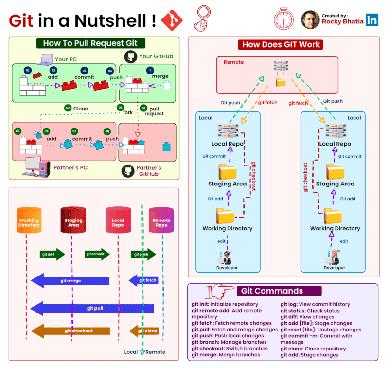

🌟 Hit star button to save this repo in your profile

# GitHub for Research Students: From Code to Collaboration

| No | Lesson | 
|--------|---------|
| 1. | [Installation & Sign in Github](./material/signin.md)|
| 2. | [Effective prompts](https://drshahizan.gitbook.io/copywriting-chatgpt/prompts/effective-prompts)|

# Learn Github 🚀

Welcome to Github class! We are thrilled to embark on this exciting learning journey together. 

# Github Education
GitHub Education is a program designed to support students and educators by providing them with free access to various tools and resources to learn, teach, and collaborate on coding and technology projects. The program offers a range of benefits, including free access to GitHub Enterprise, GitHub Pro, and a host of developer tools, as well as access to various courses, webinars, and learning resources. GitHub Education aims to foster a community of learners and educators by connecting students and teachers worldwide to create innovative projects and push the boundaries of technology. [**[More info...]**](./materials/education)

## [Case study](./materials/case_study.md)

## Git and GitHub
Git and GitHub are an essential part of the developer roadmap, particularly for those interested in software development or web development. Git is a version control system that allows developers to track changes in their codebase over time, collaborate with others, and revert changes if necessary. GitHub, on the other hand, is a web-based hosting service that uses Git for version control.

In the developer roadmap, learners are typically introduced to Git and GitHub early on as a foundational skill. They are taught how to set up a Git repository, make commits, and push changes to a remote repository on GitHub. They may also learn about basic Git commands like branching, merging, and rebasing.

As learners progress in their developer roadmap, they may dive deeper into more advanced Git and GitHub features, such as using pull requests for code reviews, integrating Git with continuous integration/continuous deployment (CI/CD) pipelines, and automating workflows using GitHub Actions.

## Developer Roadmaps
[Roadmap.sh](https://roadmap.sh/) is a website that provides roadmaps for learning various topics in technology, such as programming languages, web development, data science, and more. The roadmaps are essentially step-by-step guides that outline the skills, tools, and concepts that someone should learn to become proficient in a particular area.

The website was created to help people who are just starting out in technology or who are looking to switch careers within the industry. The roadmaps are designed to be flexible and customizable, so users can choose their own learning paths and set their own goals.

In addition to the roadmaps, the website also includes resources such as books, online courses, and tools to help learners on their journey. The community aspect of the website allows users to connect with others who are also learning and share tips and resources.
- [Frontend Developer](https://roadmap.sh/frontend)
- [Backend Developer](https://roadmap.sh/backend)
- [Flutter Developer](https://roadmap.sh/flutter)

## :large_orange_diamond: [Git](/materials/git-intro.md)
Git is a distributed version control system designed to track changes in software code over time. It was created in 2005 by Linus Torvalds, the same person who created the Linux operating system. Git is open-source software, meaning that it is free to use and modify, and it is widely used in software development teams.

With Git, developers can work collaboratively on the same codebase, making changes and merging them together seamlessly. Each developer has their own copy of the code repository, which they can modify and then share with others. Git also provides tools for branching and merging code, allowing developers to work on different features or bug fixes without interfering with each other's work.

One of the main benefits of using Git is its ability to track changes and roll back to previous versions if needed. This is particularly useful when bugs are introduced or when a new feature causes unintended consequences. Git also allows developers to review and comment on each other's code changes, making it easier to catch errors and maintain quality control.

Git can be used with a command-line interface, or with a variety of graphical user interfaces (GUIs) that provide a more user-friendly experience. Some popular Git GUIs include GitHub Desktop, Sourcetree, and GitKraken.

Overall, Git is a powerful tool for software developers that facilitates collaboration, version control, and quality control. [**[More info...]**](/materials/git-intro.md)

## :octocat: [GitHub](/materials/github-intro.md)
GitHub is a web-based platform for software development that uses Git for version control. It allows developers to collaborate on projects, share code, and manage their software development workflows.

GitHub provides a range of features that make it easy for developers to work together on projects. Some of the key features of GitHub include:

1. **Repositories**: GitHub provides a hosting service for Git repositories, making it easy to manage and share code with others. Repositories can be public or private, and can be accessed by anyone with the appropriate permissions.

2. **Pull requests**: GitHub's pull request feature allows developers to review and discuss code changes before they are merged into the main codebase. This can help ensure that code changes are of high quality and don't introduce bugs or conflicts.

3. **Issues**: GitHub's issue tracking system allows developers to create and track bugs, feature requests, and other issues related to a project. Issues can be assigned to specific developers, labeled, and prioritized to help manage the development process.

4. **Collaboration**: GitHub provides a range of tools to help developers collaborate on projects, including commenting on code, reviewing pull requests, and collaborating on code changes using branches and forks.

5. **Integrations**: GitHub integrates with a range of other software development tools and services, such as CI/CD pipelines, code analysis tools, and project management tools.

GitHub is used by millions of developers and organizations around the world for software development. It is particularly popular among open source software projects, which use GitHub to collaborate on code and manage contributions from a community of developers.

- [Stuck on Git: Git basic for beginners explained with post it notes](https://www.linkedin.com/posts/brookejamieson_git-learntocode-techbasics-activity-7029577352955219968-i4X1/)

[**[More info...]**](/materials/github-intro.md)

## Github Profile 👋
A GitHub profile is a public facing page that displays a user's activity on the platform. It includes information such as the user's username, profile picture, bio, location, and links to their website or social media profiles.

The main focus of a GitHub profile is the user's repositories. Repositories are collections of files that contain a project or a portion of a project. On a GitHub profile, users can showcase their repositories, which can be sorted by type (public or private), language, and date. Each repository includes information such as the name, description, number of stars (a measure of popularity), and the number of forks (when someone makes a copy of the repository to make their own changes).

GitHub profiles also include information on a user's contributions to open source projects. GitHub tracks contributions such as pull requests (code changes that are proposed for review and merging into a project), issues (problem reports or feature requests), and comments.

Another important aspect of a GitHub profile is the user's activity feed. This shows a chronological list of the user's recent activity on the platform, such as repositories they have starred or issues they have commented on.

GitHub profiles are a great way for developers to showcase their skills and projects to potential employers or collaborators. By maintaining an active and well-curated profile, developers can establish themselves as experts in their field and attract new opportunities.

### Sample

|  😎 My students |
|:---|
| 1. [Qaisara](https://github.com/qaisarrra)   2. [Low Junyi](https://github.com/LowJunyi2001)   3. [Ahmad Aiman Hafizi bin Muhammad](https://github.com/AimanHafizi619)   4. [KONG JIA ROU](https://github.com/jrkong2001utm)   5. [Hong Pei Geok](https://github.com/peiyu00)   6. [El Insyiraah](https://github.com/elleamyr)   7. [SEPRIYANDI BIN AGUSR](https://github.com/sepz36)   8. [Charlene A](https://github.com/Chikoness)   9. [Neo Zheng Weng](https://github.com/zw-weng)   10. [Wan Nur Sofea](https://github.com/wannursofea)  11. [Camily Tang](https://github.com/camilytang)  12. [Ng Shu Yu](https://github.com/ShuYu03) |

|  🗣 Others |
|:---|
| 1. [How to Create an Impressive GitHub Profile](https://medium.com/@catherineisonline/how-to-create-an-impressive-github-profile-c1a3610b0770) 2. [Ekaterine (Catherine) Mitagvaria](https://github.com/catherineisonline) 3. [How to create a GitHub Profile README: Michelle Mannering](https://dev.to/github/how-to-create-a-github-profile-readme-jha) 4. [How To Create A GitHub Profile README: Monica Powell](https://dev.to/m0nica/how-to-create-a-github-profile-readme-1paj) 5. [katiehuangx](https://github.com/katiehuangx)|

  
 <b>Tools</b>

1. [GitHub Profile README Generator](https://rahuldkjain.github.io/gh-profile-readme-generator/)
2. [GPRM](https://gprm.itsvg.in/)
3. [Profilinator](https://profilinator.rishav.dev/)
4. [Arturs Smirnovs](https://arturssmirnovs.github.io/github-profile-readme-generator/)

## Github Pages
GitHub Pages is a web hosting service provided by GitHub that allows users to create and host static websites directly from their GitHub repositories. With GitHub Pages, users can publish websites for personal or project use, including blogs, portfolios, and documentation. Users can choose to host their site on a custom domain or a GitHub-provided subdomain, and can create and edit their site using a variety of tools and languages, including HTML, CSS, and JavaScript. GitHub Pages is a powerful and easy-to-use tool for creating and hosting websites, and is a popular choice for developers, designers, and individuals looking to build an online presence.

- [Learn GitHub Pages](./materials/pages.md)
- [GitHub Pages](https://pages.github.com/)
- [Youtube - Getting Started with GitHub Pages](https://youtu.be/QyFcl_Fba-k)
- [Youtube - Github Pages: Web Hosting Gratis dengan GitHub Pages](https://youtu.be/rgDDWhQe-ow)
- [GitHub Pages examples](https://github.com/collections/github-pages-examples)

## Github Projects
GitHub is a web-based platform that is widely used for version control and collaborative software development. GitHub projects refer to the various software projects that are hosted on the platform.

When a project is hosted on GitHub, developers can create and manage the project's code, track its changes over time, and collaborate with other developers on the project. Each project has its own repository, which is a central location where all the project's files and code are stored. [**[More info...]**](./materials/projects)

## Github Codespaces
GitHub Codespaces is a cloud-based development environment that allows developers to create, customize, and use a fully-functional development environment in the cloud. With Codespaces, developers can quickly and easily set up a development environment for their projects, without the need to install software on their local machines. They can access their codespaces from anywhere, collaborate with their team members in real-time, and deploy their applications to production. Codespaces support a wide range of programming languages and tools, including PHP, and provide a powerful and flexible platform for building, testing, and deploying web applications. [**[More info...]**](./materials/education/codespace.md)

## Tools and useful links
Various tools and useful links for developers, particularly those using Git and GitHub. Some of the tools mentioned include StackEdit and Dillinger for editing and formatting Markdown documents, GitHub Skills for learning and improving Git and GitHub skills, and Awesome README Tools for creating more engaging and informative README files for projects. There are also links to various resources for tracking project statistics, including Todoist Stats in Readme, Github Readme Stats, and Github Contributor Stats. Additionally, there are tools for creating visitor badges, profile activity generators, and more. Overall, these tools and resources can help developers to be more productive and make their projects more accessible and engaging for users.
[**[More info...]**](./materials/tools.md)

## Articles 📖
This is a list of various articles related to Git and GitHub, particularly for beginners who want to learn more about these tools and how to use them effectively. Some of the articles provide introductions to Git and GitHub, such as the "Intro to Git and GitHub for Beginners" tutorial on Coursera and Microsoft Learning's "Github" course. Other articles focus on more specific aspects of using GitHub, such as creating a GitHub Profile README, adding dynamic stats to a README, or creating interactive READMEs. Additionally, some articles explore more advanced topics like self-updating READMEs using webhooks and Netlify functions. Overall, these articles offer a range of useful insights and tips for developers looking to improve their Git and GitHub skills and create more engaging and informative GitHub profiles. [**[More info...]**](./materials/article.md)

## Tutorials 🎥
Various tutorial videos related to Git and GitHub. These tutorials are aimed at beginners who are new to using these tools and want to learn the basics. Some of the videos provide introductions to Git and GitHub, such as "What is GitHub?" and "How to Use GitHub." Others focus on specific aspects of using GitHub, such as creating a GitHub portfolio or profile README. Additionally, some videos explore more advanced topics like advanced Git techniques and shortcuts. Overall, these tutorial videos offer a range of useful insights and tips for developers looking to improve their Git and GitHub skills and create more engaging and informative GitHub profiles. [**[More info...]**](./materials/tutorial.md)

## Contribution 🛠️
Please create an [Issue](https://github.com/drshahizan/learn-github/issues) for any improvements, suggestions or errors in the content.

You can also contact me using [Linkedin](https://www.linkedin.com/in/drshahizan/) for any other queries or feedback.

