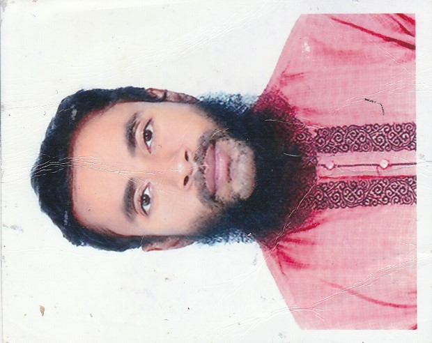

<h1 align="center">[Faisal Bin Al Abid ](https://github.com/Faisal1234-hue) 👨‍💻</h1>

# Faisal Bin Al Abid

## Personal Information

**Location:** Malaysia, Johor Bahru  
**Email:** faisaliut42@gmail.com  
**LinkedIn:** [LinkedIn Profile](LinkedIn_URL)  
**GitHub:** [GitHub Profile](GitHub_URL)

## Summary

A brief summary about Faisal Bin Al Abid. This could include professional interests, career goals, and a bit about personal background.

## Experience : 5 years teachng experinece 

### Job Position 1
**Company Name** - Location  
*Month Year - Present*  
- Responsibility/Contribution 1  
- Responsibility/Contribution 2  
- Responsibility/Contribution 3  

### Job Position 2
**Company Name** - Location  
*Month Year - Month Year*  
- Responsibility/Contribution 1  
- Responsibility/Contribution 2  
- Responsibility/Contribution 3  

## Education

### Degree Title
**Institution Name** - Location  
*Month Year - Month Year*  
- Thesis/Project: Project Title  
- Relevant Coursework: Course 1, Course 2, Course 3  

## Skills

- Skill 1
- Skill 2
- Skill 3
- Skill 4

## Projects

### Project 1 Title
- Brief description of the project, technologies used, and your contribution.
  
### Project 2 Title
- Brief description of the project, technologies used, and your contribution.

## Certifications

- Certification 1 (Issuing Organization, Month Year)
- Certification 2 (Issuing Organization, Month Year)

## Languages

- Language 1 (Proficiency Level)
- Language 2 (Proficiency Level)

## Interests

- Interest 1
- Interest 2
- Interest 3
