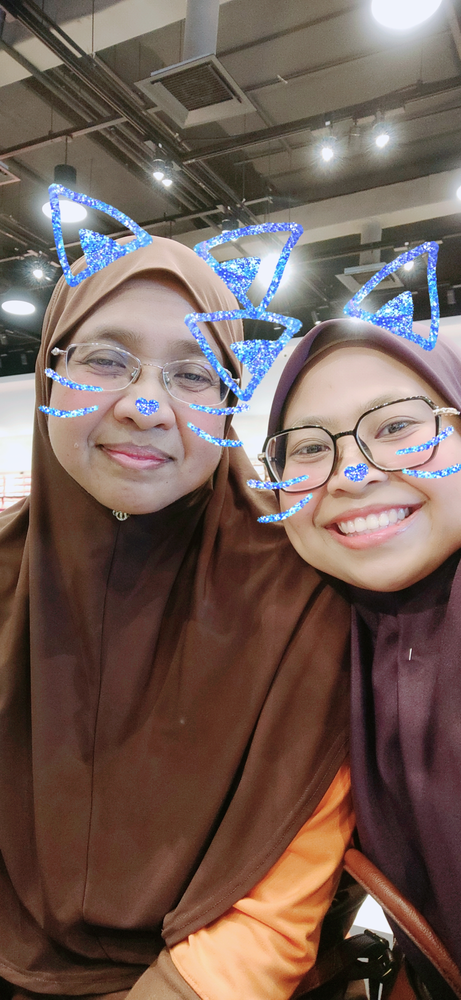

# [🐱Amalina Zul🐱](https://github.com/Amalinazul)

## About Me 🚀

Hi, I'm Amalina, from Johor Bahru. I love learning about new technologies and creating innovative solutions for real-world problems. I am a curious soul with a passion for learning and exploring the world. Whether it’s diving into a new book, experimenting with a recipe in the kitchen, or embarking on an adventure, I thrive on discovery. Currently, I'm pursuing PhD in Health Science at Universiti Teknologi Malaysia. In my free time, I enjoy writing articles on my blog, sharing my knowledge with others, and exploring and contributing to open-source projects too.

## Skills 🛠️

Data Analysis: Skilled in data wrangling, visualization, and drawing insights from messy datasets.
Creative Writing: Whether it’s crafting short stories, poems, or witty tweets, words are my playground.
Photography: My lens captures moments, emotions, and the beauty of everyday life.
Problem Solving: I thrive on dissecting complex problems and finding elegant solutions.

## Projects 

## Work Experience 💼

- I'm working as document specialist in a global company; Syneos Health. 

## Education and Training 🎓

- Bachelor of Science in Equine Management (Hons.) at Universiti Teknologi Malaysia (2014-2018)

## Contact Me 📫

If you want to get in touch with me, you can reach me through any of the following channels:

- Email: me.amalina.zul@gmail.com ✉️
- GitHub: [AmalinaZul](https://github.com/AmalinaZul) 🐱

