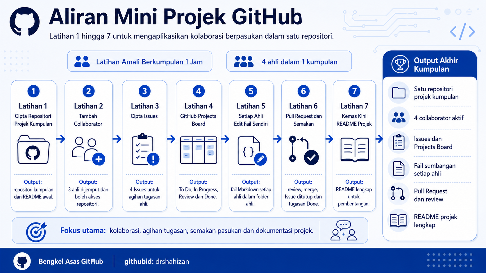

# GitHub Mini Project

This mini project is prepared for participants of the **Basic GitHub Workshop** as a group practical exercise. The main focus of the mini project is collaboration among group members in one repository through collaborators, Issues, GitHub Projects, member contribution files, Pull Requests, reviews and project README documentation.

This mini project is suitable to be completed within a short period, around 1 hour, with each group consisting of 4 members. Each group needs to produce one project repository that shows evidence of teamwork.

## Mini Project Objectives

After completing the mini project, participants will be able to:

1. Build a group project repository with members, individual contribution files and a professionally updated README.
2. Manage task distribution using Issues and a GitHub Projects Board.
3. Show evidence of team collaboration through commits, Issues, Projects and Pull Requests.

## Mini Project Table of Contents

### Part A: Repository and Collaborator Setup

| No. | Exercise | Main Focus |
|---:|---|---|
| 1 | [Create a Group Project Repository](fail/mp1.md) | The group leader creates the project repository, enables README and shares the link. |
| 2 | [Add Members as Collaborators](fail/mp2.md) | The leader invites 3 group members and all members accept the invitation. |

### Part B: Task Distribution and Project Management

| No. | Exercise | Main Focus |
|---:|---|---|
| 3 | [Create Issues for Task Distribution](fail/mp3.md) | Create at least 4 Issues, with one task for each member. |
| 4 | [Create a GitHub Projects Board](fail/mp4.md) | Arrange Issues in a board with To Do, In Progress, Review and Done columns. |

### Part C: Member Contributions and Team Review

| No. | Exercise | Main Focus |
|---:|---|---|
| 5 | [Each Member Edits Their Own File](fail/mp5.md) | Each member adds their own Markdown file in the `ahli` folder and commits the changes. |
| 6 | [Pull Request and Team Review](fail/mp6.md) | Open a Pull Request, have another member review it, merge the changes and close the Issue. |

### Part D: Final Project Documentation

| No. | Exercise | Main Focus |
|---:|---|---|
| 7 | [Update the Project README](fail/mp7.md) | Complete the main README with the project name, members, roles, file links and status. |

## Contribution 🛠️
Please create an [Issue](https://github.com/drshahizan/learn-github/issues) for any improvements, suggestions or errors in the content.

You can also contact me using [Linkedin](https://www.linkedin.com/in/drshahizan/) for any other queries or feedback.
