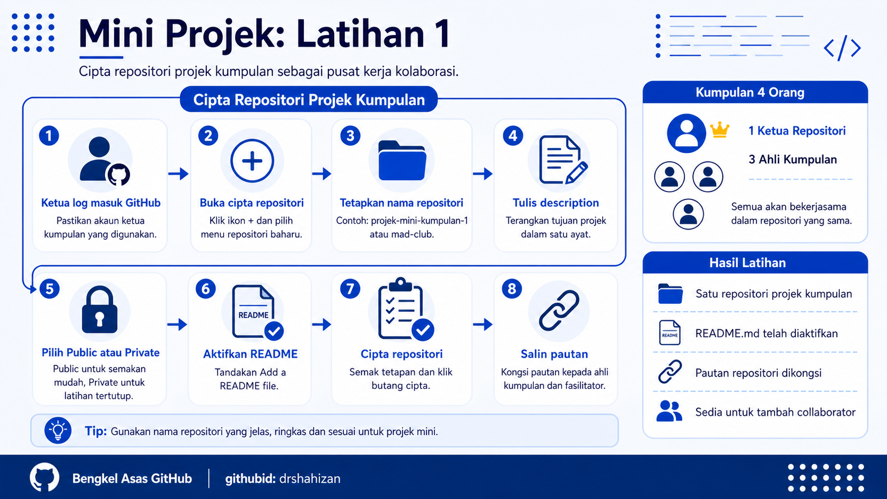

<a href="https://github.com/drshahizan/learn-github/stargazers"></a>
<a href="https://github.com/drshahizan/learn-github/network/members"></a>
<a href="https://github.com/drshahizan/learn-github/pulls"></a>
<a href="https://github.com/drshahizan/learn-github/issues"></a>
<a href="https://github.com/drshahizan/learn-github/graphs/contributors"></a>


<p align="center">

</p>

# Mini Projek: Latihan 1

## Cipta Repositori Projek Kumpulan

## Objektif Latihan

Ketua kumpulan dapat mencipta satu repositori projek kumpulan yang akan digunakan oleh semua ahli sepanjang aktiviti mini projek. Repositori ini akan menjadi pusat kerja kumpulan untuk menyimpan fail, menulis README, mengurus Issues, menggunakan Projects dan menjalankan kolaborasi.

## Situasi Latihan

Setiap kumpulan mempunyai 4 orang ahli. Seorang ahli perlu bertindak sebagai ketua repositori. Ketua ini bertanggungjawab mencipta repositori projek kumpulan dan menyediakan tetapan awal supaya ahli lain boleh menyertai projek dalam latihan seterusnya.

## Langkah 1: Log Masuk Ke Akaun GitHub

1. Ketua kumpulan membuka laman `https://github.com`.
2. Ketua kumpulan log masuk menggunakan akaun GitHub sendiri.
3. Pastikan akaun yang digunakan ialah akaun yang betul.
4. Klik ikon profil di bahagian atas kanan untuk menyemak nama pengguna GitHub.
5. Jika menggunakan komputer makmal, pastikan tiada akaun orang lain sedang log masuk.

## Langkah 2: Buka Halaman Cipta Repositori Baharu

1. Klik ikon `+` di bahagian atas kanan GitHub.
2. Pilih menu untuk mencipta repositori baharu.
3. Pastikan halaman cipta repositori dipaparkan.
4. Semak bahagian `Owner`.
5. Pastikan `Owner` ialah akaun ketua kumpulan.

## Langkah 3: Tetapkan Nama Repositori

1. Cari ruangan nama repositori.
2. Masukkan nama repositori projek kumpulan.
3. Gunakan nama yang ringkas, jelas dan profesional.
4. Elakkan nama seperti `test`, `project`, `latihan` atau `abc`.
5. Gunakan nama yang menggambarkan projek mini kumpulan.

Contoh nama repositori:

```text
projek-mini-kumpulan-1
mad-club
portfolio-kumpulan-a
sistem-aktiviti-kelab
mini-project-github-team
```

## Langkah 4: Tulis Description Repositori

1. Cari ruangan `Description`.
2. Tulis satu ayat ringkas yang menerangkan projek kumpulan.
3. Description perlu menjawab soalan: repositori ini tentang apa?
4. Pastikan ayat mudah difahami oleh ahli kumpulan dan fasilitator.
5. Jangan biarkan ruangan description kosong.

Contoh description:

```text
Repositori projek mini untuk latihan kolaborasi GitHub berkumpulan.
```

Contoh lain:

```text
Projek mini kumpulan bagi membina README, Issues, Projects dan Pull Request.
```

## Langkah 5: Pilih Public atau Private

1. Pilih `Public` jika projek sesuai dilihat oleh fasilitator, rakan dan peserta lain.
2. Pilih `Private` jika projek mengandungi maklumat sensitif atau latihan tertutup.
3. Untuk mini projek bengkel, pilih `Public` jika fasilitator mahu membuat semakan dengan mudah.
4. Jika kumpulan tidak pasti, tanya fasilitator sebelum memilih.
5. Ingat bahawa repositori public boleh dilihat oleh orang luar.

## Langkah 6: Aktifkan README

1. Cari pilihan `Add a README file`.
2. Tandakan pilihan tersebut.
3. README akan menjadi dokumen utama projek kumpulan.
4. Fail ini akan digunakan dalam latihan seterusnya untuk menulis maklumat projek.
5. Pastikan pilihan ini ditanda sebelum repositori dicipta.

## Langkah 7: Tetapan Tambahan

1. Bahagian `.gitignore` boleh dibiarkan kosong untuk latihan ini.
2. Bahagian `license` juga boleh dibiarkan kosong dahulu.
3. Fokus latihan ini ialah mencipta repositori kumpulan yang boleh digunakan untuk kolaborasi.
4. Tetapan tambahan boleh dikemaskini kemudian jika perlu.
5. Jangan ubah tetapan yang tidak difahami tanpa arahan fasilitator.

## Langkah 8: Cipta Repositori

1. Semak nama repositori.
2. Semak description.
3. Semak pilihan public atau private.
4. Pastikan `Add a README file` telah ditanda.
5. Klik butang untuk mencipta repositori.
6. Tunggu sehingga halaman repositori baharu dipaparkan.

## Langkah 9: Semak Repositori Projek Kumpulan

1. Pastikan nama repositori dipaparkan dengan betul.
2. Pastikan fail `README.md` wujud.
3. Semak tab utama seperti `Code`, `Issues`, `Pull requests`, `Projects` dan `Settings`.
4. Pastikan ketua kumpulan boleh membuka fail `README.md`.
5. Jika repositori tersalah cipta, maklumkan kepada fasilitator sebelum meneruskan.

## Langkah 10: Salin Pautan Repositori

1. Salin pautan repositori daripada address bar.
2. Pautan biasanya berbentuk seperti berikut:

```text
https://github.com/nama-pengguna/nama-repositori
```

3. Kongsi pautan tersebut kepada ahli kumpulan.
4. Simpan pautan ini kerana ia akan digunakan dalam latihan tambah collaborator.
5. Pastikan semua ahli kumpulan boleh membuka pautan tersebut.


## Masalah Biasa dan Cara Mengatasi

| Masalah | Cadangan Penyelesaian |
|---|---|
| Nama repositori telah digunakan | Pilih nama lain yang lebih khusus, contohnya tambah nombor kumpulan. |
| Terlupa aktifkan README | Cipta fail `README.md` secara manual selepas repositori siap. |
| Tersalah pilih public atau private | Buka `Settings` dan ubah visibility jika perlu. |
| Ahli kumpulan tidak boleh buka pautan | Semak semula visibility repositori dan pastikan pautan betul. |
| Ketua menggunakan akaun salah | Log keluar dan log masuk semula menggunakan akaun GitHub ketua yang betul. |

## Contribution 🛠️
Please create an [Issue](https://github.com/drshahizan/learn-github/issues) for any improvements, suggestions or errors in the content.

You can also contact me using [Linkedin](https://www.linkedin.com/in/drshahizan/) for any other queries or feedback.

[](https://visitorbadge.io/status?path=https%3A%2F%2Fgithub.com%2Fdrshahizan)

