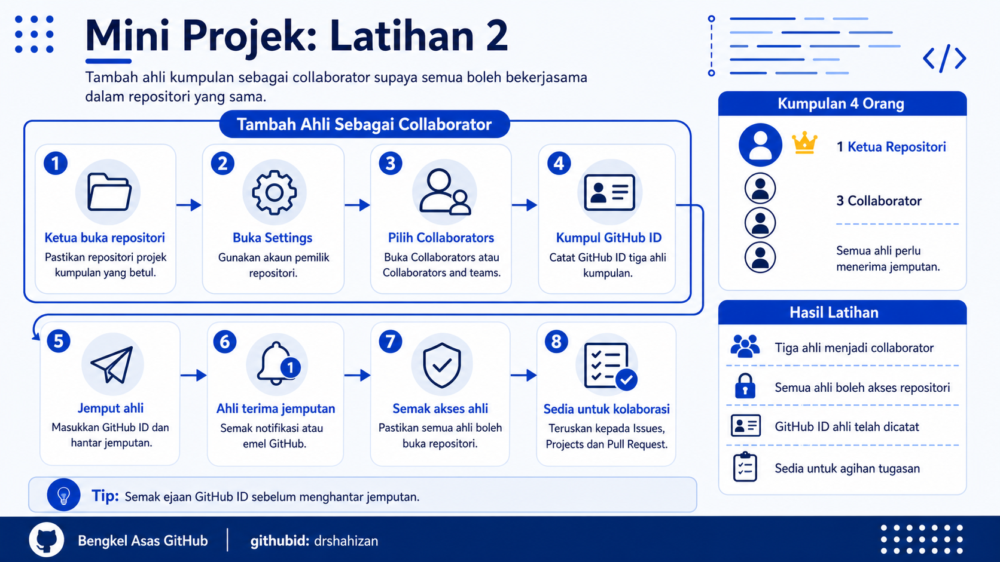

<a href="https://github.com/drshahizan/learn-github/stargazers"></a>
<a href="https://github.com/drshahizan/learn-github/network/members"></a>
<a href="https://github.com/drshahizan/learn-github/pulls"></a>
<a href="https://github.com/drshahizan/learn-github/issues"></a>
<a href="https://github.com/drshahizan/learn-github/graphs/contributors"></a>


<p align="center">

</p>

# Mini Projek: Latihan 2

## Tambah Ahli Sebagai Collaborator

## Objektif Latihan

Ketua kumpulan dapat menambah tiga ahli kumpulan sebagai collaborator dalam repositori projek kumpulan supaya semua ahli boleh bekerjasama, mengedit fail, mencipta Issues, mengemaskini Projects dan menyumbang kepada projek mini.

## Situasi Latihan

Repositori projek kumpulan telah dicipta dalam Latihan 1. Dalam latihan ini, ketua kumpulan perlu menjemput tiga ahli lain sebagai collaborator. Setiap ahli perlu menerima jemputan tersebut sebelum boleh menyumbang kepada repositori kumpulan.

## Langkah 1: Ketua Buka Repositori Projek Kumpulan

1. Ketua kumpulan log masuk ke akaun GitHub.
2. Buka repositori projek kumpulan yang telah dicipta dalam Latihan 1.
3. Pastikan repositori yang dibuka ialah repositori projek kumpulan yang betul.
4. Semak nama repositori pada bahagian atas halaman.
5. Pastikan ketua kumpulan mempunyai akses kepada tab `Settings`.

## Langkah 2: Buka Tab Settings

1. Pada halaman repositori, cari tab `Settings`.
2. Klik tab `Settings`.
3. Jika tab `Settings` tidak kelihatan, pastikan ketua menggunakan akaun pemilik repositori.
4. Tunggu sehingga halaman tetapan repositori dipaparkan.
5. Jangan ubah tetapan lain tanpa arahan fasilitator.

## Langkah 3: Buka Bahagian Collaborators

1. Dalam halaman `Settings`, cari bahagian `Collaborators`.
2. Jika paparan GitHub menunjukkan menu `Collaborators and teams`, pilih menu tersebut.
3. GitHub mungkin meminta pengesahan kata laluan.
4. Masukkan kata laluan jika diminta.
5. Pastikan halaman untuk menambah collaborator dipaparkan.

## Langkah 4: Dapatkan GitHub ID Ahli Kumpulan

1. Minta setiap ahli kumpulan memberikan GitHub ID masing-masing.
2. GitHub ID ialah nama pengguna yang terdapat pada pautan profil GitHub.
3. Contoh pautan profil:

```text
https://github.com/nama-pengguna
```

4. Dalam contoh tersebut, GitHub ID ialah `nama-pengguna`.
5. Catat GitHub ID semua ahli supaya jemputan tidak tersalah hantar.

Contoh senarai GitHub ID kumpulan:

```text
ketua-kumpulan
ahli-pertama
ahli-kedua
ahli-ketiga
```

## Langkah 5: Jemput Ahli Pertama

1. Klik butang untuk menambah collaborator.
2. Masukkan GitHub ID ahli pertama.
3. Pilih akaun yang betul daripada cadangan yang dipaparkan.
4. Klik butang untuk menghantar jemputan.
5. Maklumkan kepada ahli pertama supaya menyemak jemputan pada akaun GitHub.

## Langkah 6: Jemput Ahli Kedua dan Ketiga

1. Ulang langkah yang sama untuk ahli kedua.
2. Ulang langkah yang sama untuk ahli ketiga.
3. Pastikan setiap GitHub ID dieja dengan betul.
4. Jangan jemput akaun yang tidak berkaitan dengan kumpulan.
5. Semak senarai jemputan selepas semua ahli dijemput.

## Langkah 7: Ahli Terima Jemputan

1. Setiap ahli log masuk ke akaun GitHub masing-masing.
2. Semak notifikasi GitHub.
3. Buka jemputan collaborator daripada ketua kumpulan.
4. Klik butang untuk menerima jemputan.
5. Selepas menerima jemputan, ahli boleh membuka repositori projek kumpulan.

## Langkah 8: Semak Akses Ahli

1. Ketua kumpulan kembali ke halaman `Collaborators`.
2. Semak senarai collaborator.
3. Pastikan semua tiga ahli telah menerima jemputan.
4. Minta setiap ahli membuka pautan repositori.
5. Pastikan setiap ahli boleh melihat tab yang diperlukan seperti `Code`, `Issues` dan `Projects`.

## Langkah 9: Uji Akses Ringkas

1. Setiap ahli buka repositori projek kumpulan.
2. Setiap ahli semak sama ada boleh membuka fail `README.md`.
3. Setiap ahli semak sama ada boleh membuka tab `Issues`.
4. Seorang ahli cuba tambah komen ringkas pada Issue jika Issue telah tersedia.
5. Jika belum ada Issue, aktiviti ini boleh dibuat dalam latihan seterusnya.

## Langkah 10: Catat Status Collaborator

1. Ketua kumpulan catat nama ahli yang telah berjaya menjadi collaborator.
2. Catat GitHub ID setiap ahli.
3. Catat ahli yang masih belum menerima jemputan.
4. Jika ada ahli belum menerima jemputan, minta ahli tersebut semak notifikasi atau emel GitHub.
5. Pastikan semua ahli selesai sebelum bergerak ke latihan Issues dan Projects.

## Masalah Biasa dan Cara Mengatasi

| Masalah | Cadangan Penyelesaian |
|---|---|
| Tab Settings tidak kelihatan | Pastikan ketua menggunakan akaun pemilik repositori. |
| GitHub ID ahli tidak dijumpai | Semak ejaan GitHub ID dan pastikan akaun ahli wujud. |
| Jemputan tidak diterima | Minta ahli semak notifikasi GitHub dan emel. |
| Ahli tersalah akaun | Minta ahli log keluar dan log masuk menggunakan akaun GitHub yang betul. |
| Ahli tidak boleh akses repositori | Semak semula status collaborator dan visibility repositori. |

## Contribution 🛠️
Please create an [Issue](https://github.com/drshahizan/learn-github/issues) for any improvements, suggestions or errors in the content.

You can also contact me using [Linkedin](https://www.linkedin.com/in/drshahizan/) for any other queries or feedback.

[](https://visitorbadge.io/status?path=https%3A%2F%2Fgithub.com%2Fdrshahizan)

