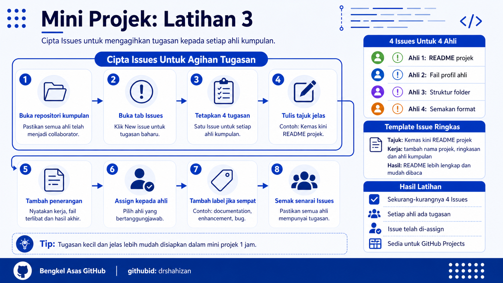

<a href="https://github.com/drshahizan/learn-github/stargazers"></a>
<a href="https://github.com/drshahizan/learn-github/network/members"></a>
<a href="https://github.com/drshahizan/learn-github/pulls"></a>
<a href="https://github.com/drshahizan/learn-github/issues"></a>
<a href="https://github.com/drshahizan/learn-github/graphs/contributors"></a>


<p align="center">

</p>

# Mini Projek: Latihan 3

## Cipta Issues Untuk Agihan Tugasan

## Objektif Latihan

Peserta dapat mencipta Issues dalam repositori projek kumpulan untuk mengagihkan tugasan kepada setiap ahli. Setiap ahli kumpulan perlu mempunyai sekurang-kurangnya satu Issue yang jelas, boleh difahami dan boleh dipantau sepanjang mini projek.

## Situasi Latihan

Repositori projek kumpulan telah dicipta dan semua ahli telah ditambah sebagai collaborator. Dalam latihan ini, kumpulan akan menggunakan Issues sebagai senarai tugasan rasmi. Setiap Issue mewakili satu kerja yang perlu dibuat oleh ahli kumpulan.

## Langkah 1: Buka Repositori Projek Kumpulan

1. Ketua kumpulan atau pengurus tugasan log masuk ke GitHub.
2. Buka repositori projek kumpulan.
3. Pastikan repositori yang dibuka ialah repositori projek kumpulan yang betul.
4. Pastikan semua ahli telah menjadi collaborator.
5. Jika ahli belum menjadi collaborator, selesaikan Latihan 2 terlebih dahulu.

## Langkah 2: Buka Tab Issues

1. Pada halaman repositori, klik tab `Issues`.
2. Pastikan halaman Issues dipaparkan.
3. Jika belum ada Issue, senarai akan kelihatan kosong.
4. Klik butang `New issue`.
5. GitHub akan memaparkan borang untuk mencipta Issue baharu.

## Langkah 3: Tetapkan Tugasan Untuk Setiap Ahli

1. Kumpulan perlu menyediakan sekurang-kurangnya 4 Issues.
2. Setiap ahli kumpulan perlu menerima satu tugasan.
3. Tugasan perlu kecil, jelas dan boleh disiapkan dalam masa mini projek.
4. Elakkan tugasan yang terlalu besar atau terlalu umum.
5. Pastikan tugasan berkaitan dengan hasil projek kumpulan.

Contoh agihan tugasan:

| Ahli | Tugasan |
|---|---|
| Ahli 1 | Kemas kini README projek |
| Ahli 2 | Tambah fail profil ahli |
| Ahli 3 | Tambah struktur folder projek |
| Ahli 4 | Semak pautan, ejaan dan format Markdown |

## Langkah 4: Tulis Tajuk Issue Yang Jelas

1. Pada ruangan tajuk Issue, tulis tajuk tugasan yang mudah difahami.
2. Tajuk perlu menunjukkan kerja yang perlu dibuat.
3. Elakkan tajuk yang terlalu pendek seperti `buat kerja`, `update` atau `fix`.
4. Gunakan kata kerja yang jelas.
5. Pastikan ahli yang menerima tugasan faham maksud tajuk tersebut.

Contoh tajuk Issue:

```text
Kemas kini README projek kumpulan
Tambah fail profil untuk ahli kumpulan
Tambah folder images untuk bahan projek
Semak format Markdown dan pautan README
```

## Langkah 5: Tulis Penerangan Issue

1. Pada ruangan penerangan, tulis maklumat tugasan dengan lebih jelas.
2. Terangkan apa yang perlu dibuat.
3. Nyatakan fail atau folder yang terlibat jika ada.
4. Nyatakan hasil yang dijangka selepas tugasan selesai.
5. Gunakan senarai semak supaya tugasan mudah dipantau.

Contoh penerangan Issue:

```markdown
Tugasan ini bertujuan mengemas kini README projek kumpulan.

Senarai kerja:

- Tambah nama projek
- Tambah ringkasan projek
- Tambah senarai ahli kumpulan
- Tambah status projek

Hasil akhir:

README projek mempunyai maklumat asas yang lengkap dan mudah dibaca.
```

## Langkah 6: Assign Issue Kepada Ahli

1. Pada bahagian kanan Issue, cari pilihan `Assignees`.
2. Klik `Assignees`.
3. Pilih ahli kumpulan yang bertanggungjawab untuk tugasan tersebut.
4. Pastikan hanya ahli yang sesuai dipilih.
5. Jika nama ahli tidak muncul, semak semula status collaborator dalam Latihan 2.

## Langkah 7: Tambah Label Jika Sempat

1. Pada bahagian kanan Issue, cari pilihan `Labels`.
2. Pilih label yang sesuai jika tersedia.
3. Contoh label yang boleh digunakan:

```text
documentation
enhancement
bug
question
```

4. Jika tiada label yang sesuai, kumpulan boleh biarkan tanpa label.
5. Fokus utama latihan ini ialah mencipta Issue dan assign tugasan.

## Langkah 8: Cipta Issue

1. Semak tajuk Issue.
2. Semak penerangan Issue.
3. Semak assignee.
4. Klik `Create`.
5. Issue akan dipaparkan dalam senarai Issues.

## Langkah 9: Ulang Untuk Semua Ahli

1. Ulang proses mencipta Issue sehingga semua ahli mempunyai tugasan.
2. Pastikan setiap Issue mempunyai tajuk yang jelas.
3. Pastikan setiap Issue mempunyai penerangan yang boleh difahami.
4. Pastikan setiap Issue telah di-assign kepada ahli yang betul.
5. Pastikan sekurang-kurangnya 4 Issues telah diwujudkan untuk kumpulan 4 orang.

## Langkah 10: Semak Senarai Issues

1. Kembali ke tab `Issues`.
2. Semak semua Issues yang telah dicipta.
3. Pastikan setiap ahli mempunyai satu Issue.
4. Pastikan tiada tugasan yang bertindih secara tidak perlu.
5. Jika ada kesilapan, buka Issue tersebut dan kemas kini maklumatnya.

## Masalah Biasa dan Cara Mengatasi

| Masalah | Cadangan Penyelesaian |
|---|---|
| Nama ahli tidak muncul dalam Assignees | Pastikan ahli telah menerima jemputan collaborator. |
| Issue terlalu umum | Pecahkan tugasan kepada kerja yang lebih kecil dan jelas. |
| Ahli mendapat terlalu banyak tugasan | Agihkan semula tugasan supaya lebih seimbang. |
| Penerangan Issue tidak jelas | Tambah senarai kerja dan hasil akhir yang dijangka. |
| Issue tersalah assign | Buka semula Issue dan tukar assignee kepada ahli yang betul. |

## Contribution 🛠️
Please create an [Issue](https://github.com/drshahizan/learn-github/issues) for any improvements, suggestions or errors in the content.

You can also contact me using [Linkedin](https://www.linkedin.com/in/drshahizan/) for any other queries or feedback.

[](https://visitorbadge.io/status?path=https%3A%2F%2Fgithub.com%2Fdrshahizan)

