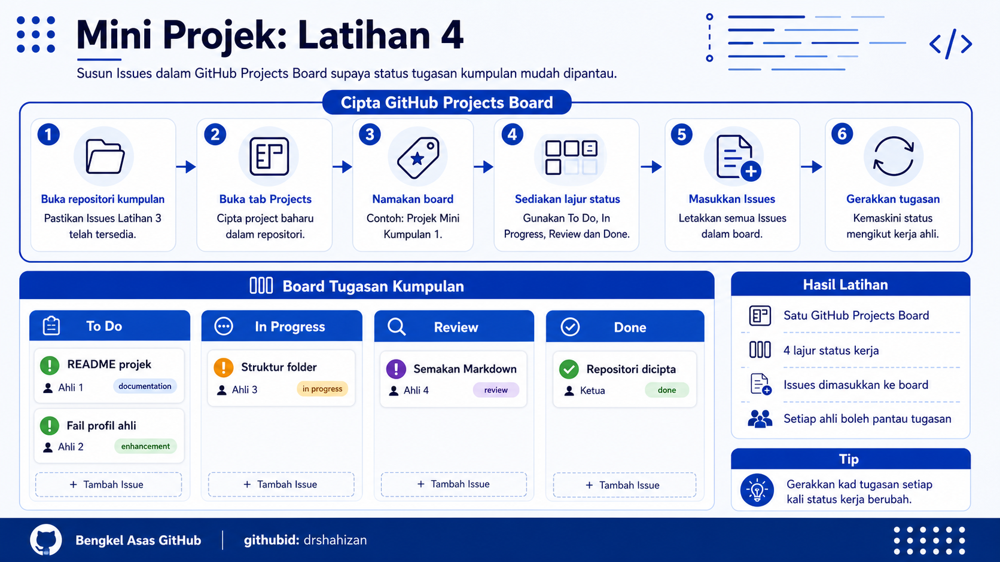

<a href="https://github.com/drshahizan/learn-github/stargazers"></a>
<a href="https://github.com/drshahizan/learn-github/network/members"></a>
<a href="https://github.com/drshahizan/learn-github/pulls"></a>
<a href="https://github.com/drshahizan/learn-github/issues"></a>
<a href="https://github.com/drshahizan/learn-github/graphs/contributors"></a>


<p align="center">

</p>

# Mini Projek: Latihan 4

## Cipta GitHub Projects Board

## Objektif Latihan

Peserta dapat mencipta GitHub Projects Board untuk menyusun tugasan kumpulan, menghubungkan Issues yang telah dibuat dan memantau status kerja setiap ahli secara visual.

## Situasi Latihan

Kumpulan telah mencipta Issues untuk agihan tugasan dalam Latihan 3. Dalam latihan ini, semua Issues tersebut akan dimasukkan ke dalam GitHub Projects Board supaya status tugasan dapat dipantau melalui lajur `To Do`, `In Progress`, `Review` dan `Done`.

## Langkah 1: Buka Repositori Projek Kumpulan

1. Ketua kumpulan atau pengurus tugasan log masuk ke GitHub.
2. Buka repositori projek kumpulan.
3. Pastikan repositori yang dibuka ialah repositori projek kumpulan yang betul.
4. Pastikan Issues untuk ahli kumpulan telah dicipta.
5. Jika Issues belum wujud, lengkapkan Mini Projek Latihan 3 terlebih dahulu.

## Langkah 2: Buka Tab Projects

1. Pada halaman repositori, klik tab `Projects`.
2. Jika tab `Projects` tidak kelihatan, semak menu repositori atau tanya fasilitator.
3. Klik butang untuk mencipta project baharu.
4. Pilih paparan yang sesuai seperti board atau table.
5. Untuk latihan ini, gunakan paparan board kerana lebih mudah melihat status kerja.

## Langkah 3: Namakan Project Board

1. Masukkan nama project board yang jelas.
2. Gunakan nama yang menggambarkan projek kumpulan.
3. Elakkan nama yang terlalu umum seperti `test` atau `project`.

Contoh nama project board:

```text
Projek Mini Kumpulan 1
Mad_club Task Board
Kolaborasi Projek GitHub
```

4. Simpan project board selepas nama dimasukkan.
5. Pastikan project board boleh dibuka oleh ahli kumpulan.

## Langkah 4: Sediakan Lajur Tugasan

1. Sediakan lajur utama untuk status tugasan.
2. Gunakan empat lajur berikut:

```text
To Do
In Progress
Review
Done
```

3. `To Do` digunakan untuk tugasan yang belum dimulakan.
4. `In Progress` digunakan untuk tugasan yang sedang dibuat.
5. `Review` digunakan untuk tugasan yang perlu disemak.
6. `Done` digunakan untuk tugasan yang telah selesai.

## Langkah 5: Masukkan Issues Ke Dalam Board

1. Buka project board yang telah dicipta.
2. Tambah item baharu ke dalam board.
3. Pilih Issues yang telah dicipta dalam Latihan 3.
4. Masukkan semua Issues kumpulan ke dalam lajur `To Do`.
5. Pastikan setiap ahli mempunyai sekurang-kurangnya satu tugasan dalam board.

## Langkah 6: Semak Tugasan Setiap Ahli

1. Buka setiap kad tugasan pada board.
2. Semak tajuk tugasan.
3. Semak assignee untuk tugasan tersebut.
4. Pastikan tugasan telah diberikan kepada ahli yang betul.
5. Jika tugasan tersalah assign, buka Issue berkaitan dan kemas kini assignee.

## Langkah 7: Gerakkan Tugasan Mengikut Status

1. Tugasan yang belum dimulakan kekal dalam lajur `To Do`.
2. Apabila ahli mula bekerja, gerakkan tugasan ke `In Progress`.
3. Apabila tugasan siap untuk disemak, gerakkan tugasan ke `Review`.
4. Selepas tugasan diterima atau digabungkan, gerakkan tugasan ke `Done`.
5. Pastikan semua ahli mengemas kini status tugasan masing-masing.

## Langkah 8: Gunakan Board Semasa Perbincangan Kumpulan

1. Ketua kumpulan buka project board semasa perbincangan ringkas.
2. Setiap ahli terangkan status tugasan masing-masing.
3. Kenal pasti tugasan yang belum dimulakan.
4. Kenal pasti tugasan yang memerlukan bantuan.
5. Kemas kini kedudukan kad tugasan selepas perbincangan.

## Langkah 9: Hubungkan Board Dengan Kerja Seterusnya

1. Gunakan board sebagai rujukan semasa ahli mula mengedit fail.
2. Pastikan tugasan yang sedang dibuat berada dalam `In Progress`.
3. Selepas ahli commit atau buka Pull Request, gerakkan tugasan ke `Review`.
4. Selepas tugasan selesai, gerakkan tugasan ke `Done`.
5. Gunakan board ini sepanjang mini projek sehingga pembentangan akhir.

## Langkah 10: Semak Project Board

1. Pastikan semua Issues berada dalam project board.
2. Pastikan setiap ahli mempunyai tugasan.
3. Pastikan lajur `To Do`, `In Progress`, `Review` dan `Done` wujud.
4. Pastikan sekurang-kurangnya satu tugasan telah digerakkan mengikut status kerja.
5. Kongsi paparan board kepada fasilitator jika diminta.

## Hasil Latihan

Pada akhir latihan ini, kumpulan mempunyai:

1. Satu GitHub Projects Board.
2. Empat lajur utama iaitu `To Do`, `In Progress`, `Review` dan `Done`.
3. Issues kumpulan dimasukkan ke dalam board.
4. Setiap ahli mempunyai tugasan dalam board.
5. Status tugasan boleh dipantau secara visual.

## Kriteria Siap

Latihan ini dianggap selesai apabila:

1. Project board berjaya dicipta.
2. Semua Issues kumpulan telah dimasukkan ke board.
3. Lajur tugasan telah disediakan.
4. Tugasan setiap ahli boleh dilihat pada board.
5. Sekurang-kurangnya satu tugasan telah digerakkan ke status yang sesuai.

## Masalah Biasa dan Cara Mengatasi

| Masalah | Cadangan Penyelesaian |
|---|---|
| Tab Projects tidak kelihatan | Semak menu repositori atau minta bantuan fasilitator. |
| Issues tidak muncul dalam pilihan item | Pastikan Issues telah dicipta dalam repositori yang sama. |
| Tugasan tidak mempunyai assignee | Buka Issue berkaitan dan assign kepada ahli yang betul. |
| Lajur board tidak sesuai | Namakan semula lajur kepada `To Do`, `In Progress`, `Review` dan `Done`. |
| Ahli tidak tahu status tugasan | Gunakan board semasa perbincangan ringkas kumpulan. |

## Contribution 🛠️
Please create an [Issue](https://github.com/drshahizan/learn-github/issues) for any improvements, suggestions or errors in the content.

You can also contact me using [Linkedin](https://www.linkedin.com/in/drshahizan/) for any other queries or feedback.

[](https://visitorbadge.io/status?path=https%3A%2F%2Fgithub.com%2Fdrshahizan)

