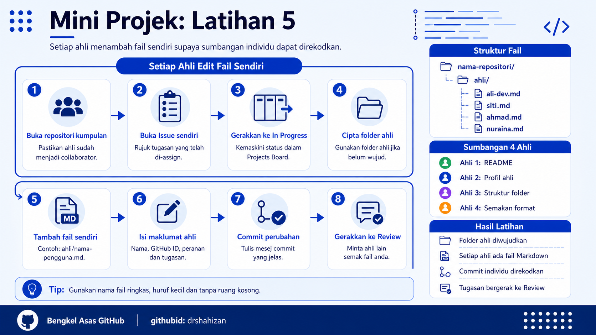

<a href="https://github.com/drshahizan/learn-github/stargazers"></a>
<a href="https://github.com/drshahizan/learn-github/network/members"></a>
<a href="https://github.com/drshahizan/learn-github/pulls"></a>
<a href="https://github.com/drshahizan/learn-github/issues"></a>
<a href="https://github.com/drshahizan/learn-github/graphs/contributors"></a>


<p align="center">

</p>

# Mini Project: Exercise 5

## Each Member Edits Their Own File

## Learning Objective

Each group member will be able to add one simple file in the group project repository, write information about their role and make a commit so that each member's contribution can be recorded.

## Exercise Scenario

The group has prepared the repository, collaborators, Issues and GitHub Projects Board. In this exercise, each member needs to make a small individual contribution. Each member will create one Markdown file in the `ahli` folder using their name or GitHub ID.

## Step 1: Open the Group Project Repository

1. Each member signs in to their own GitHub account.
2. Open the group project repository.
3. Make sure the member has access as a collaborator.
4. Check the `Issues` tab to view the assigned task.
5. Check the GitHub Projects Board to view the task status.

## Step 2: Open the Assigned Issue

1. Open the `Issues` tab.
2. Find the Issue that has been assigned to you.
3. Read the Issue title.
4. Read the task description.
5. Make sure the task you will do matches the instructions in the Issue.

## Step 3: Move the Task to In Progress

1. Open the GitHub Projects Board.
2. Find your own task card.
3. Move the card from `To Do` to `In Progress`.
4. Inform group members that the task is being worked on.
5. Make sure only your own task card is moved.

## Step 4: Create the ahli Folder If It Does Not Exist

1. Open the `Code` tab.
2. Check whether the `ahli` folder already exists.
3. If the folder does not exist yet, the first member can create it while adding a file.
4. This folder will store a simple file for each group member.
5. All members should use the same folder.

Example folder structure:

```text
repository-name/
└── ahli/
```

## Step 5: Add a File for Yourself

1. Click `Add file`.
2. Select `Create new file`.
3. In the file name field, type the file path inside the `ahli` folder.
4. Use a file name based on your name or GitHub ID.

Example:

```text
ahli/ali.md
ahli/siti.md
ahli/ahmad-dev.md
ahli/nuraina.md
```

5. Avoid spaces in the file name.
6. Use lowercase letters if possible.

## Step 6: Write Member Information

1. In the Markdown file that was created, write brief information about yourself.
2. Enter your name.
3. Enter your GitHub ID.
4. Enter your role in the project.
5. Enter the task you completed.
6. Enter a short note about your contribution.

Example file content:

```markdown
# Member Information

- Name: Ali bin Ahmad
- GitHub ID: ali-dev
- Role: README writer
- Task: Update project documentation

## Contribution Notes

I am responsible for writing the project summary, group member list and project status in the README.
```

## Step 7: Write a Commit Message

1. Scroll to the bottom of the page.
2. Find the `Commit changes` section.
3. Write a clear commit message.
4. The commit message should explain the file that was added.

Example commit message:

```text
Add Ali member information file
```

Another example:

```text
Add group member profile
```

## Step 8: Commit the Changes

1. Check the file name again.
2. Check the file content.
3. Make sure the commit message has been written.
4. Click `Commit changes`.
5. Wait until GitHub saves the changes.

## Step 9: Check the Member File in the Repository

1. Return to the `Code` tab.
2. Open the `ahli` folder.
3. Make sure your own file exists.
4. Open the file and check its content.
5. If there is a mistake, click edit and commit the new changes.

## Step 10: Move the Task to Review

1. Open the GitHub Projects Board.
2. Find your own task card.
3. Move the card from `In Progress` to `Review`.
4. Ask another member to check the file that has been added.
5. Wait for feedback from group members.

## Common Problems and How to Solve Them

| Problem | Suggested Solution |
|---|---|
| Cannot add a file | Make sure the member has accepted the collaborator invitation. |
| The `ahli` folder does not exist | Create the folder while adding a file using the format `ahli/file-name.md`. |
| File name is not neat | Use lowercase letters and avoid spaces. |
| Commit fails | Check the commit message and make sure the file content has been written. |
| File is saved in the wrong location | Move or recreate the file inside the `ahli` folder. |

## Contribution 🛠️
Please create an [Issue](https://github.com/drshahizan/learn-github/issues) for any improvements, suggestions or errors in the content.

You can also contact me using [Linkedin](https://www.linkedin.com/in/drshahizan/) for any other queries or feedback.

[](https://visitorbadge.io/status?path=https%3A%2F%2Fgithub.com%2Fdrshahizan)

