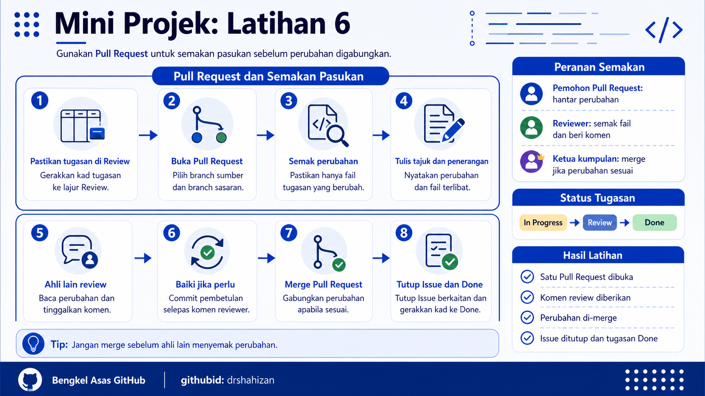

<a href="https://github.com/drshahizan/learn-github/stargazers"></a>
<a href="https://github.com/drshahizan/learn-github/network/members"></a>
<a href="https://github.com/drshahizan/learn-github/pulls"></a>
<a href="https://github.com/drshahizan/learn-github/issues"></a>
<a href="https://github.com/drshahizan/learn-github/graphs/contributors"></a>


<p align="center">

</p>

# Mini Projek: Latihan 6

## Pull Request dan Semakan Pasukan

## Objektif Latihan

Peserta dapat membuka Pull Request untuk perubahan yang telah dibuat, menjalankan semakan pasukan, memberi komen ringkas dan menggabungkan perubahan yang sesuai ke dalam projek kumpulan.

## Situasi Latihan

Setiap ahli telah menambah fail sendiri dan menggerakkan tugasan ke status `Review`. Dalam latihan ini, perubahan tersebut akan disemak oleh ahli lain melalui Pull Request. Aktiviti ini melatih proses kolaborasi yang biasa digunakan dalam projek sebenar.

## Langkah 1: Pastikan Tugasan Berada Di Review

1. Buka repositori projek kumpulan.
2. Buka GitHub Projects Board.
3. Semak kad tugasan sendiri.
4. Pastikan kad tugasan telah berada dalam lajur `Review`.
5. Jika masih berada dalam `In Progress`, gerakkan ke `Review` sebelum membuka Pull Request.

## Langkah 2: Buka Tab Pull Requests

1. Pada halaman repositori, klik tab `Pull requests`.
2. Klik butang `New pull request`.
3. Pastikan halaman perbandingan perubahan dipaparkan.
4. Semak branch sumber dan branch sasaran.
5. Jika menggunakan branch sendiri, pastikan branch sumber ialah branch tugasan peserta.

## Langkah 3: Pilih Branch Yang Betul

1. Pilih branch sumber yang mengandungi perubahan peserta.
2. Pilih branch sasaran yang ditetapkan oleh kumpulan atau fasilitator.
3. Biasanya branch sasaran ialah `main`.
4. Semak senarai fail yang berubah.
5. Pastikan hanya fail tugasan peserta yang terlibat.

Contoh branch sumber:

```text
feature/ali-profile
latihan-ahli-siti
update-readme-ahmad
```

## Langkah 4: Semak Perubahan Sebelum Pull Request

1. Lihat bahagian perubahan fail.
2. Semak kandungan yang ditambah atau diubah.
3. Pastikan tiada maklumat sensitif.
4. Pastikan fail berada dalam folder yang betul.
5. Jika ada kesilapan, kembali ke fail asal, betulkan dan commit semula sebelum meneruskan.

## Langkah 5: Tulis Tajuk Pull Request

1. Tulis tajuk Pull Request yang jelas.
2. Tajuk perlu menerangkan perubahan yang dibuat.
3. Elakkan tajuk terlalu umum seperti `update`, `edit` atau `test`.
4. Gunakan nama ahli atau tugasan jika sesuai.

Contoh tajuk Pull Request:

```text
Tambah fail maklumat ahli Ali
Kemas kini README projek kumpulan
Tambah struktur folder ahli
```

## Langkah 6: Tulis Penerangan Pull Request

1. Terangkan perubahan yang telah dibuat.
2. Nyatakan fail yang terlibat.
3. Nyatakan Issue yang berkaitan jika ada.
4. Tulis penerangan ringkas dan mudah difahami.

Contoh penerangan:

```markdown
Pull Request ini menambah fail maklumat ahli dalam folder `ahli`.

Perubahan dibuat:

- Tambah fail `ahli/ali.md`
- Masukkan nama, GitHub ID dan peranan
- Kemas kini status tugasan untuk semakan
```

## Langkah 7: Hantar Pull Request

1. Semak tajuk Pull Request.
2. Semak penerangan Pull Request.
3. Semak senarai fail yang berubah.
4. Klik butang untuk mencipta Pull Request.
5. Salin pautan Pull Request jika diminta oleh fasilitator.

## Langkah 8: Ahli Lain Buat Semakan

1. Seorang ahli lain membuka Pull Request tersebut.
2. Baca tajuk dan penerangan Pull Request.
3. Semak fail yang berubah.
4. Tinggalkan komen ringkas jika ada cadangan pembetulan.
5. Jika perubahan sudah baik, tulis komen persetujuan.

Contoh komen semakan:

```text
Fail sudah berada dalam folder yang betul dan maklumat ahli lengkap.
```

Contoh komen pembetulan:

```text
Sila betulkan ejaan GitHub ID sebelum merge.
```

## Langkah 9: Baiki Perubahan Jika Perlu

1. Jika reviewer meminta pembetulan, ahli yang membuat Pull Request perlu mengedit fail semula.
2. Commit pembetulan tersebut.
3. Push perubahan jika menggunakan GitHub Desktop.
4. Pull Request akan dikemas kini secara automatik.
5. Minta reviewer menyemak semula.

## Langkah 10: Merge Pull Request

1. Selepas semakan selesai, ketua kumpulan atau ahli yang diberi kebenaran boleh merge Pull Request.
2. Klik butang `Merge pull request`.
3. Sahkan proses merge.
4. Pastikan Pull Request bertukar status kepada merged.
5. Jangan merge jika masih ada kesilapan yang belum dibaiki.

## Langkah 11: Tutup Issue Berkaitan

1. Buka Issue yang berkaitan dengan Pull Request.
2. Semak sama ada tugasan telah selesai.
3. Jika tugasan selesai, tutup Issue tersebut.
4. Tulis komen ringkas jika perlu.
5. Pastikan ahli kumpulan tahu tugasan telah selesai.

## Langkah 12: Gerakkan Tugasan Ke Done

1. Buka GitHub Projects Board.
2. Cari kad tugasan yang telah selesai.
3. Gerakkan kad daripada `Review` ke `Done`.
4. Semak semua tugasan ahli lain.
5. Pastikan status board mencerminkan kerja sebenar kumpulan.

## Hasil Latihan

Pada akhir latihan ini, kumpulan mempunyai:

1. Sekurang-kurangnya satu Pull Request.
2. Semakan ringkas daripada ahli kumpulan.
3. Komen review pada Pull Request.
4. Perubahan yang telah digabungkan ke branch utama.
5. Issue berkaitan telah ditutup atau dikemas kini.
6. Tugasan dalam Projects Board telah digerakkan ke `Done`.

## Kriteria Siap

Latihan ini dianggap selesai apabila:

1. Pull Request berjaya dibuka.
2. Ahli lain telah menyemak perubahan.
3. Komen semakan telah diberikan.
4. Pull Request telah di-merge jika perubahan sesuai.
5. Issue berkaitan telah ditutup atau dikemas kini.
6. Kad tugasan berada dalam lajur `Done`.

## Masalah Biasa dan Cara Mengatasi

| Masalah | Cadangan Penyelesaian |
|---|---|
| Pull Request tidak boleh dibuka | Pastikan perubahan telah dibuat dalam branch yang betul. |
| Terlalu banyak fail berubah | Semak semula fail dan elakkan perubahan yang tidak berkaitan. |
| Reviewer tidak nampak perubahan | Pastikan branch telah dipush ke GitHub. |
| Tidak boleh merge | Semak sama ada terdapat konflik atau semakan belum selesai. |
| Issue tidak tertutup | Tutup Issue secara manual selepas tugasan selesai. |

## Contribution 🛠️
Please create an [Issue](https://github.com/drshahizan/learn-github/issues) for any improvements, suggestions or errors in the content.

You can also contact me using [Linkedin](https://www.linkedin.com/in/drshahizan/) for any other queries or feedback.

[](https://visitorbadge.io/status?path=https%3A%2F%2Fgithub.com%2Fdrshahizan)

