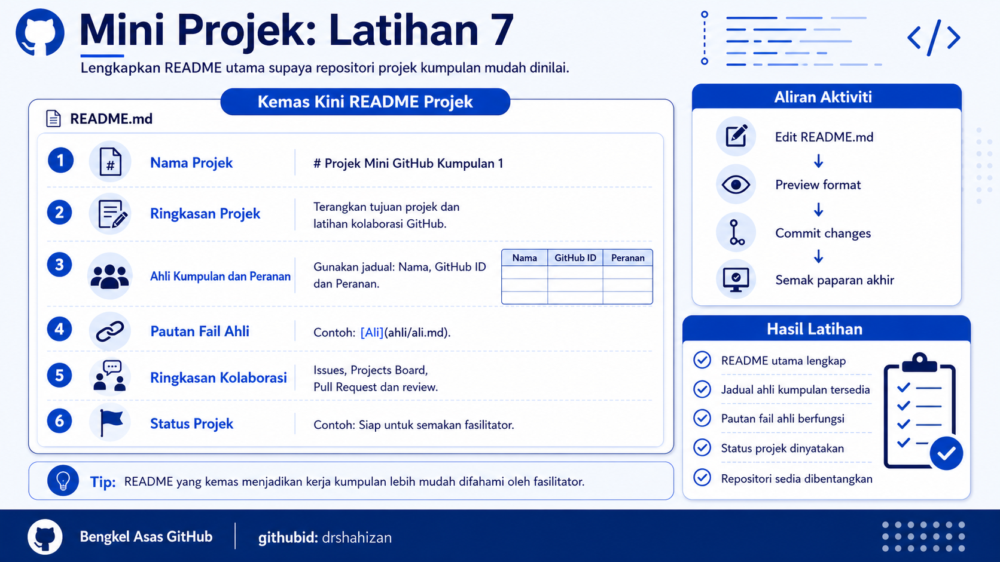

<a href="https://github.com/drshahizan/learn-github/stargazers"></a>
<a href="https://github.com/drshahizan/learn-github/network/members"></a>
<a href="https://github.com/drshahizan/learn-github/pulls"></a>
<a href="https://github.com/drshahizan/learn-github/issues"></a>
<a href="https://github.com/drshahizan/learn-github/graphs/contributors"></a>


<p align="center">

</p>

# Mini Projek: Latihan 7

## Kemas Kini README Projek

## Objektif Latihan

Peserta dapat mengemas kini fail `README.md` utama dalam repositori projek kumpulan supaya maklumat projek, ahli kumpulan, peranan, pautan fail ahli dan status projek dipaparkan dengan jelas.

## Situasi Latihan

Kumpulan telah mencipta repositori, menambah collaborator, mencipta Issues, menggunakan Projects Board, menambah fail ahli dan menjalankan Pull Request. Dalam latihan terakhir ini, kumpulan perlu mengemas kini README utama supaya repositori projek kelihatan lengkap dan mudah dinilai oleh fasilitator.

## Langkah 1: Buka Repositori Projek Kumpulan

1. Ketua kumpulan atau penulis README log masuk ke GitHub.
2. Buka repositori projek kumpulan.
3. Pastikan repositori yang dibuka ialah repositori projek kumpulan yang betul.
4. Semak bahawa fail ahli telah wujud dalam folder `ahli`.
5. Semak bahawa tugasan utama telah dikemas kini dalam GitHub Projects Board.

## Langkah 2: Buka Fail README.md

1. Pada tab `Code`, cari fail `README.md`.
2. Klik fail `README.md`.
3. Klik ikon pensel atau butang `Edit`.
4. GitHub akan membuka editor README.
5. Pastikan penulis README tidak memadam kandungan penting tanpa persetujuan kumpulan.

## Langkah 3: Tulis Nama Projek

1. Letakkan tajuk projek pada bahagian paling atas README.
2. Gunakan simbol `#` untuk tajuk utama.
3. Nama projek perlu sama atau hampir sama dengan nama repositori.
4. Pastikan tajuk projek ringkas dan mudah difahami.

Contoh:

```markdown
# Projek Mini GitHub Kumpulan 1
```

Contoh lain:

```markdown
# Mad_club: Projek Mini Kolaborasi GitHub
```

## Langkah 4: Tulis Ringkasan Projek

1. Tambah bahagian `Ringkasan Projek`.
2. Terangkan tujuan projek dalam satu perenggan ringkas.
3. Nyatakan bahawa projek ini digunakan untuk latihan kolaborasi GitHub.
4. Pastikan ayat mudah difahami oleh pembaca luar.

Contoh:

```markdown
## Ringkasan Projek

Projek ini dibangunkan sebagai latihan mini untuk memahami kolaborasi berpasukan menggunakan GitHub. Kumpulan menggunakan repositori, Issues, GitHub Projects, Pull Request dan README untuk menyusun kerja bersama.
```

## Langkah 5: Senaraikan Ahli Kumpulan dan Peranan

1. Tambah bahagian `Ahli Kumpulan`.
2. Gunakan jadual Markdown.
3. Masukkan nama ahli.
4. Masukkan GitHub ID.
5. Masukkan peranan setiap ahli dalam projek.

Contoh:

```markdown
## Ahli Kumpulan

| Nama | GitHub ID | Peranan |
|---|---|---|
| Nama Ahli 1 | ahli1 | Ketua repositori |
| Nama Ahli 2 | ahli2 | Penulis README |
| Nama Ahli 3 | ahli3 | Pengurus Issues dan Projects |
| Nama Ahli 4 | ahli4 | Reviewer Pull Request |
```

## Langkah 6: Tambah Pautan Fail Ahli

1. Buka folder `ahli`.
2. Salin nama fail setiap ahli.
3. Dalam README, tambah bahagian `Pautan Fail Ahli`.
4. Masukkan pautan kepada fail ahli menggunakan format Markdown.
5. Pastikan semua pautan boleh diklik.

Contoh:

```markdown
## Pautan Fail Ahli

- [Ali](ahli/ali.md)
- [Siti](ahli/siti.md)
- [Ahmad](ahli/ahmad.md)
- [Nuraina](ahli/nuraina.md)
```

## Langkah 7: Tambah Ringkasan Kolaborasi

1. Tambah bahagian `Ringkasan Kolaborasi`.
2. Nyatakan aktiviti GitHub yang telah digunakan oleh kumpulan.
3. Masukkan Issues, Projects Board, Pull Request dan review.
4. Gunakan senarai bullet supaya mudah dibaca.

Contoh:

```markdown
## Ringkasan Kolaborasi

- Repositori projek kumpulan telah dicipta.
- Semua ahli telah ditambah sebagai collaborator.
- Issues digunakan untuk agihan tugasan.
- GitHub Projects digunakan untuk memantau status kerja.
- Pull Request digunakan untuk semakan perubahan.
```

## Langkah 8: Nyatakan Status Projek

1. Tambah bahagian `Status Projek`.
2. Nyatakan status semasa projek.
3. Gunakan status yang mudah difahami.
4. Status boleh dikemas kini selepas pembentangan jika perlu.

Contoh:

```markdown
## Status Projek

Status: Siap untuk semakan fasilitator
```

Pilihan status lain:

```markdown
Status: Dalam semakan kumpulan
Status: Siap untuk pembentangan mini projek
```

## Langkah 9: Preview README

1. Klik tab `Preview`.
2. Semak paparan tajuk projek.
3. Semak jadual ahli kumpulan.
4. Semak pautan fail ahli.
5. Semak senarai ringkasan kolaborasi.
6. Baiki format Markdown jika ada bahagian yang tidak kemas.

## Langkah 10: Commit Perubahan README

1. Scroll ke bahagian bawah editor.
2. Cari bahagian `Commit changes`.
3. Tulis mesej commit yang jelas.

Contoh mesej commit:

```text
Kemas kini README projek kumpulan
```

Contoh lain:

```text
Tambah ahli kumpulan dan status projek
```

4. Klik `Commit changes`.
5. Tunggu sehingga perubahan disimpan.

## Langkah 11: Semak Paparan Akhir Repositori

1. Kembali ke halaman utama repositori.
2. Semak paparan README di bawah senarai fail.
3. Pastikan semua bahagian utama dipaparkan.
4. Klik pautan fail ahli untuk memastikan pautan berfungsi.
5. Tunjukkan paparan akhir kepada fasilitator jika diminta.

## Hasil Latihan

Pada akhir latihan ini, kumpulan mempunyai:

1. README projek kumpulan yang lengkap.
2. Nama projek dan ringkasan projek.
3. Jadual ahli kumpulan dan peranan.
4. Pautan kepada fail setiap ahli.
5. Ringkasan kolaborasi kumpulan.
6. Status projek yang jelas.

## Kriteria Siap

Latihan ini dianggap selesai apabila:

1. README utama telah dikemas kini.
2. Jadual ahli kumpulan lengkap.
3. Pautan fail ahli berfungsi.
4. Ringkasan kolaborasi ditulis.
5. Status projek dinyatakan.
6. Perubahan README telah di-commit.

## Masalah Biasa dan Cara Mengatasi

| Masalah | Cadangan Penyelesaian |
|---|---|
| Jadual README tidak kemas | Semak simbol `|` dan baris pemisah jadual. |
| Pautan fail ahli tidak berfungsi | Semak nama folder, nama fail dan huruf besar atau kecil. |
| README terlalu ringkas | Tambah ringkasan projek, ahli kumpulan dan status projek. |
| Terlupa commit perubahan | Scroll ke bawah dan klik `Commit changes`. |
| Ada ahli tiada fail | Minta ahli tersebut lengkapkan Mini Projek Latihan 5. |

## Contribution 🛠️
Please create an [Issue](https://github.com/drshahizan/learn-github/issues) for any improvements, suggestions or errors in the content.

You can also contact me using [Linkedin](https://www.linkedin.com/in/drshahizan/) for any other queries or feedback.

[](https://visitorbadge.io/status?path=https%3A%2F%2Fgithub.com%2Fdrshahizan)

